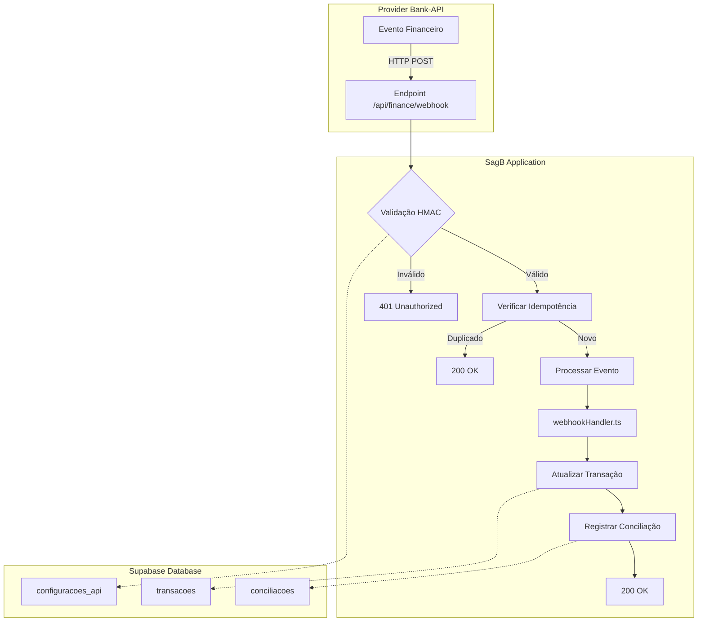

# Plano de Implementação: Conciliação via Webhook

**Data**: 2026-04-19  
**Autor**: Yasmin Rangel (Agente de Gestão Financeira)  
**Versão**: 1.0  
**Status**: Planejamento Aprovado

## Contexto

O módulo de Gestão Financeira necessita de conciliação automática via webhooks para integrar com provedores bancários externos. O usuário solicitou foco no provider único `bank-api`, com endpoint interno único e suporte aos eventos `payment.confirmed` e `transfer.failed` com validação de assinatura por segredo.

## Objetivo

Implementar endpoint interno único para receber webhooks do provider `bank-api`, processando eventos `payment.confirmed` e `transfer.failed` com validação de assinatura HMAC e idempotência via `event_id`.

## Escopo

### Incluído
- Provider único: `bank-api`
- Endpoint: `/api/finance/webhook`
- Eventos: `payment.confirmed`, `transfer.failed`
- Validação de assinatura HMAC-SHA256
- Idempotência via campo `event_id` na tabela `conciliacoes`
- Logging e auditoria completa
- Documentação técnica e operacional

### Excluído
- Múltiplos providers (expansão futura)
- Eventos além dos 2 especificados
- UI para configuração (MVP)
- Notificações em tempo real para usuários

## Arquitetura Técnica

### Diagrama de Fluxo



### Componentes

1. **Endpoint Handler** (`webhookEndpoint.ts`)
   - Recebe requisições HTTP POST
   - Valida headers e payload
   - Coordena fluxo de processamento

2. **Validador de Assinatura** (`webhookValidator.ts`)
   - Busca segredo da tabela `configuracoes_api`
   - Calcula HMAC do payload
   - Compara com signature recebida

3. **Serviço Financeiro** (`financeService.ts` - extensões)
   - `findConciliacaoByEventId()` - verifica idempotência
   - `getWebhookSecret()` - obtém segredo criptografado
   - Métodos auxiliares para logging

4. **Processador de Eventos** (`webhookHandler.ts` - existente)
   - `processWebhookNotification()` - processa eventos
   - Atualiza status de transações
   - Registra conciliações

## Plano de Implementação Detalhado

### Fase 1: Serviços de Suporte (2-3 horas)
**Objetivo**: Criar fundamentos seguros para validação

| # | Tarefa | Arquivo | Descrição |
|---|--------|---------|-----------|
| 1.1 | Criar validador de assinatura | `webhookValidator.ts` | Classe com métodos estáticos para validação HMAC |
| 1.2 | Extender financeService | `financeService.ts` | Adicionar `findConciliacaoByEventId()` e `getWebhookSecret()` |
| 1.3 | Configurar segredo de teste | Supabase | Inserir registro em `configuracoes_api` para desenvolvimento |

### Fase 2: Endpoint Handler (3-4 horas)
**Objetivo**: Implementar endpoint HTTP funcional

| # | Tarefa | Arquivo | Descrição |
|---|--------|---------|-----------|
| 2.1 | Criar endpoint handler | `webhookEndpoint.ts` | Função principal que processa requisições |
| 2.2 | Configurar roteamento | `vite.config.ts` | Extender proxy para desenvolvimento |
| 2.3 | Implementar respostas HTTP | `webhookEndpoint.ts` | Respostas apropriadas (200, 400, 401, 500) |
| 2.4 | Adicionar logging | `webhookEndpoint.ts` | Logs estruturados para debugging |

### Fase 3: Integração e Melhorias (2-3 horas)
**Objetivo**: Integrar componentes e melhorar robustez

| # | Tarefa | Arquivo | Descrição |
|---|--------|---------|-----------|
| 3.1 | Atualizar webhookHandler | `webhookHandler.ts` | Adicionar parâmetros de validação |
| 3.2 | Melhorar tratamento de erros | Todos os serviços | Try-catch com fallbacks apropriados |
| 3.3 | Adicionar telemetria | `webhookEndpoint.ts` | Métricas de processamento |
| 3.4 | Criar scripts de teste | `tools/test-webhook.sh` | Scripts para testes manuais |

### Fase 4: Documentação e Testes (2-3 horas)
**Objetivo**: Documentar e validar implementação

| # | Tarefa | Arquivo | Descrição |
|---|--------|---------|-----------|
| 4.1 | Documentação da API | `webhook-api.md` | Especificação completa do endpoint |
| 4.2 | Guia de configuração | `provider-setup.md` | Passos para configurar provider |
| 4.3 | Atualizar changelog | `changelog.md` | Registrar mudanças |
| 4.4 | Criar testes | `webhook.test.ts` | Testes unitários e de integração |
| 4.5 | Atualizar session log | `session-log.md` | Registrar decisões técnicas |

## Especificação Técnica

### Endpoint
```
POST /api/finance/webhook
```

### Headers Obrigatórios
```
Content-Type: application/json
X-Webhook-Signature: <hmac_hex_digest>
X-Webhook-Timestamp: <iso_timestamp> (opcional, replay protection)
```

### Payload Exemplo
```json
{
  "event": "payment.confirmed",
  "data": {
    "id": "evt_123456",
    "event_id": "evt_123456",
    "reference": "tx_789012",
    "provider": "bank-api",
    "paid_at": "2024-04-19T10:30:00Z",
    "amount": 1500.00,
    "currency": "BRL",
    "metadata": {}
  },
  "timestamp": "2024-04-19T10:30:05Z"
}
```

### Respostas HTTP

| Código | Situação | Corpo da Resposta |
|--------|----------|-------------------|
| 200 OK | Processado com sucesso | `{"status": "processed", "conciliacao_id": "..."}` |
| 200 OK | Evento idempotente (já processado) | `{"status": "already_processed", "conciliacao_id": "..."}` |
| 400 Bad Request | Payload inválido ou malformado | `{"error": "Invalid payload", "details": "..."}` |
| 401 Unauthorized | Assinatura inválida ou ausente | `{"error": "Invalid signature"}` |
| 500 Internal Server Error | Erro no processamento | `{"error": "Processing error", "request_id": "..."}` |

### Validação de Assinatura

1. **Obter segredo**: Buscar `webhook_secret_enc` da tabela `finance.configuracoes_api` para o provider
2. **Calcular HMAC**: `HMAC-SHA256(payload_string, secret)`
3. **Comparar**: Verificar se `X-Webhook-Signature` matches `hex(hmac_digest)`

### Idempotência

1. **Extrair event_id**: `payload.data.event_id` ou `payload.data.id`
2. **Verificar duplicata**: Buscar em `finance.conciliacoes` onde `event_id = ? AND provider = ?`
3. **Ação**: Se existir, retornar 200 OK sem processar novamente

## Considerações de Segurança

### 1. Proteção de Segredos
- Segredos armazenados criptografados no banco
- Nunca logar segredos em texto claro
- Rotação periódica de segredos

### 2. Validação de Payload
- Verificar estrutura JSON
- Validar campos obrigatórios
- Sanitizar entradas

### 3. Replay Protection (Futuro)
- Validar timestamp do header
- Rejeitar requisições muito antigas
- Implementar nonce tracking

### 4. Rate Limiting (Futuro)
- Limitar requisições por IP/provider
- Implementar backoff exponencial

## Riscos e Mitigações

| Risco | Impacto | Probabilidade | Mitigação |
|-------|---------|---------------|-----------|
| Provider muda algoritmo de assinatura | Alto | Baixa | Design extensível, suporte a múltiplos algoritmos |
| Eventos duplicados devido a retries | Médio | Alta | Idempotência robusta com event_id único |
| Segredo comprometido | Crítico | Baixa | Rotação periódica, auditoria de acesso |
| Performance do endpoint sob carga | Baixo | Média | Processamento assíncrono, queue futura |
| Incompatibilidade de payload | Médio | Média | Validação schema, fallback gracefull |

## Dependências

1. **Supabase Database**: Tabelas `finance.*` devem estar criadas e acessíveis
2. **Serviço Financeiro**: `financeService.ts` funcional com acesso ao banco
3. **Webhook Handler**: `processWebhookNotification()` funcional
4. **Ambiente de Desenvolvimento**: Vite configurado com proxy

## Próximos Passos Imediatos

1. **Configurar ambiente**
   - [ ] Verificar tabelas `finance.configuracoes_api` existentes
   - [ ] Inserir segredo de teste para `bank-api`
   - [ ] Configurar variáveis de ambiente

2. **Implementar Fase 1**
   - [ ] Criar `webhookValidator.ts`
   - [ ] Extender `financeService.ts`
   - [ ] Testar validação localmente

3. **Testar MVP**
   - [ ] Endpoint básico funcionando
   - [ ] Validação de assinatura
   - [ ] Processamento de evento mock

## Recursos Necessários

### Desenvolvimento
- 8-12 horas de desenvolvimento
- Ambiente Node.js 18+
- Acesso ao Supabase (desenvolvimento)

### Produção
- Servidor para endpoint (Supabase Edge Functions ou servidor dedicado)
- SSL/TLS para endpoint
- Monitoramento e alertas

## Métricas de Sucesso

1. **Funcionalidade**: Endpoint processa webhooks com sucesso
2. **Segurança**: Validação de assinatura impede acesso não autorizado
3. **Idempotência**: Eventos duplicados não causam processamento duplicado
4. **Performance**: 95% das requisições respondem em < 500ms
5. **Confiabilidade**: 99.9% uptime do endpoint

## Expansões Futuras

1. **Múltiplos Providers**: Suporte a `stripe`, `pagar.me`, etc.
2. **UI de Configuração**: Interface para gerenciar segredos e webhooks
3. **Webhook Testing**: Ferramenta para testar webhooks na UI
4. **Dashboard de Conciliação**: Visualização em tempo real
5. **Alertas**: Notificações para eventos críticos (transfer.failed)

## Aprovações

- [ ] Revisão técnica
- [ ] Aprovação de segurança
- [ ] Aprovação do usuário/stakeholder

---
*Documento gerado automaticamente pelo Agente Yasmin Rangel - Módulo de Gestão Financeira*