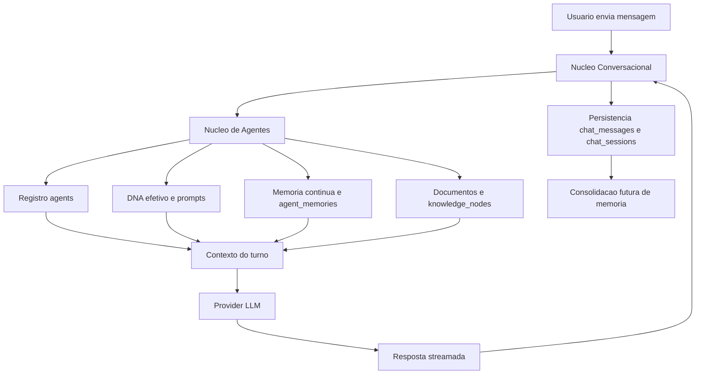
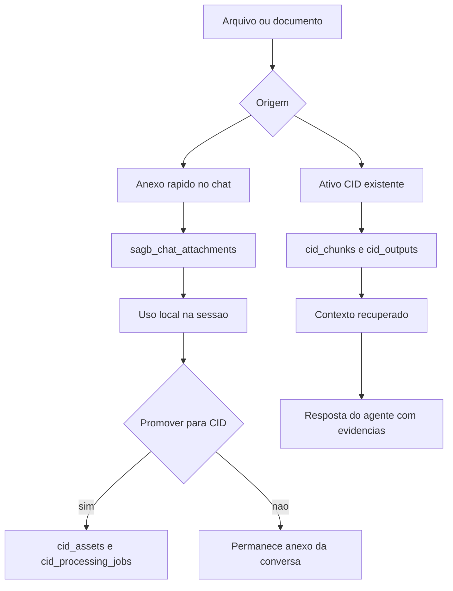
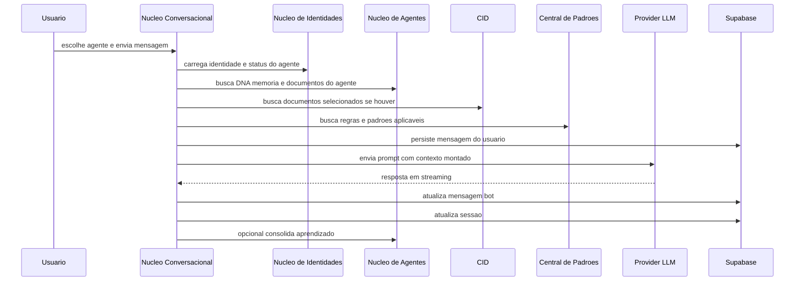
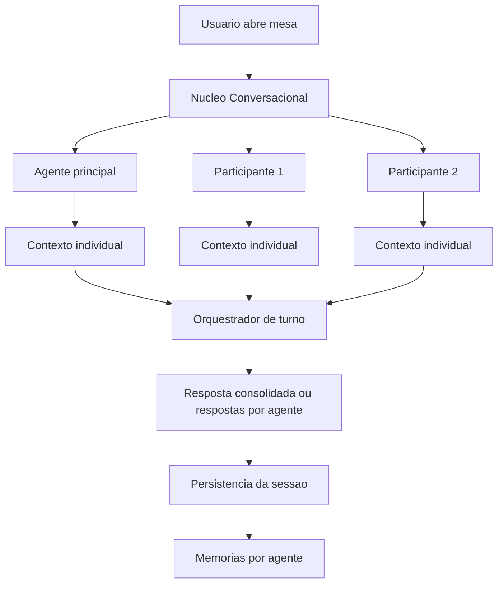
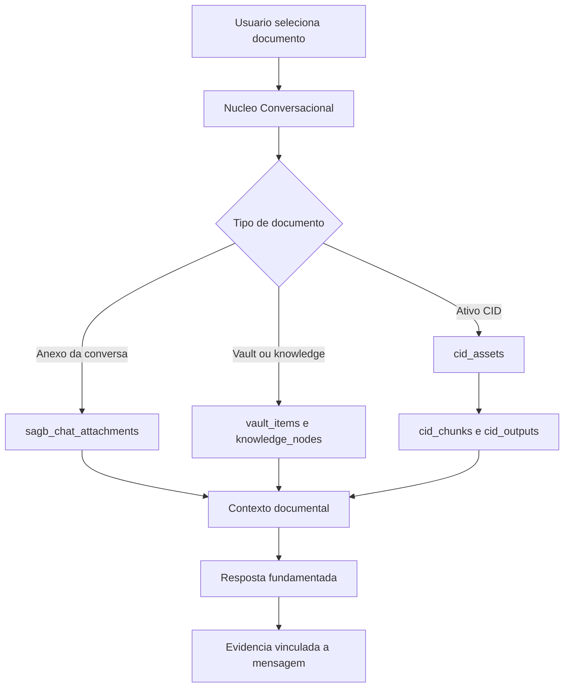

# Plano arquitetural — Núcleo Conversacional integrado ao ecossistema SagB

Data de referência: 07.07.2026

Módulo foco: `src/modules/nucleo-conversacional`

Módulos relacionados prioritários:

- `src/modules/nucleo_de_agentes`
- `src/modules/quadro_de_elite`
- `src/modules/cadastro-empresas`
- `src/modules/cid`
- `src/modules/nagi`
- `src/modules/central_padroes`

---

## 1. Síntese executiva

O `nucleo-conversacional` já existe como módulo oficial e possui documentação própria em `src/modules/nucleo-conversacional/module-doc.ts`. Ele compila no build de produção e já é usado parcialmente pelo sistema, especialmente por `components/SystemicVision.tsx`, que hoje concentra boa parte do motor real de chat.

O módulo, porém, ainda não está plenamente independente como núcleo operacional completo. Ele funciona em três camadas parcialmente separadas:

1. **Camada modular declarada**: `manifest.ts`, `routes.tsx`, `index.ts`, `module-doc.ts`.
2. **Camada de UI e serviços extraídos**: `ChatMessage`, `ChatAttachmentCard`, `SuggestionPanel`, `ncDb`, `chatPersistence`, `observability`.
3. **Camada operacional real ainda acoplada ao app legado**: `components/SystemicVision.tsx`, onde ficam criação de sessão, envio de mensagem, streaming, multiagente, anexos, áudio, consolidação de memória, seleção de documentos e integração com fluxos.

Conclusão: o módulo está **compilável e parcialmente operacional**, mas seu desenho correto deveria evoluir para um **orquestrador conversacional conectado aos módulos de identidade, memória, documentos, governança e encaminhamento**, em vez de depender de lógica espalhada no `SystemicVision.tsx`.

---

## 2. Estado atual encontrado

### 2.1. Documentação existente do próprio módulo

Existe documentação estruturada em `src/modules/nucleo-conversacional/module-doc.ts`.

Ela declara:

- Nome oficial: **Núcleo Conversacional Multiagente**.
- Objetivo: conduzir conversas com agentes, multi-provider, persistência, memória, handoff, anexos, áudio e instrumentação.
- Tabelas ligadas: `chat_sessions`, `chat_messages`, `agent_memories`, `agent_quality_events`, `intelligence_flows`, `intelligence_flow_steps`, `agent_dna_effective`.
- Bucket: `sagb_chat_attachments`.
- Integrações: Gemini, Deepseek, LlamaLocal via proxy, Whisper local.
- Pendências: tornar standalone, extrair UI, providers, reduzir `SystemicVision.tsx`, fortalecer RAG.

Essa documentação já aponta a intenção correta do módulo, mas ainda não descreve profundamente a relação com `nucleo_de_agentes`, `quadro_de_elite`, `cadastro-empresas`, `cid`, `nagi` e `central_padroes`.

### 2.2. Registro modular

O módulo está registrado no registry central por `src/core/modules/moduleRegistry.ts`.

Ponto de atenção:

- `manifest.id` atual do módulo é `conversations`.
- A navegação oficial também possui destino `nucleo-conversacional`.
- O `App.tsx` tem fallback tanto para `nucleo-conversacional` quanto para `conversations`.

Isso cria duplicidade semântica: o módulo é chamado por dois nomes e pode ser renderizado por caminhos diferentes.

### 2.3. Build e operacionalidade técnica

O comando `npm run build` passou com sucesso.

Logo, não há erro impeditivo de compilação.

Mas há risco funcional: a rota modular de `routes.tsx` renderiza `ConversationsView` sem passar agentes, workspace e callback de abertura de sessão. O fallback em `App.tsx` renderiza com props corretas. Portanto, dependendo do caminho de navegação, a tela pode aparecer sem conversas ou sem contexto.

### 2.4. Motor real de conversa hoje

O motor conversacional mais completo está em `components/SystemicVision.tsx`, não totalmente dentro de `src/modules/nucleo-conversacional`.

Ele já implementa:

- criação de `chat_sessions`;
- criação e leitura de `chat_messages`;
- carregamento incremental de mensagens antigas;
- persistência de placeholders de bot;
- streaming por Gemini, DeepSeek, LlamaLocal e providers por proxy;
- convite de agentes para sessão multiagente;
- persistência de participantes no payload da sessão;
- consolidação de memória em `agent_memories`;
- anexos com upload no bucket `sagb_chat_attachments`;
- áudio e transcrição;
- sugestões de título e pauta;
- criação de tópicos/tarefas e fluxos de inteligência.

Esse é o comportamento que deve ser migrado, organizado e documentado como núcleo do módulo.

---

## 3. Papel conceitual do Núcleo Conversacional

O `nucleo-conversacional` deve ser o **ambiente de interação viva** entre usuário, agentes, documentos, memória e decisões.

Ele não deve ser apenas uma tela de histórico. Deve ser a camada onde:

1. O usuário escolhe um agente ou uma mesa de agentes.
2. O sistema hidrata o contexto do agente a partir do Núcleo de Agentes e Núcleo de Identidades.
3. O sistema puxa memórias, documentos e regras relevantes.
4. A conversa acontece com persistência, streaming, anexos e trilha auditável.
5. A conversa gera aprendizados, tarefas, decisões, handoffs e evidências.
6. Os resultados retornam para os módulos de origem ou destino.

Em termos arquiteturais, ele deve operar como um **bus conversacional governado**.

---

## 4. Relação com Núcleo de Agentes

### 4.1. O que o Núcleo de Agentes já declara

O `src/modules/nucleo_de_agentes/module-doc.ts` define o Núcleo de Agentes como módulo base para visualização das 7 camadas dos agentes e governança da arquitetura cognitiva/operacional.

Ele lista como fontes de dados:

- `agents`
- `governance_global_culture`
- `governance_compliance_rules`
- `vault_items`
- `knowledge_nodes`
- `continuous_memory_sessions`
- `continuous_memory_chunks`
- `continuous_memory_files`
- `continuous_memory_outputs`

E cita serviços relevantes:

- `services/continuousMemory.ts`
- `services/knowledge.ts`
- `services/contextAssembler.ts`

### 4.2. Relação já existente

Existe relação indireta e parcial:

- `SystemicVision.tsx` recebe `dynamicAgents` e usa agentes como fonte de conversa.
- `services/knowledge.ts` recupera documentos relevantes do próprio agente por heurística simples.
- `SystemicVision.tsx` consolida aprendizados em `agent_memories`.
- `contextAssembler.ts` já possui lógica de resolução de agente oficial para missão, usando cadastro de agentes e prompt efetivo.

### 4.3. Relação que deveria existir

O Núcleo Conversacional deveria tratar o Núcleo de Agentes como **fonte viva de contexto cognitivo**.

Contrato sugerido:

- Entrada: `agentId`, `workspaceId`, `conversationIntent`, `userMessage`, `selectedDocumentRefs`.
- Saída do Núcleo de Agentes para o Conversacional:
  - identidade do agente;
  - status operacional;
  - papel oficial;
  - prompt efetivo;
  - DNA individual;
  - documentos globais;
  - memória aprendida;
  - chunks de memória contínua;
  - regras de governança aplicáveis;
  - evidências de contexto.

### 4.4. Fluxo ideal



### 4.5. Lacunas

- A busca de contexto ainda é heurística e local em `services/knowledge.ts`.
- A memória contínua não parece estar integrada diretamente ao chat em um contrato específico.
- `agent_memories` é gravado no chat, mas precisa de serviço formal de leitura e ranking.
- Ainda não existe um `ConversationalContextAssembler` próprio do módulo.

---

## 5. Relação com Quadro de Elite / Núcleo de Identidades

### 5.1. O que o módulo declara

`src/modules/quadro_de_elite/module-doc.ts` define o módulo como **Núcleo de Identidades**, responsável pelo cadastro mestre estrutural de humanos, agentes e híbridos.

Fontes declaradas:

- `agents`
- `agent_configs`
- `agent_dna_profiles`
- `agent_dna_effective`

### 5.2. Relação já existente

O Conversacional já depende da lista de agentes que chega por props no `App.tsx` e `SystemicVision.tsx`.

Também existe uso de campos como:

- `agent.id`
- `agent.name`
- `agent.officialRole`
- `agent.status`
- `agent.modelProvider`
- `agent.preferredModel`
- `agent.effectivePrompt`
- `agent.dnaIndividualPrompt`
- `agent.globalDocuments`
- `agent.learnedMemory`

### 5.3. Relação que deveria existir

O Núcleo Conversacional não deveria cadastrar agentes nem redefinir identidade. Ele deve consumir o Núcleo de Identidades como fonte oficial.

Responsabilidade do Quadro de Elite:

- definir quem é o agente;
- definir se está ativo, planejado, bloqueado;
- definir modelo preferencial;
- definir canonicalId;
- manter prompt e DNA efetivo;
- controlar metadados de função e setor.

Responsabilidade do Conversacional:

- selecionar agente elegível;
- iniciar sessão;
- montar contexto;
- registrar conversa;
- gerar aprendizados;
- atualizar histórico e evidências.

### 5.4. Lacunas

- Falta contrato formal de `AgentRuntimeProfile` para conversa.
- Falta normalização entre `agent.id`, `canonicalId` e eventuais ids legados.
- Falta bloqueio claro para agente `PLANNED`, `BLOCKED` ou sem prompt efetivo no fluxo modular.

---

## 6. Relação com Cadastro de Empresas

### 6.1. Estado documental

`src/modules/cadastro-empresas/module-doc.ts` existe, mas é genérico. Ele declara o módulo como ativo e alinhado ao padrão canônico de governança, sem detalhar contratos de dados.

### 6.2. Relação esperada

O Conversacional deve usar cadastro de empresas para contextualizar:

- empresa cliente;
- grupo;
- unidade de negócio;
- venture;
- responsáveis;
- segmento;
- status comercial ou operacional;
- histórico de relacionamento.

### 6.3. Relação atual provável

Há relação indireta por `businessUnits`, `activeBU`, `ventureId`, `buId` e `workspaceId` no `SystemicVision.tsx`.

O chat salva:

- `workspaceId`
- `buId`
- `ventureId` em fluxos/tarefas quando disponível.

Mas não foi encontrado um contrato forte de integração com `cadastro-empresas` no `nucleo-conversacional`.

### 6.4. Desenho ideal

O Conversacional deveria solicitar um `BusinessContext` antes do turno:

- `workspaceId`
- `companyId`
- `companyName`
- `businessUnitId`
- `ventureId`
- `relationshipStage`
- `activeContacts`
- `knownConstraints`
- `commercialContext`

Isso permitiria que o agente conversasse sabendo de qual empresa, unidade e contexto operacional se trata.

---

## 7. Relação com CID

### 7.1. O que o CID declara

`src/modules/cid/module-doc.ts` define o CID como Centro de Ingestão Documental.

Ele faz:

- upload;
- armazenamento;
- extração de texto;
- transcrição;
- fragmentação;
- metadados;
- organização de ativos documentais.

Ele não faz:

- inteligência profunda;
- cruzamento estratégico;
- recomendações;
- interpretação avançada.

### 7.2. Relação já existente

No chat atual, há anexos próprios do Conversacional:

- bucket `sagb_chat_attachments`;
- upload direto no chat;
- persistência no `chat_messages`.

Isso é útil para anexos conversacionais, mas é diferente do pipeline CID.

### 7.3. Relação que deveria existir

O CID deve ser a fonte de documentos preparados, enquanto o Conversacional deve ser consumidor desses documentos.

Fluxos sugeridos:

1. **Anexo rápido de conversa**:
   - usuário anexa arquivo no chat;
   - arquivo vai para `sagb_chat_attachments`;
   - é usado apenas naquela sessão;
   - opcionalmente vira candidato para CID.

2. **Documento formal do CID**:
   - usuário seleciona ativo CID;
   - Conversacional busca chunks e outputs do CID;
   - contexto é inserido no turno;
   - resposta cita evidências.

3. **Promoção de anexo para CID**:
   - anexo relevante de conversa é promovido;
   - cria `cid_assets`, `cid_asset_files`, `cid_processing_jobs`;
   - depois fica disponível como documento governado.

### 7.4. Fluxo ideal com CID



### 7.5. Lacunas

- O chat ainda não parece ter seletor formal de ativos CID.
- Não há contrato `DocumentContextProvider` conectando CID ao Conversacional.
- Anexos do chat e documentos CID ainda são mundos separados.

---

## 8. Relação com NAGI

### 8.1. O que o NAGI declara

`src/modules/nagi/module-doc.ts` define o NAGI como núcleo de governança de ideias, documentos relevantes, triagem, catálogo, priorização e handoff.

Fluxo declarado:

- CID + RAI → NICO → NAGI → NIDE → SADEV.

### 8.2. Relação atual

O Conversacional já cria ou apoia fluxos de inteligência via `intelligence_flows` e `intelligence_flow_steps`, especialmente quando sugestões de pauta/tarefa viram ações.

No entanto, a integração direta com NAGI não aparece como contrato formal.

### 8.3. Relação ideal

O Conversacional deve ser uma das principais fontes de entrada para o NAGI.

Exemplos:

- uma conversa gera uma ideia estratégica;
- o usuário marca uma resposta como candidata;
- o sistema extrai decisão, hipótese, oportunidade ou iniciativa;
- cria um item de triagem no NAGI;
- mantém link para `chat_session` e `chat_message` de origem;
- NAGI governa o item até catálogo ou handoff.

### 8.4. Contrato sugerido

`ConversationToNagiCandidate`:

- `workspaceId`
- `sessionId`
- `sourceMessageIds`
- `agentIds`
- `userId`
- `title`
- `summary`
- `candidateType`
- `evidenceExcerpt`
- `suggestedDestination`
- `prioritySignal`

---

## 9. Relação com Central de Padrões

### 9.1. O que a Central de Padrões declara

`src/modules/central_padroes/module-doc.ts` define a Central como responsável por consolidar, validar, publicar e relacionar padrões oficiais, documentos, decisões, módulos, agentes, checklists e evidências.

Ela possui tabelas como:

- `governance_rules`
- `central_padroes_standards`
- `central_padroes_documents`
- `central_padroes_decisions`
- `central_padroes_module_links`
- `central_padroes_evidence_records`

### 9.2. Relação esperada

O Conversacional deve consultar padrões para:

- instruções de conduta;
- limites de decisão;
- regras de governança;
- checklists aplicáveis;
- padrões de documentação;
- padrões de handoff.

E deve enviar evidências para:

- decisões tomadas;
- conversas usadas como base;
- padrões violados ou seguidos;
- aprendizados consolidados.

### 9.3. Papel recomendado

Central de Padrões não executa conversa. Ela define as regras. O Conversacional executa a conversa respeitando essas regras e produzindo evidências.

---

## 10. Como o módulo deve funcionar

### 10.1. Fluxo de conversa com um agente



### 10.2. Fluxo multiagente



### 10.3. Fluxo com documentos



---

## 11. O que não deve ser papel do Núcleo Conversacional

Para evitar duplicação:

- Não deve cadastrar agentes. Isso pertence ao Núcleo de Identidades / Quadro de Elite.
- Não deve ser fonte primária de DNA. Deve consumir `agent_dna_effective`.
- Não deve processar documentos brutos complexos. Isso pertence ao CID.
- Não deve substituir Central de Padrões. Deve consumir regras e registrar evidências.
- Não deve governar pipeline de ideias. Deve criar candidatos para o NAGI.
- Não deve manter cadastro paralelo de empresas. Deve consumir Cadastro de Empresas.

---

## 12. Modelo de dados conceitual

### 12.1. Entidades principais

`chat_sessions`:

- `workspaceId`
- `agentId`
- `ownerUserId`
- `title`
- `status`
- `buId`
- `payload.participantAgentIds`
- `payload.selectedVaultDocumentIds`
- `payload.selectedCidAssetIds`
- `payload.contextSnapshotId`
- `createdAt`
- `updatedAt`
- `lastMessageAt`

`chat_messages`:

- `workspaceId`
- `sessionId`
- `agentId`
- `participantName`
- `sender`
- `text`
- `buId`
- `hasAttachment`
- `attachment`
- `payload.isStreaming`
- `payload.contextRefs`
- `payload.provider`
- `payload.modelId`
- `payload.turnId`
- `createdAt`

`agent_memories`:

- `workspaceId`
- `agentId`
- `sessionId`
- `memoryType`
- `content`
- `confidence`
- `status`
- `payload.source`
- `payload.primaryAgentId`
- `payload.participantAgentIds`

### 12.2. Entidades futuras recomendadas

`conversation_context_snapshots`:

- snapshot do contexto usado em cada turno.
- evita perda de rastreabilidade.

`conversation_document_refs`:

- vínculo entre sessão/mensagem e documento CID, vault, knowledge ou anexo.

`conversation_handoffs`:

- encaminhamentos para NAGI, NIDE, SADEV, tarefas ou outros módulos.

---

## 13. Arquitetura sugerida para refatoração

### 13.1. Separar o módulo em camadas

Estrutura proposta:

```text
src/modules/nucleo-conversacional/
  components/
    ChatMessage.tsx
    ChatAttachmentCard.tsx
    SuggestionPanel.tsx
    ChatShell.tsx
    ChatComposer.tsx
    ChatSessionSidebar.tsx
    AgentInvitePanel.tsx
    DocumentContextPanel.tsx
  pages/
    ConversationsView.tsx
    ChatRuntimePage.tsx
  services/
    ncDb.ts
    ncLlm.ts
    chatPersistence.ts
    conversationRuntime.ts
    conversationalContextAssembler.ts
    agentContextProvider.ts
    documentContextProvider.ts
    memoryProvider.ts
    handoffProvider.ts
  domain/
    conversation.types.ts
    context.types.ts
    handoff.types.ts
  docs/
    arquitetura.md
    contratos.md
    fluxos.md
```

### 13.2. Serviços centrais

`agentContextProvider`:

- lê identidade, prompt, DNA e status.
- origem: Núcleo de Identidades e Núcleo de Agentes.

`memoryProvider`:

- lê `agent_memories` e memória contínua.
- ranqueia memórias relevantes para a mensagem atual.

`documentContextProvider`:

- lê anexos do chat, CID, vault e knowledge.
- monta evidências documentais.

`conversationalContextAssembler`:

- junta agente, empresa, documentos, memória e padrões.
- gera snapshot rastreável.

`conversationRuntime`:

- controla turno, provider, streaming e persistência.

`handoffProvider`:

- envia candidatos para NAGI, tarefas, fluxos ou outros módulos.

---

## 14. Matriz de relações atuais e futuras

| Módulo | Relação atual | Relação desejada | Prioridade |
|---|---|---|---|
| Núcleo de Agentes | Parcial via agents, knowledge e agent_memories | Fonte principal de memória, DNA, documentos e contexto cognitivo | Alta |
| Quadro de Elite | Parcial via lista de agentes e DNA efetivo | Fonte única de identidade, status e prompt efetivo | Alta |
| Cadastro de Empresas | Indireta via buId, workspaceId e businessUnits | Contexto empresarial completo no turno | Alta |
| CID | Separado; chat tem anexos próprios | Seleção de ativos CID e promoção de anexos para CID | Alta |
| NAGI | Indireta via intelligence_flows e tarefas | Criação de candidatos governáveis a partir de conversas | Média alta |
| Central de Padrões | Indireta via governança geral | Regras aplicáveis e registro de evidências | Média alta |
| NIDE / SADEV | Futuro via handoff | Encaminhar iniciativas formalizadas | Média |

---

## 15. Riscos principais

1. **Duplicidade de identidade de agentes**
   - Risco: criar cadastro próprio dentro do Conversacional.
   - Mitigação: consumir `agents`, `agent_configs`, `agent_dna_effective`.

2. **Memória fragmentada**
   - Risco: `agent_memories`, `learnedMemory`, `continuous_memory_*` e documentos ficarem desconectados.
   - Mitigação: criar `memoryProvider` unificado.

3. **Documentos duplicados**
   - Risco: anexos do chat competirem com CID.
   - Mitigação: definir diferença entre anexo efêmero e ativo documental CID.

4. **Governança invisível**
   - Risco: respostas sem saber que padrões/regras foram usados.
   - Mitigação: snapshot de contexto e evidências por turno.

5. **Rota modular sem contexto**
   - Risco: tela de conversas abrir vazia dependendo do id usado.
   - Mitigação: padronizar ids e renderização com props/runtime context.

6. **`SystemicVision.tsx` grande demais**
   - Risco: difícil manutenção e refatoração arriscada.
   - Mitigação: extrair gradualmente serviços e componentes sem quebrar comportamento.

---

## 16. Plano de execução recomendado

### Fase 1 — Estabilização funcional

- Padronizar identidade do módulo entre `manifest.id`, navegação e fallback.
- Garantir que `ConversationsView` sempre receba `agents`, `activeWorkspaceId` e callbacks.
- Corrigir listagem de sessões para não esconder conversas quando agente não estiver carregado.
- Adicionar logs de workspace, agentes, sessões brutas e sessões exibidas.
- Atualizar documentação do módulo com relações intermodulares.

### Fase 2 — Extração do runtime conversacional

- Extrair de `SystemicVision.tsx` a lógica de sessão para `conversationRuntime`.
- Extrair persistência de mensagens para `chatPersistence` ampliado.
- Extrair seleção de participantes para `multiAgentRuntime`.
- Extrair anexos para `attachmentService`.
- Preservar UI existente durante a extração.

### Fase 3 — Contexto unificado de agentes e memória

- Criar `agentContextProvider`.
- Criar `memoryProvider`.
- Integrar `agent_memories` como leitura antes de cada turno.
- Integrar memória contínua do Núcleo de Agentes.
- Criar ranking simples e evoluir para busca semântica.

### Fase 4 — Documentos e CID

- Criar `documentContextProvider`.
- Permitir seleção de ativos CID por sessão.
- Criar vínculo entre `chat_sessions` e ativos CID.
- Criar opção de promover anexo de chat para CID.
- Registrar evidências documentais por mensagem.

### Fase 5 — Governança e handoff

- Consultar Central de Padrões para regras aplicáveis ao turno.
- Criar `conversation_context_snapshots`.
- Criar candidatos para NAGI a partir de conversa.
- Registrar handoffs e decisões.

### Fase 6 — Modularização visual

- Criar `ChatRuntimePage`.
- Criar `ChatShell`, `ChatComposer`, `ChatSessionSidebar` e painéis laterais.
- Reduzir dependência de `SystemicVision.tsx`.
- Manter compatibilidade com navegação existente.

---

## 17. Checklist operacional para próxima implementação

- [ ] Confirmar id canônico do módulo: `nucleo-conversacional` ou `conversations`.
- [ ] Ajustar registry/fallback para não renderizar sem props.
- [ ] Atualizar `module-doc.ts` com integrações detalhadas.
- [ ] Criar documentação `docs/arquitetura.md` dentro do módulo.
- [ ] Extrair contratos de tipos para conversa e contexto.
- [ ] Criar provider de contexto de agente.
- [ ] Criar provider de memória.
- [ ] Criar provider de documentos com suporte futuro ao CID.
- [ ] Criar snapshot de contexto por turno.
- [ ] Definir política de anexos efêmeros versus ativos CID.
- [ ] Definir contrato de handoff para NAGI.
- [ ] Integrar Central de Padrões como fonte de regras.
- [ ] Criar testes mínimos de montagem de contexto.

---

## 18. Decisão arquitetural recomendada

O `nucleo-conversacional` deve ser tratado como **módulo de execução conversacional**, não apenas como tela de histórico.

Ele deve se apoiar nos demais módulos da seguinte forma:

- **Núcleo de Identidades / Quadro de Elite**: quem são os agentes.
- **Núcleo de Agentes**: o que os agentes sabem, lembram e podem acessar.
- **Cadastro de Empresas**: sobre quem ou qual unidade se está conversando.
- **CID**: quais documentos preparados entram como evidência.
- **Central de Padrões**: quais regras governam a resposta.
- **NAGI**: quais ideias, decisões e oportunidades devem virar pipeline governado.

Essa arquitetura evita duplicação e transforma o chat em uma camada viva de inteligência operacional do SagB.

