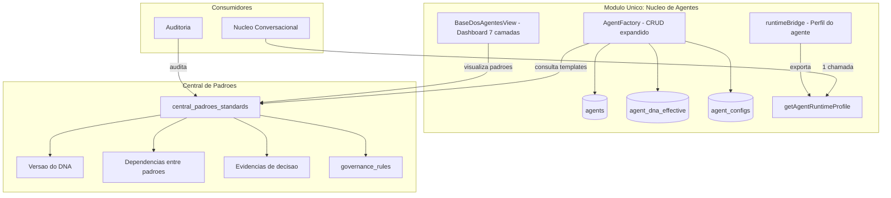
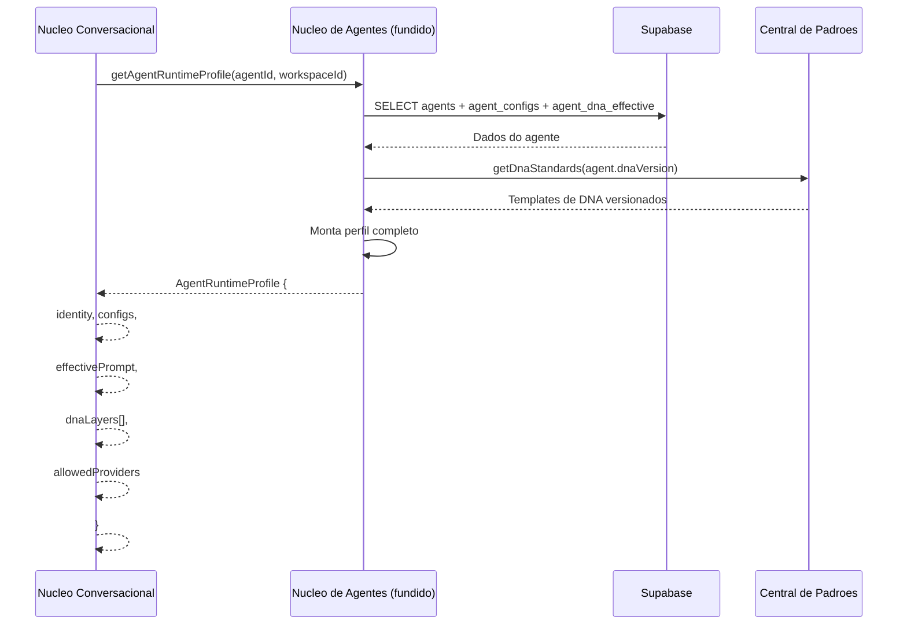

# Decisao Arquitetural | Fusao Quadro de Elite + Nucleo de Agentes | v1 | 07-06-2026

## Cabecalho interno

| Campo | Informacao |
|---|---|
| Documento | Decisao Arquitetural de FUSao do Quadro de Elite com o Nucleo de Agentes |
| Projeto | SagB |
| Versao | v1 |
| Data da versao | 07-06-2026 |
| Status | DECISAO | estrutura aprovada para implementacao |
| Local do arquivo | `Z:\00_sagb\plans\decisao-fusao-quadro-de-elite-nucleo-de-agentes.md` |
| Documentos base | `padrao-criacao-agentes-oficial-3forb.md`; `padrao-criacao-agentes-oficial-grupob.md` |
| Responsavel pela decisao | Cassio Mendes |
| Envolvidos | Helen Dravet (QE), Brene Sagore (NA), Pietro Carboni (CP) |

---

## 1. Sintese executiva

Este documento formaliza a decisao de **fundir** os modulos [`Quadro de Elite`](00_sagb/src/modules/quadro_de_elite) e [`Nucleo de Agentes`](00_sagb/src/modules/nucleo_de_agentes) em um **unico modulo** chamado `nucleo_de_agentes`, que passa a ser a **fonte unica de cadastro e perfil completo dos agentes** do SagB.

O DNA das 7 camadas (prompts, skills, protocolos, memoria) e movido para a [`Central de Padroes`](00_sagb/src/modules/central_padroes) como **padrao governado**, com versionamento, rastreabilidade e auditoria.

O [`Nucleo Conversacional`](00_sagb/src/modules/nucleo-conversacional) passa a consultar **apenas o Nucleo de Agentes fundido** para obter o perfil completo do agente, em vez de fazer multiplas consultas a modulos diferentes.

### Regra central

```txt
Um agente, um cadastro, um perfil, um contrato.
DNA governado na Central de Padroes.
Conversacional consome 1 chamada.
```

---

## 2. Color code operacional

| Cor/Simbolo | Significado | Quando usar |
|---|---|---|
| 🟢 Verde | Correto, aprovado ou pronto | Estrutura ou item que deve ser mantido |
| 🟡 Amarelo | Atencao, parcial ou depende de validacao | Conteudo util que precisa triagem |
| 🔴 Vermelho | Proibido, risco ou erro | Padrao que nao deve ser usado |
| 🟣 Roxo | Governanca ou decisao estrutural | Regra canonica ou decisao de sistema |
| 🔵 Azul | Oportunidade estrategica | Melhoria ou evolucao possivel |
| ⚫ Cinza | Contexto neutro | Informacao auxiliar ou explicativa |

---

## 3. Situacao atual (antes da fusao)

### 3.1. Dois modulos com responsabilidade sobreposta

```txt
QUADRO DE ELITE                    NUCLEO DE AGENTES
├── AgentFactory.tsx               ├── BaseDosAgentesView.tsx
├── CRUD real no Supabase          ├── Placeholders (console.log)
├── AgentFormState com dnaStatus   ├── Dashboard visual das 7 camadas
├── Story + runtimeBridge          ├── Subscriptions diretas ao banco
└── Owner: Helen Dravet            └── Owner: Brene Sagore
```

### 3.2. Problemas identificados

| Problema | Descricao | Impacto |
|---|---|---|
| Duplicacao de responsabilidade | Ambos os modulos lidam com agentes de forma diferente | 🟡 Confusao sobre onde cadastrar vs onde visualizar |
| Placeholders sem acao | [`BaseDosAgentesView`](00_sagb/src/modules/nucleo_de_agentes/components/BaseDosAgentesView.tsx:130) tem todos os callbacks como `console.log` | 🔴 Nao e possivel criar/editar dados pelas 7 camadas |
| DNA sem conteudo real | [`dnaStatus`](00_sagb/src/modules/quadro_de_elite/components/agent-factory/types.ts:35) marca se DNA esta completo, mas nao armazena o conteudo | 🔴 As 7 camadas nao tem dados estruturados |
| Conversacional disperso | Precisa consultar 2 modulos + banco direto para montar o perfil do agente | 🟡 Risco de divergencia, complexidade de orquestracao |
| Owners duplicados | Helen Dravet (QE) + Brene Sagore (NA) para o mesmo dominio | 🟡 Ninguem e dono completo do perfil do agente |

---

## 4. Arquitetura alvo (depois da fusao)

### 4.1. Diagrama de componentes



### 4.2. Novo contrato do modulo fundido

| Contrato | Antes | Depois |
|---|---|---|
| Nome do modulo | `quadro_de_elite` + `nucleo_de_agentes` | `nucleo_de_agentes` (unico) |
| ID no registry | `quadro_de_elite` | `nucleo_de_agentes` (com alias legado) |
| Rota | `/quadro_de_elite` | `/nucleo_de_agentes` (com redirect) |
| Store | `runtimeBridge` do QE | `runtimeBridge` expandido com `getAgentRuntimeProfile()` |
| Pagina principal | `QuadroDeElitePage` + `NucleoAgentesPage` | `NucleoAgentesPage` unificada |
| Owner | Helen Dravet + Brene Sagore | Helen Dravet (unico) |
| Dados que gerencia | `agents`, `agent_configs` | `agents`, `agent_configs`, `agent_dna_*` |

### 4.3. Fluxo de dados do perfil do agente



---

## 5. Mapa de migracao

### 5.1. O que herda do Quadro de Elite (mantido)

| Componente | Caminho | Acao |
|---|---|---|
| [`AgentFactory.tsx`](00_sagb/src/modules/quadro_de_elite/components/AgentFactory.tsx) | `components/AgentFactory.tsx` | ✅ **Manter no modulo fundido** |
| [`AgentFormState`](00_sagb/src/modules/quadro_de_elite/components/agent-factory/types.ts) | `components/agent-factory/types.ts` | ✅ **Expandir** com campos das 7 camadas |
| [`helpers.ts`](00_sagb/src/modules/quadro_de_elite/components/agent-factory/helpers.ts) | `components/agent-factory/helpers.ts` | ✅ **Manter** |
| [`runtimeBridge.ts`](00_sagb/src/modules/quadro_de_elite/store/runtimeBridge.ts) | `store/runtimeBridge.ts` | ✅ **Manter e expandir** |
| [`changelog.md`, `decisions.md`](00_sagb/src/modules/quadro_de_elite) | `changelog.md`, `decisions.md` | ✅ **Migrar** para o modulo unico |

### 5.2. O que herda do Nucleo de Agentes (mantido)

| Componente | Caminho | Acao |
|---|---|---|
| [`BaseDosAgentesView.tsx`](00_sagb/src/modules/nucleo_de_agentes/components/BaseDosAgentesView.tsx) | `components/BaseDosAgentesView.tsx` | ✅ **Manter** mas com dados reais |
| [`NucleoAgentesPage.tsx`](00_sagb/src/modules/nucleo_de_agentes/pages/NucleoAgentesPage.tsx) | `pages/NucleoAgentesPage.tsx` | ✅ **Manter** como pagina principal do modulo |
| [`module-doc.ts`](00_sagb/src/modules/nucleo_de_agentes/module-doc.ts) | `module-doc.ts` | ✅ **Unificar** com o do QE |
| [`README.md`](00_sagb/src/modules/nucleo_de_agentes/README.md) | `README.md` | ✅ **Manter e atualizar** |

### 5.3. O que vai para Central de Padroes

| Item | Tabela/Entidade | Descricao |
|---|---|---|
| Templates de DNA das 7 camadas | `central_padroes_standards` | Cada camada vira um padrao com versao |
| Regras de compliance vinculadas | `governance_rules` | Regras que validam cada camada |
| Dependencias entre camadas | `central_padroes_standard_dependencies` | Quais camadas dependem de quais |
| Evidencias de decisao de DNA | `central_padroes_evidence_records` | Decisoes de alteracao de DNA registradas |
| Checklist de preenchimento | `central_padroes_checklists` | Checklist de cada camada do DNA |

### 5.4. O que e removido

| Componente | Caminho | Motivo |
|---|---|---|
| `QuadroDeElitePage.tsx` | `modules/quadro_de_elite/pages/QuadroDeElitePage.tsx` | Substituido pela `NucleoAgentesPage` unificada |
| `manifest.ts` do QE | `modules/quadro_de_elite/manifest.ts` | Substituido pelo `manifest.ts` do NA expandido |
| `routes.tsx` do QE | `modules/quadro_de_elite/routes.tsx` | Rotas unificadas no NA |
| `quadro_de_elite` no registry | `core/modules/moduleRegistry.ts` | Removido como modulo independente |

### 5.5. Rotas legadas

| Rota antiga | Destino | Acao |
|---|---|---|
| `/quadro_de_elite` | `/nucleo_de_agentes` | 🟢 Redirect permanente (301) |
| `conversations` (id antigo) | `nucleo-conversacional` | 🟢 Redirect ja implementado |

---

## 6. Expansao do formulario de agente (AgentFormState)

### 6.1. Campos atuais que permanecem

Do [`AgentFormState`](00_sagb/src/modules/quadro_de_elite/components/agent-factory/types.ts:16):

| Campo | Tipo | Origem |
|---|---|---|
| `canonicalId`, `name`, `entityType` | strings, EntityType | Identidade |
| `email`, `usesEmail`, `avatarUrl` | string, boolean, string | Contato |
| `origin`, `ventureId`, `unitName`, `area` | strings | Organizacao |
| `functionName`, `baseRoleUniversal`, `level`, `roleType` | strings, AgentTier, RoleType | Cargo |
| `structuralStatus`, `operationalStatus`, `operationalActivation` | Status enums | Status |
| `dnaStatus` | DnaStatus | 🟡 Vira referencia ao padrao na CP |
| `allowedStacks`, `preferredModel` | ModelProvider[] | Modelo |
| `aiMentor`, `humanOwner`, `projectId`, `authUserId` | strings | Vinculacao |
| `customFields` | FormCustomField[] | Extra |

### 6.2. Campos novos (7 camadas como referencia)

| Campo | Tipo | Descricao | Origem |
|---|---|---|---|
| `dnaStandardVersion` | `string` | Versao do padrao de DNA na Central de Padroes | 🟣 Novo |
| `dnaScopeAccess` | `string` | ID do padrao de Escopo e Acessos (camada 1) | 🟣 Novo |
| `dnaCultureOfficial` | `string` | ID do padrao de Cultura Oficial (camada 2) | 🟣 Novo |
| `dnaInstitutionalBase` | `string` | ID do padrao de Base Institucional (camada 3) | 🟣 Novo |
| `dnaComplianceDirectives` | `string` | ID do padrao de Compliance (camada 4) | 🟣 Novo |
| `dnaOfficialProtocols` | `string` | ID do padrao de Protocolos (camada 5) | 🟣 Novo |
| `dnaIntelligenceCore` | `string` | ID do padrao de Nucleo de Inteligencia (camada 6) | 🟣 Novo |
| `dnaMemoryAgents` | `string` | ID do padrao de Memoria (camada 7) | 🟣 Novo |

> **Nota:** Os campos novos sao **referencias** (IDs de padroes na Central de Padroes), nao conteudo inline. O conteudo real (prompts, skills, regras) e governado como padrao versionado na CP.

---

## 7. Impacto nos modulos consumidores

### 7.1. Nucleo Conversacional

| Contrato | Antes | Depois |
|---|---|---|
| Fonte de dados do agente | QE + NA + banco direto | **Apenas Nucleo de Agentes** |
| Chamada para perfil | Multipla (3+ consultas) | **Unica**: `getAgentRuntimeProfile()` |
| Props recebidas | `agents` array + callbacks soltos | `AgentRuntimeProfile` consolidado |
| Complexidade de orquestracao | Alta (montar contexto de 3 fontes) | **Baixa** (1 contrato) |

### 7.2. Central de Padroes

| Contrato | Antes | Depois |
|---|---|---|
| `central_padroes_standards` | Padroes genericos | + Padroes de DNA das 7 camadas |
| `governance_rules` | Regras genericas | + Regras de compliance do DNA |
| `central_padroes_evidence_records` | Evidencias em geral | + Evidencias de decisao de DNA |
| Responsavel | Pietro Carboni | Pietro Carboni + Helen Dravet |

---

## 8. Riscos e mitigacoes

| Risco | Probabilidade | Impacto | Mitigacao |
|---|---|---|---|
| Perda de dados na migracao do QE | Baixa | 🔴 Alto | Manter backup do schema e dados do QE antes de remover |
| Central de Padroes ficar sobrecarregada | Media | 🟡 Medio | DNA vira **padrao referenciado** (template + versionamento), nao conteudo operacional |
| Quebra de rotas existentes | Baixa | 🔴 Alto | Redirect permanente `/quadro_de_elite` → `/nucleo_de_agentes` |
| Agentes sem DNA (legado) | Alta | 🟡 Medio | `dnaStandardVersion` = `null` → agente funciona sem padrao, apenas sem as 7 camadas |
| Conflito de merge no registry | Baixa | 🟡 Medio | Remover QE do registry e adicionar NA (ja existe) |
| Placeholders do NA virarem responsabilidade real | Media | 🟡 Medio | Os callbacks de `BaseDosAgentesView` passam a usar os servicos do AgentFactory |

---

## 9. Roadmap de implementacao

### Fase 1: Preparacao (pre-merge)

| Tarefa | Estimativa | Status |
|---|---|---|
| Mapear todos os arquivos do QE que serao movidos | Concluido | ✅ |
| Mapear todos os arquivos do NA que serao mantidos | Concluido | ✅ |
| Identificar conflitos de nome entre os modulos | Concluido | ✅ |
| Criar backup do schema `quadro_de_elite` no banco | Pendente | ⬜ |

### Fase 2: Unificacao do modulo

| Ordem | Tarefa | Descricao |
|---|---:|---|
| 1 | **Criar pasta unica** | Mover arquivos do QE para dentro da estrutura do NA |
| 2 | **Unificar `manifest.ts`** | Expandir `manifest.ts` do NA com dados do QE (owner Helen, icone, etc.) |
| 3 | **Unificar `routes.tsx`** | Rota `/nucleo_de_agentes` como principal, `/quadro_de_elite` como redirect |
| 4 | **Unificar `index.ts`** | Re-exportar tudo do modulo fundido |
| 5 | **Expandir `runtimeBridge.ts`** | Adicionar `getAgentRuntimeProfile()` |
| 6 | **Unificar `module-doc.ts`** | Consolidar documentacao dos dois modulos |
| 7 | **Atualizar `moduleRegistry.ts`** | Remover QE, manter NA |
| 8 | **Compilar e testar** | Build sem erros |

### Fase 3: Migracao do DNA para Central de Padroes

| Ordem | Tarefa | Descricao |
|---|---:|---|
| 1 | **Criar padroes de DNA na CP** | 7 padroes em `central_padroes_standards` (um por camada) |
| 2 | **Criar versao inicial** | `dna-v1` como template base |
| 3 | **Vincular regras de compliance** | Regras que validam cada camada do DNA |
| 4 | **Criar servico de consulta** | `getDnaStandards(version)` na CP |
| 5 | **Expandir AgentFormState** | Adicionar campos de referencia `dnaStandardVersion` + `dna*` |
| 6 | **Criar seletor de padrao no formulario** | Dropdown para vincular versao de DNA ao agente |
| 7 | **Compilar e testar** | Build sem erros |

### Fase 4: Contrato com o Conversacional

| Ordem | Tarefa | Descricao |
|---|---:|---|
| 1 | **Implementar `getAgentRuntimeProfile()`** | Servico que monta o perfil completo do agente |
| 2 | **Atualizar `ncDb.ts`** | Usar o novo servico em vez de consultas dispersas |
| 3 | **Simplificar `ConversationsView`** | Props passam a receber perfil consolidado |
| 4 | **Compilar e testar** | Build sem erros |

### Fase 5: Limpeza

| Ordem | Tarefa | Descricao |
|---|---:|---|
| 1 | **Remover pasta `quadro_de_elite`** | Apenas depois de confirmar que nada quebra |
| 2 | **Atualizar `changelog.md` e `decisions.md`** | Registrar a fusao |
| 3 | **Atualizar `moduleRegistry.ts`** | Remover import do QE |
| 4 | **Teste de fumaca** | Navegar por todas as rotas, verificar dados |

---

## 10. Estrutura final do modulo fundido

```txt
src/modules/nucleo_de_agentes/
├── index.ts                  # Barrel export
├── manifest.ts               # Manifest unificado
├── routes.tsx                # Rotas unificadas
├── module-doc.ts             # Documentacao unificada
├── changelog.md              # Changelog (migrado do QE)
├── decisions.md              # Decisoes (migrado do QE)
├── README.md                 # README (mantido do NA)
│
├── agent/                    # Persona files (mantido)
│   ├── falas_user.md
│   ├── persona.md
│   ├── prompt_ativacao_cline.md
│   └── session_log.md
│
├── components/               # Componentes unificados
│   ├── AgentFactory.tsx      # CRUD expandido (do QE)
│   ├── agent-factory/        # Subcomponentes (do QE)
│   │   ├── types.ts          # EXPANDIDO com campos DNA
│   │   ├── helpers.ts
│   │   ├── constants.ts
│   │   ├── AgentFactoryHeader.tsx
│   │   ├── AgentFactoryToolbar.tsx
│   │   ├── AgentFactoryTable.tsx
│   │   ├── AgentFactoryFormModal.tsx
│   │   ├── NameCreatorPanel.tsx
│   │   └── batchImportValidator.ts
│   │
│   └── BaseDosAgentesView.tsx  # Dashboard 7 camadas (do NA)
│
├── pages/                    # Paginas unificadas
│   └── NucleoAgentesPage.tsx # Pagina principal (expandida do NA)
│
├── store/                    # Store (do QE, expandido)
│   ├── index.ts
│   └── runtimeBridge.ts      # EXPANDIDO com getAgentRuntimeProfile
│
├── docs/                     # Documentos auxiliares (do QE)
│   └── auditoria-renomeacao-sistema-nomes-2026-06-01.md
│
└── plans/                    # Planos (do QE)
    ├── template_importacao_nucleo_identidades.csv
    └── teste-importacao-cadastro-de-agentes.csv
```

---

## 11. Checklist de fusao

| Item | Responsavel | Status |
|---|---|---|
| Mover `AgentFactory.tsx` + `agent-factory/` para `nucleo_de_agentes/components/` | Dev | ⬜ |
| Mover `runtimeBridge.ts` para `nucleo_de_agentes/store/` | Dev | ⬜ |
| Mover `changelog.md` e `decisions.md` | Dev | ⬜ |
| Mover `docs/` e `plans/` | Dev | ⬜ |
| Expandir `manifest.ts` com owner e icone do QE | Dev | ⬜ |
| Expandir `routes.tsx` com redirect do QE | Dev | ⬜ |
| Expandir `index.ts` com exports do QE | Dev | ⬜ |
| Expandir `runtimeBridge.ts` com `getAgentRuntimeProfile()` | Dev | ⬜ |
| Remover `quadro_de_elite` do `moduleRegistry.ts` | Dev | ⬜ |
| Adicionar redirect `/quadro_de_elite` → `/nucleo_de_agentes` | Dev | ⬜ |
| Compilar e testar build | Dev | ⬜ |
| Remover pasta `quadro_de_elite` (so apos validacao) | Dev | ⬜ |
| Atualizar `changelog.md` do modulo fundido | Dev | ⬜ |

---

## 12. Checklist de DNA na Central de Padroes

| Item | Responsavel | Status |
|---|---|---|
| Criar padrao `dna-escopo-acessos-v1` | Pietro Carboni | ⬜ |
| Criar padrao `dna-cultura-oficial-v1` | Pietro Carboni | ⬜ |
| Criar padrao `dna-base-institucional-v1` | Pietro Carboni | ⬜ |
| Criar padrao `dna-compliance-v1` | Pietro Carboni | ⬜ |
| Criar padrao `dna-protocolos-oficiais-v1` | Pietro Carboni | ⬜ |
| Criar padrao `dna-nucleo-inteligencia-v1` | Pietro Carboni | ⬜ |
| Criar padrao `dna-memoria-agentes-v1` | Pietro Carboni | ⬜ |
| Criar versao `v1` como template base | Pietro Carboni | ⬜ |
| Registrar dependencias entre camadas | Pietro Carboni | ⬜ |
| Vincular `governance_rules` a cada padrao | Pietro Carboni | ⬜ |
| Criar servico `getDnaStandards(version)` | Dev | ⬜ |
| Expandir `AgentFormState` com campos de referencia | Dev | ⬜ |
| Criar seletor de versao de DNA no formulario | Dev | ⬜ |

---

## 13. Criterio de pronto

| Criterio | Status esperado |
|---|---|
| Modulo `nucleo_de_agentes` contem todo o codigo dos dois modulos antigos | 🟢 obrigatorio |
| Build compila sem erros | 🟢 obrigatorio |
`/nucleo_de_agentes` renderiza o CRUD + dashboard das 7 camadas | 🟢 obrigatorio |
| `/quadro_de_elite` redireciona para `/nucleo_de_agentes` | 🟢 obrigatorio |
| Central de Padroes tem 7 padroes de DNA registrados | 🟢 obrigatorio |
| `getAgentRuntimeProfile()` retorna perfil completo | 🟢 obrigatorio |
| Nucleo Conversacional usa `getAgentRuntimeProfile()` | 🟢 obrigatorio |
| Pasta `quadro_de_elite` removida | 🟢 obrigatorio |
| `changelog.md` registra a fusao | 🟢 obrigatorio |

---

## 14. Checklist documental final

| Item | Confirmacao |
|---|---|
| Titulo contem projeto, versao e data | ☑ |
| Cabecalho interno foi inserido | ☑ |
| Documento esta em Markdown | ☑ |
| Tabelas foram usadas quando ajudam | ☑ |
| Mermaid foi usado para fluxo | ☑ |
| Color code foi aplicado onde ha status ou decisao | ☑ |
| Diagrama de componentes e sequencia foram incluidos | ☑ |
| Roadmap com fases e ordens foi incluido | ☑ |
| Checklist de fusao foi incluido | ☑ |
| Checklist de DNA na CP foi incluido | ☑ |
| Criterio de pronto foi definido | ☑ |
| Sintese final foi inserida | ☑ |

---

## 15. Sintese final

```txt
O Quadro de Elite e o Nucleo de Agentes serao fundidos em um unico modulo
chamado nucleo_de_agentes, que passa a ser a fonte unica de cadastro,
perfil e runtime dos agentes do SagB.

O DNA das 7 camadas vira padrao governado na Central de Padroes,
com versionamento, rastreabilidade e auditoria.

O Nucleo Conversacional passa a fazer 1 unica chamada
(getAgentRuntimeProfile) em vez de consultar 2 modulos + banco direto.

Helen Dravet e a owner unica do modulo fundido.
Pietro Carboni e o guardiao dos padroes de DNA na Central de Padroes.

Rotas legadas tem redirect permanente.
Nada e apagado sem antes validar que nada quebra.

Um agente, um cadastro, um perfil, um contrato.
```
