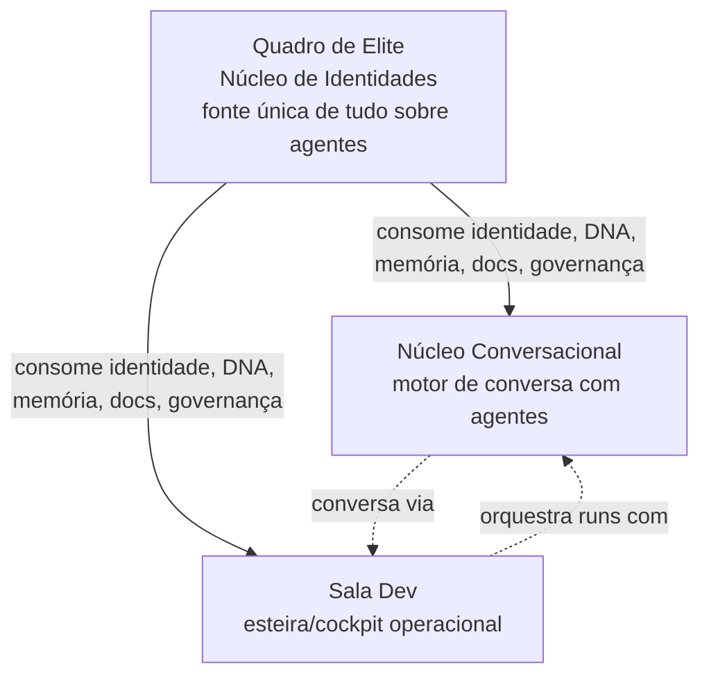
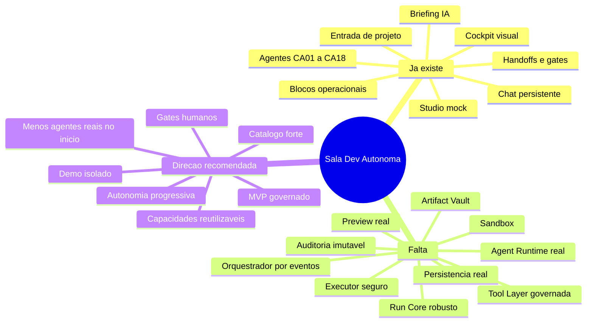
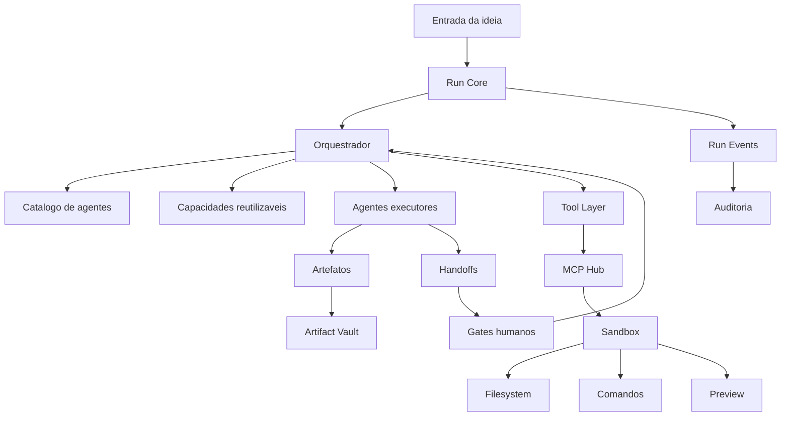
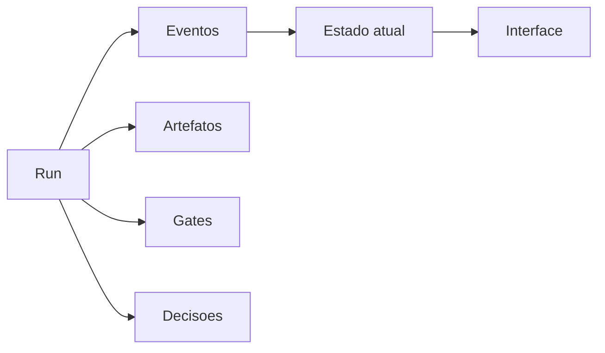
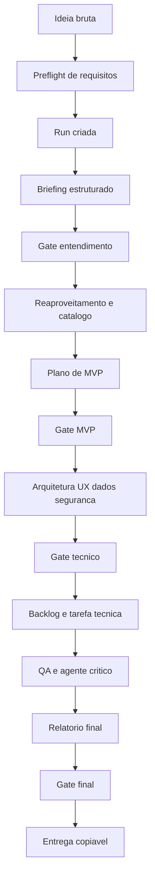
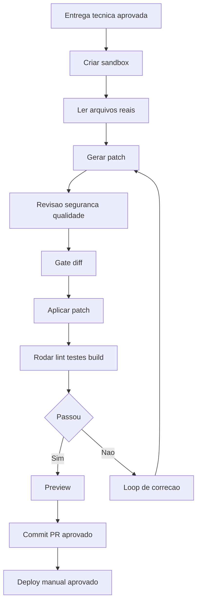
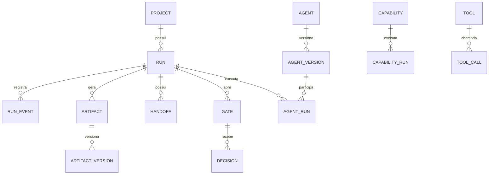
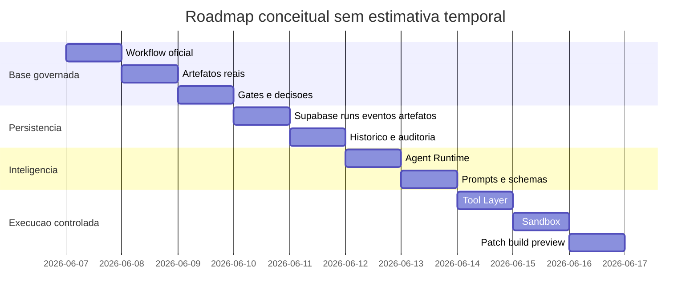
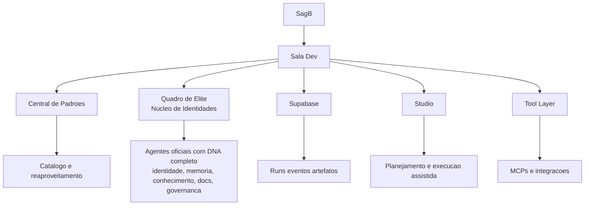

# 01-A — Análise da reunião dos agentes consultores de 4 IAs sobre Sala Dev

**Documento analisado:** `00_sagb/src/modules/sala-dev/docs/reuniao-agentes-consultores-de-4-ias-sobre-sala-dev-07.06.2926`  
**Módulo relacionado:** `00_sagb/src/modules/sala-dev`  
**Documento gerado em:** 07/06/2026  
**Finalidade:** consolidar o que os consultores trouxeram, cruzar com o estado real da Sala Dev e definir um plano de ação para transformar o módulo em uma esteira visual, governada e progressivamente autônoma.

**Atualizado em:** 07/06/2026 (pós-validação com o usuário sobre arquitetura de identidade de agentes)

---

## ⚠️ ERRATA — Correção arquitetural crítica sobre identidade dos agentes

**Problema identificado na versão original:** o relatório assumiu que os agentes CA-01 a CA-18 são gerenciados dentro do módulo Sala Dev (via constantes locais como `salaDev.agentConstants.ts`).

**Correção após validação com o usuário:**

A Sala Dev **não cria, não cadastra e não gerencia agentes localmente**. Ela deve **consumir/puxar** os agentes do [`quadro_de_elite`](00_sagb/src/modules/quadro_de_elite/module-doc.ts) — Núcleo de Identidades — que é a **fonte única e completa de tudo sobre cada agente**, incluindo:

- `agents` → identidade, status, canonicalId
- `agent_configs` → configurações
- `agent_dna_profiles` → perfis de DNA
- `agent_dna_effective` → prompt compilado efetivo
- `vault_items` → documentos globais do agente
- `knowledge_nodes` → conhecimento do agente
- `continuous_memory_*` → memória contínua aprendida
- `governance_global_culture` e `governance_compliance_rules` → regras de governança

**Mudança arquitetural importante:** o módulo [`nucleo_de_agentes`](00_sagb/src/modules/nucleo_de_agentes/module-doc.ts) está sendo **deprecado/unificado no Quadro de Elite**. Tudo que antes estava separado entre Núcleo de Identidades e Núcleo de Agentes agora converge para o Quadro de Elite como único ponto de verdade.

**Relação entre os módulos consumidores:**



**Implicações diretas para o plano:**
- O passo de criar `agentIdentityProvider` na Sala Dev deve consultar exclusivamente o Quadro de Elite
- As constantes locais de agentes (`CA-01` a `CA-18`) devem ser substituídas por consulta ao Quadro de Elite
- O Núcleo Conversacional e a Sala Dev compartilham a mesma fonte de agentes
- Não há linha direta Sala Dev → Núcleo de Agentes (esse módulo será unificado no QE)
- Toda interação conversacional com agentes na Sala Dev passa pelo Núcleo Conversacional

As seções abaixo que mencionam `nucleo_de_agentes` ou cadastro local de agentes devem ser lidas com esta correção em mente. A correção será aplicada integralmente no plano de ação consolidado.

## 0. Prompt operacional usado nesta tarefa

```text
Você é um arquiteto técnico e consultor de produto responsável por analisar profundamente uma reunião consolidada de agentes consultores de 4 IAs sobre a Sala Dev.

Leia o documento integralmente, extraia convergências, divergências, recomendações, riscos, arquitetura proposta, módulos necessários, fluxos, agentes, dados, UX, governança e plano evolutivo.

Depois cruze essa análise com o estado atual do módulo Sala Dev já existente no projeto SagB, considerando que o módulo já possui cockpit operacional, entrada de novo projeto, briefing local e com IA, fluxo de agentes, 18 agentes oficiais CA-01 a CA-18, blocos operacionais, handoffs, gates, artefatos, logs, decisões, chat IA persistente com comandos contextuais e Studio inicial em modo mock seguro.

Crie um relatório em Markdown, rico em recursos visuais, com diagramas Mermaid, mapas mentais, tabelas e fluxos. O relatório deve responder:

1. O que os consultores trouxeram no geral.
2. Onde houve consenso.
3. Onde houve tensão ou divergência.
4. O que o módulo já tem.
5. O que o módulo ainda não tem.
6. O que foi indicado e precisa entrar.
7. O que deve ser evitado.
8. Como a Sala Dev deve funcionar como produto e como módulo interno.
9. Como a Sala Dev deve interagir com outros módulos e sistemas.
10. Qual o plano de ação total para deixar o módulo completo.

Inclua também uma visão própria, conclusiva, sobre a melhor direção para a Sala Dev: não apenas como demo visual, mas como esteira governada, auditável, com autonomia progressiva, sandbox, Tool Layer, Supabase, catálogo, agentes reais e gates humanos.
```

---

## 1. Resumo executivo

A reunião dos consultores converge em um ponto central: **a Sala Dev não deve ser apenas uma tela bonita de agentes e nem um chat multiagente. Ela deve ser uma esteira visual, governada, auditável e progressivamente autônoma para transformar uma ideia bruta em artefatos técnicos, decisões, backlog, arquitetura, tarefas e, futuramente, execução controlada.**

O módulo atual já avançou bastante na direção correta: existe entrada de projeto, briefing, cockpit, blocos, agentes, gates, handoffs, logs, artefatos, chat IA persistente e Studio inicial. Porém, a Sala Dev ainda está majoritariamente em camada **mock, visual e preparatória**. Ela ainda não possui Run Core persistente completo, orquestração real por eventos, Supabase integral, Agent Runtime real, Artifact Vault, Tool Layer governada, MCP Hub, sandbox, execução real, preview real, versionamento operacional, gates imutáveis e auditoria robusta ponta a ponta.

Em termos de maturidade, a Sala Dev está hoje entre:

- **Cockpit funcional de planejamento e visualização**
- **Studio mock seguro para simular autonomia**
- **Base arquitetural para virar uma esteira real**

Ela ainda não é:

- **fábrica autônoma de software**
- **executor real de código**
- **orquestrador multiagente persistente em produção**
- **plataforma SaaS vendável pronta**

---

## 2. Diagnóstico em uma frase

> A Sala Dev está no caminho certo como cockpit e Studio inicial, mas precisa trocar o centro de gravidade de agentes visuais para **Run, Artefato, Handoff, Gate, Decisão e Auditoria** como entidades primárias.

---

## 3. Mapa mental da conclusão geral



---

## 4. O que os consultores trouxeram no geral

O documento contém quatro grandes linhas de inteligência consultiva:

### 4.1 Linha estratégica

Os consultores reforçam que o produto tem potencial forte porque ocupa um espaço entre:

- chat com IA
- ferramenta de gestão de projeto
- IDE assistida
- gerador de documentação
- orquestrador multiagente
- plataforma de discovery técnico

A proposta de valor mais forte não é “ter agentes”, mas **mostrar uma operação acontecendo com controle, rastreabilidade e entrega tangível**.

### 4.2 Linha arquitetural

Há forte recomendação para separar camadas:

- Interface visual
- Run Core
- Orquestrador
- Catálogo de agentes e capacidades
- Tool Layer ou MCP Hub
- Memória e contexto
- Artifact Vault
- Gates e aprovações
- Observabilidade e auditoria

### 4.3 Linha de produto

Os consultores indicam que o MVP mais forte não é “programar tudo sozinho”, mas transformar uma ideia bruta em:

- briefing estruturado
- plano de MVP
- arquitetura
- UX
- dados e integrações
- backlog
- tarefa técnica copiável
- relatório final

### 4.4 Linha de risco

Os riscos mais repetidos foram:

- excesso de agentes
- teatro visual sem operação real
- confundir demo com produção
- agentes conversando sem contrato
- falta de gates
- falta de logs
- custo de tokens
- contexto inchado
- autonomia perigosa
- falta de versionamento
- ausência de dono humano por agente
- vazamento entre clientes/projetos

---

## 5. Consensos fortes entre os consultores

| Tema | Consenso identificado | Implicação para Sala Dev |
|---|---|---|
| Run como unidade central | A run deve ser a entidade primária | O módulo precisa fortalecer `run`, `run_events`, `run_steps` e estado persistente |
| Artefatos versionados | Tudo que a run gera deve virar artefato | A Sala Dev precisa evoluir a central de artefatos e versões |
| Handoff estruturado | Handoff não pode ser conversa solta | Cada passagem precisa schema, origem, destino, payload e critério de aceite |
| Gates humanos | Autonomia precisa de pontos de aprovação | Gates precisam virar objetos reais e auditáveis |
| Orquestrador forte | Agentes não devem controlar a esteira | A Sala Dev precisa de Run Engine separado da UI |
| Visual vivo | A interface precisa mostrar operação | O visual deve refletir estado real, não animação vazia |
| Demo isolado | Modo demo é útil, mas perigoso | Demo precisa selo, dados sintéticos e bloqueio técnico |
| Persistência desde cedo | Log depois é caro e incompleto | Supabase deve entrar de forma incremental |
| Autonomia progressiva | Não liberar execução real no início | Começar por planejamento e artefatos, depois sandbox |
| Catálogo e reaproveitamento | Diferencial do produto | Guardião de Reaproveitamento deve ser prioritário |

---

## 6. Divergências e tensões detectadas

### 6.1 Demo primeiro versus produto governado primeiro

Alguns consultores defendem um MVP visual fortemente demonstrável, quase teatral. Outros alertam que isso pode contaminar o produto real e vender uma capacidade inexistente.

**Síntese recomendada:** criar modo demo, mas isolado por design. A Sala Dev pode ter experiência visual forte, mas precisa sempre separar:

- modo real assistido
- modo mock seguro
- modo demo comercial
- modo execução futura

### 6.2 18 agentes versus 5 a 10 agentes reais

O módulo atual está estruturado com 18 agentes CA-01 a CA-18. Os consultores alertam que 18 agentes no MVP pode gerar ruído, custo, drift e dificuldade de auditoria.

**Síntese recomendada:** manter os 18 agentes como catálogo oficial e organograma metodológico, mas operar o MVP com agentes compostos ou blocos:

- Orquestrador
- Produto e Briefing
- Reaproveitamento e Catálogo
- Arquitetura e UX
- Engenharia Full Stack
- Segurança e Governança
- QA e Revisor Final
- Documentação e Runbook

### 6.3 Pipeline linear versus grafo iterativo

A Sala Dev atual já trabalha com blocos, mas ainda se aproxima de uma leitura sequencial. Os consultores defendem grafo com voltas, paralelismo controlado, revisão e reexecução.

**Síntese recomendada:** manter o fluxo visual simples no MVP, mas preparar o domínio para grafo:

- etapas com dependências
- gates que retornam etapa
- revisão parcial
- branching futuro
- replay de run

---

## 7. Estado atual do módulo Sala Dev

Com base no módulo existente e no plano do módulo, a Sala Dev já possui:

### 7.1 Funcionalidades já presentes

| Área | Já existe | Observação |
|---|---|---|
| Entrada de projeto | Sim | Tela de novo projeto com ideia, objetivo, público e restrições |
| Briefing local | Sim | Gera resumo, escopo, riscos e próximos passos |
| Briefing com IA | Sim | Usa serviço LLM para gerar briefing |
| Cockpit principal | Sim | `DevRoomView` organiza Centro, Fluxo e Workspace |
| Agentes oficiais | Sim | CA-01 a CA-18 modelados na v3 |
| Blocos operacionais | Sim | 5 blocos operacionais multiagentes |
| Handoffs e gates | Sim, em base mock/domínio | Já há componentes e tipos para representar |
| Artefatos e auditoria | Sim, em base inicial | Workspace mostra artefatos, versões, logs e decisões |
| Chat IA | Sim | Chat persistente local e comandos básicos |
| Studio | Sim, inicial | Studio mock seguro com plano, diff, terminal e preview placeholder |
| Integração técnica futura | Sim, planejada | Bridge técnica ainda sem execução real |
| Fallback mock | Sim | Estratégia correta para segurança |

### 7.2 O que isso significa na prática

Hoje, se o usuário coloca uma ideia, a Sala Dev consegue gerar uma **entrega de planejamento e organização**, não uma entrega final executada.

Ela entrega:

- briefing
- riscos
- próximos passos
- cockpit de acompanhamento
- agentes e blocos visuais
- simulação de Studio
- plano simulado
- diff simulado
- build simulado
- preview placeholder

Ela ainda não entrega:

- artefatos persistidos de forma completa no Supabase
- execução real de agentes por etapa
- leitura real de repositório via sandbox
- geração real de patch
- execução real de comandos
- preview real
- Git, PR e deploy

---

## 8. Gap analysis — consultores versus módulo atual

| Recomendação dos consultores | Existe hoje? | Nível | Ação necessária |
|---|---:|---|---|
| Run como entidade central | Parcial | Médio | Fortalecer Run Core persistente |
| Event sourcing e timeline imutável | Parcial | Baixo | Criar `run_events` real e append-only |
| Handoff estruturado com schema | Parcial | Médio | Formalizar schema e persistência |
| Gates com decisão humana auditável | Parcial | Médio | Criar gate real com decisão, justificativa e versão |
| Agentes com ficha oficial | Parcial | Médio | Completar dono humano, autonomia, tools, escopo, não escopo |
| Capacidades reutilizáveis | Não claro | Baixo | Separar agentes de capacidades |
| Catálogo e reaproveitamento | Parcial conceitual | Baixo | Integrar com Central de Padrões e catálogo técnico |
| Modo demo isolado | Não | Baixo | Criar modo demo com selo e bloqueios |
| Supabase persistente | Parcial planejado | Baixo/Médio | Executar migrations e repositories |
| Artifact Vault | Parcial visual | Baixo | Criar storage e versionamento robusto |
| Tool Layer/MCP Hub | Planejado | Baixo | Criar camada governada antes de tools reais |
| Sandbox | Não | Baixo | Criar workspace isolado por sessão |
| Executor de comandos | Não real | Baixo | Criar allowlist, timeout e logs |
| Preview real | Não | Baixo | Criar preview sandbox |
| Git e PR | Não | Baixo | Criar Git adapter aprovado |
| Auditoria forte | Parcial | Médio | Criar trilha completa com hash e replay |
| Score da Run | Não | Baixo | Criar métricas de clareza, risco e prontidão |
| Radar de Risco | Não | Baixo | Criar painel de riscos por categoria |
| Replay de Run | Não | Baixo | Depende de event sourcing/checkpoints |

---

## 9. Arquitetura recomendada consolidada



### 9.1 Princípio arquitetural central

A UI nunca deve ser a dona da esteira. A UI apenas projeta o estado da run.

O núcleo deve ser:



---

## 10. Modelo mental correto para a Sala Dev

### 10.1 O que a Sala Dev não deve ser

- Não deve ser só chat.
- Não deve ser só demo animada.
- Não deve ser um organograma de agentes fazendo teatro.
- Não deve liberar autonomia real antes de sandbox e auditoria.
- Não deve colocar 18 agentes falando livremente.
- Não deve misturar dados reais com modo demo.

### 10.2 O que a Sala Dev deve ser

- Esteira visual de transformação de ideias.
- Cockpit de run.
- Ambiente Studio progressivamente autônomo.
- Orquestrador de agentes e capacidades.
- Central de artefatos e decisões.
- Sistema de gates humanos.
- Camada auditável de preparação para execução.
- Futuro executor controlado em sandbox.

---

## 11. Fluxo ideal consolidado da Sala Dev



### 11.1 Fluxo futuro com execução real



---

## 12. Papel dos agentes CA-01 a CA-18 na visão consolidada

**⚠️ Correção arquitetural:** os agentes CA-01 a CA-18 não são gerenciados localmente na Sala Dev. Eles existem no [`quadro_de_elite`](00_sagb/src/modules/quadro_de_elite/module-doc.ts) como registros oficiais com DNA completo. A Sala Dev deve **consultar o QE** para obter identidade, status, prompt efetivo, memória, conhecimento, documentos e governança de cada agente. Não há cadastro paralelo.

O módulo atual adotou 18 agentes oficiais em constantes locais. Isso precisa ser substituído por consumo do Quadro de Elite. A recomendação dos consultores não é apagar os agentes, mas reorganizar a operação:

### 12.1 Agentes como catálogo oficial (vindos do QE)

Os 18 agentes devem permanecer como repertório oficial, com fichas, prompts, limites e responsabilidades — mas servidos pelo Quadro de Elite.

### 12.2 Agentes como blocos operacionais no MVP

Para execução recorrente, usar blocos compostos:

| Bloco operacional | Agentes relacionados | Papel no MVP |
|---|---|---|
| Orquestração | CA-01 | Controlar run, gates e handoffs |
| Produto e briefing | CA-02, CA-03 | Entender ideia e definir MVP |
| Reaproveitamento | CA-13 e catálogo | Buscar padrões, módulos e decisões anteriores |
| Arquitetura e UX | CA-04, CA-05, CA-16 | Desenhar sistema e experiência |
| Construção técnica | CA-06, CA-07 | Gerar plano técnico e futuro patch |
| Segurança e qualidade | CA-08, CA-10, CA-15 | Revisar riscos, qualidade e código |
| Operação e entrega | CA-09, CA-11, CA-12, CA-17, CA-18 | Build, logs, versionamento, runbook e auditoria |

### 12.3 Capacidades reutilizáveis sugeridas

Nem tudo precisa ser agente. Algumas funções devem virar capacidades:

- gerar resumo executivo
- gerar checklist
- classificar risco
- gerar diagrama
- gerar backlog
- gerar runbook
- detectar fora de escopo
- comparar versões
- gerar ata da run
- validar formato de artefato
- comprimir contexto
- calcular score da run

---

## 13. Entidades centrais recomendadas



### 13.1 Entidades prioritárias para a próxima etapa

- `projects`
- `runs`
- `run_events`
- `run_steps`
- `agent_profiles`
- `agent_versions`
- `agent_runs`
- `handoffs`
- `gates`
- `decisions`
- `artifacts`
- `artifact_versions`
- `audit_logs`
- `capabilities`
- `tool_calls`
- `studio_sessions`

---

## 14. O que precisa ser colocado no módulo

### 14.1 Produto e UX

- Dashboard de runs.
- Central de aprovações.
- Central de artefatos versionados.
- Mapa de decisões.
- Radar de riscos.
- Score da run.
- Modo executivo e modo técnico.
- Modo demo isolado.
- Replay da run.
- Biblioteca de runs.
- Templates de esteira.

### 14.2 Domínio e backend

- Run Core real.
- Máquina de estados persistente.
- Event sourcing mínimo.
- Supabase real com fallback mock.
- Artifact Vault.
- Checkpoint de gate.
- Handoff com schema.
- Gate com decisão, justificativa e versão.

### 14.3 Agentes e orquestração

- Agent Runtime.
- Fichas oficiais completas.
- Versionamento de prompts.
- Capabilities separadas de agentes.
- Orquestrador que decide próxima etapa.
- Context compression.
- Narrative casting entre agentes.
- Revisão adversarial.
- Indicador de incerteza por artefato.

### 14.4 Autonomia real futura

- Tool Layer governada.
- MCP Hub.
- Sandbox por run.
- File System API controlada.
- Executor de comandos com allowlist.
- Preview real.
- Git adapter.
- PR e deploy aprovados.

---

## 15. Plano de ação total

### Fase 1 — Consolidar o MVP governado da Sala Dev

**Objetivo:** transformar o que já existe em uma run de ponta a ponta que gera artefatos úteis, ainda sem execução real.

Tarefas:

- Definir workflow oficial `Ideia bruta → projeto técnico pronto para execução`.
- Conectar entrada de projeto ao Studio.
- Fazer o Studio gerar artefatos reais em markdown, não apenas mock visual.
- Criar central de artefatos por run.
- Criar gates reais no estado da UI.
- Criar mapa de decisões.
- Criar radar de riscos.
- Criar score da run.
- Criar relatório final copiável.

Critério de pronto:

- Uma ideia simples entra e sai como entrega técnica completa documentada.

### Fase 2 — Persistência Supabase e auditoria

**Objetivo:** tirar a Sala Dev do localStorage/mock e registrar runs reais.

Tarefas:

- Criar migrations principais.
- Criar repository Supabase.
- Criar fallback mock/local.
- Persistir runs.
- Persistir eventos.
- Persistir artefatos.
- Persistir gates e decisões.
- Persistir mensagens do chat por sessão.
- Criar tela de histórico de runs.

Critério de pronto:

- Uma run pode ser fechada, reaberta e auditada.

### Fase 3 — Orquestrador real e agentes com IA

**Objetivo:** fazer os agentes gerarem saídas estruturadas de verdade.

Tarefas:

- Criar Agent Runtime.
- Criar prompts versionados.
- Criar schemas de entrada e saída.
- Separar agentes de capacidades.
- Criar orquestrador por estado.
- Criar gates automáticos por risco.
- Criar agente crítico/adversarial.
- Criar compressor de contexto.

Critério de pronto:

- Cada etapa gera artefato com agente responsável, versão e qualidade mínima.

### Fase 4 — Catálogo e reaproveitamento

**Objetivo:** diferenciar a Sala Dev de um gerador genérico de briefing.

Tarefas:

- Integrar com Central de Padrões.
- Criar catálogo técnico da Sala Dev.
- Indexar componentes, módulos, prompts, padrões e runs.
- Criar Guardião de Reaproveitamento operacional.
- Criar sugestões de reaproveitamento por run.
- Criar registro de aprendizado candidato.

Critério de pronto:

- Antes de propor algo novo, a Sala Dev verifica o que já existe.

### Fase 5 — Tool Layer e MCP Hub

**Objetivo:** preparar integrações reais com segurança.

Tarefas:

- Criar camada de ferramentas com schema.
- Definir tools permitidas por agente.
- Criar logs por tool call.
- Criar aprovação por tool sensível.
- Criar MCP Hub interno.
- Criar integração inicial somente leitura.

Critério de pronto:

- Nenhum agente acessa ferramenta externa sem passar por governança.

### Fase 6 — Sandbox e execução controlada

**Objetivo:** permitir programação real sem risco ao projeto principal.

Tarefas:

- Criar sandbox por run.
- Criar File System API controlada.
- Criar diff real.
- Criar patch real.
- Criar executor de comandos.
- Criar preview real.
- Criar rollback.
- Criar Git adapter.

Critério de pronto:

- A Sala Dev altera, testa e exibe resultado dentro do sandbox.

### Fase 7 — Produto vendável e multi-tenant

**Objetivo:** preparar operação para clientes, unidades e organizações.

Tarefas:

- Criar organizações.
- Criar projetos por organização.
- Criar RLS.
- Criar permissões por papel.
- Criar isolamento de memória.
- Criar modo cliente.
- Criar billing futuro.
- Criar analytics.

Critério de pronto:

- A Sala Dev pode operar com múltiplos clientes sem vazamento de dados.

---

## 16. Roadmap visual



Observação: o diagrama usa duração simbólica apenas para ordenação visual, não como estimativa de esforço.

---

## 17. Matriz de prioridade

| Prioridade | Item | Motivo |
|---|---|---|
| P0 | Workflow oficial de run | Sem isso o produto fica genérico |
| P0 | Artefato final padrão | Define o que sai no fim |
| P0 | Gates e decisões reais | Protege qualidade e rastreabilidade |
| P0 | Persistência de runs e eventos | Base para auditoria |
| P1 | Catálogo e reaproveitamento | Diferencial competitivo |
| P1 | Agent Runtime com schemas | Evita texto solto entre agentes |
| P1 | Radar de risco e score | Aumenta confiança |
| P2 | Modo demo isolado | Ajuda venda sem contaminar produção |
| P2 | Tool Layer | Prepara integrações reais |
| P3 | Sandbox e execução | Libera autonomia operacional futura |

---

## 18. Minha visão conclusiva

A melhor direção é assumir a Sala Dev como **produto de operação cognitiva governada**, não como IDE autônoma imediatamente.

O desejo final de “colocar uma ideia em uma ponta e sair pronto na outra” é válido, mas precisa ser dividido em dois significados:

### 18.1 Pronto para decisão

Esse é o primeiro alvo correto.

A Sala Dev deve receber uma ideia e entregar:

- briefing aprovado
- MVP definido
- arquitetura
- UX
- banco futuro
- riscos
- backlog
- tarefa técnica
- runbook
- relatório final

Esse alvo é realista, vendável e seguro.

### 18.2 Pronto como software executado

Esse é o alvo futuro.

Para isso, a Sala Dev precisa antes de:

- backend seguro
- sandbox
- File System API
- executor de comandos
- preview
- Git
- deploy aprovado
- auditoria forte

### 18.3 Decisão recomendada

Não tentar pular direto para autonomia operacional. Primeiro tornar a Sala Dev excelente em transformar ideia em **entrega técnica governada**. Depois, progressivamente, permitir execução real.

---

## 19. Função final da Sala Dev no SagB



A Sala Dev deve ser o módulo que transforma intenção em operação técnica rastreável dentro do SagB.

**Nota arquitetural importante:** o [`nucleo_de_agentes`](00_sagb/src/modules/nucleo_de_agentes/module-doc.ts) foi unificado no [`quadro_de_elite`](00_sagb/src/modules/quadro_de_elite/module-doc.ts). A Sala Dev não consulta mais dois módulos separados para agentes — tudo sobre cada agente vive no Quadro de Elite.

Ela interage com:

- **Central de Padrões:** consulta padrões, componentes, decisões e metodologias.
- **Quadro de Elite (Núcleo de Identidades):** consome agentes oficiais com DNA completo — identidade, status, prompt compilado, memória contínua, conhecimento, documentos, regras de governança. Não há cadastro paralelo de agentes na Sala Dev.
- **Núcleo Conversacional:** motor de conversa com agentes, consumindo os mesmos agentes do Quadro de Elite. A Sala Dev orquestra runs e handoffs, e usa o NC para diálogos com agentes.
- **Supabase:** persiste runs, artefatos, decisões e auditoria.
- **Studio:** permite planejamento e futura execução assistida.
- **Tool Layer/MCP:** acessa ferramentas externas de modo governado.
- **Governança:** registra donos humanos, permissões e incidentes.

---

## 20. Checklist consolidado para transformar em execução

### 🔗 Pré-requisito arquitetural: conexão com Quadro de Elite

- [ ] Criar `agentIdentityProvider` na Sala Dev que consulta [`quadro_de_elite`](00_sagb/src/modules/quadro_de_elite/module-doc.ts) como fonte única de agentes
- [ ] Substituir constantes locais de agentes (`salaDev.agentConstants.ts`) por consulta real ao Quadro de Elite
- [ ] Garantir que cada agente CA-01 a CA-18 carregue do QE: identidade, status, prompt efetivo, memória, conhecimento, documentos e governança
- [ ] Integrar Núcleo Conversacional como motor de conversa (ambos consomem do mesmo QE)

### 📋 Esteira e produto

- [ ] Definir workflow oficial `Ideia bruta → projeto técnico pronto para execução`.
- [ ] Definir artefato final padrão.
- [ ] Definir 3 a 5 gates do MVP.
- [ ] Definir agentes compostos do MVP.
- [ ] Separar agentes e capacidades reutilizáveis.
- [ ] Criar templates de artefatos.
- [ ] Criar Supabase mínimo para runs, eventos, artefatos e decisões.
- [ ] Criar histórico de runs.
- [ ] Criar mapa de decisões.
- [ ] Criar radar de riscos.
- [ ] Criar score da run.
- [ ] Criar relatório final copiável.
- [ ] Criar modo demo isolado.

### 🧠 Inteligência e orquestração

- [ ] Criar Agent Runtime com schemas.
- [ ] Criar catálogo e reaproveitamento.

### 🛡️ Autonomia futura

- [ ] Criar Tool Layer.
- [ ] Criar sandbox.
- [ ] Criar execução real apenas após sandbox e auditoria.

---

## 21. Conclusão final

A reunião dos consultores foi extremamente valiosa porque confirmou uma direção madura: **a Sala Dev deve crescer como esteira governada antes de crescer como agente autônomo executor.**

O módulo atual já tem boa parte da casca e parte do domínio: cockpit, agentes, blocos, chat, Studio e simulações. Agora o salto necessário é dar substância operacional:

- persistência real
- artefatos reais
- gates reais
- decisões reais
- orquestração real
- catálogo real
- auditoria real

Depois disso, a autonomia operacional deixa de ser promessa perigosa e vira consequência natural de uma arquitetura segura.

**A Sala Dev completa deve ser uma fábrica visual de decisões técnicas, artefatos e execução controlada. Não começa escrevendo código sozinha. Começa criando clareza, confiança, rastreabilidade e entrega técnica pronta para execução.**

