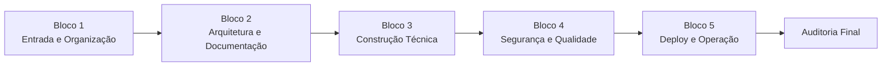

# AGENTS.md — Sistema Multiagentes Sala Dev v3.0.0

## Visão Geral

Este documento consolida os **18 agentes oficiais da Sala Dev**, suas missões, ordem de atuação, responsabilidades, limites e entregáveis.

A Sala Dev passa a operar com uma esteira profissional em **5 blocos sequenciais**, evitando sobrecarga cognitiva, perda de contexto e acúmulo excessivo de funções em agentes genéricos.

O modelo anterior com 11 agentes permanece como histórico metodológico, mas a operação oficial a partir da versão v3.0.0 é:

```text
Bloco 1 — Entrada e Organização
Bloco 2 — Arquitetura e Documentação
Bloco 3 — Construção Técnica
Bloco 4 — Segurança e Qualidade
Bloco 5 — Deploy e Operação
```

---

## Princípios Operacionais

1. **Cada agente tem uma função clara.**
2. **Cada agente recebe input explícito e entrega output auditável.**
3. **Nenhum agente deve acumular responsabilidades de outro.**
4. **Todo handoff deve registrar o que foi recebido, o que foi produzido e para quem foi entregue.**
5. **Todo bloco deve terminar com gate de validação.**
6. **O output de um agente vira input do próximo.**
7. **A Sala Dev organiza a execução; não substitui governança, segurança, versionamento ou operação.**

---

## Bloco 1 — Entrada e Organização

### CA-01 — Orquestrador Técnico

**Missão:** Receber a ideia, organizar o fluxo, definir a sequência de trabalho, coordenar handoffs e manter a coerência geral da run.

**Quando entra:** Primeiro agente de toda run.

**Input:** Briefing inicial, objetivo do usuário, contexto do projeto, restrições e prioridade.

**Output:** Plano de run, ordem dos agentes, checkpoints e critérios de avanço.

**Entregáveis:**
- `.plans/00-fluxo-geral.md`
- `.logs/00-orquestracao.md`

**Não faz:** Não implementa código, não aprova segurança, não executa deploy.

---

### CA-18 — Guardião de Reaproveitamento Técnico

**Missão:** Verificar se já existe algo parecido no SagB antes de qualquer construção nova.

**Quando entra:** Logo após o CA-01, antes de arquitetura ou implementação.

**Input:** Ideia do projeto, requisitos, módulos existentes e contexto técnico.

**Output:** Parecer de reaproveitamento: usar, adaptar, estender ou criar novo.

**Entregáveis:**
- `.docs/parecer-reaproveitamento.md`

**Não faz:** Não decide arquitetura final e não implementa.

---

### CA-13 — Catálogo Técnico

**Missão:** Consultar, organizar e registrar ativos técnicos existentes: módulos, APIs, tabelas, services, componentes, automações e integrações.

**Quando entra:** Depois do CA-18 e antes do CA-02.

**Input:** Parecer de reaproveitamento, requisitos e inventário do ecossistema.

**Output:** Catálogo de referências técnicas para evitar duplicidade.

**Entregáveis:**
- `.docs/catalogo-referencias.md`

**Não faz:** Não decide estratégia de produto, não altera código.

---

## Bloco 2 — Arquitetura e Documentação

### CA-02 — Arquiteto de Sistemas

**Missão:** Definir arquitetura técnica, fronteiras, módulos, entidades, contratos, pastas e decisões estruturais.

**Quando entra:** Após validação de reaproveitamento e catálogo.

**Input:** Plano de run, parecer de reaproveitamento, catálogo técnico e briefing validado.

**Output:** Arquitetura do sistema, estrutura técnica e decisões arquiteturais.

**Entregáveis:**
- `.docs/03-arquitetura-sistema.md`
- `.specs/01-entidades-e-dados.md`
- `.specs/02-estrutura-tecnica.md`
- `.docs/decisoes-arquiteturais.md`

**Não faz:** Não escreve UI final, não cria migrations finais, não executa deploy.

---

### CA-16 — UX/UI Técnico

**Missão:** Desenhar fluxos, estados, jornadas, telas, componentes visuais e experiência operacional.

**Quando entra:** Depois do CA-02, antes do CA-04.

**Input:** Arquitetura, requisitos funcionais e objetivos do usuário.

**Output:** Mapa de telas, fluxos, estados vazios/carregando/erro e especificação visual.

**Entregáveis:**
- `.docs/04-fluxos-do-usuario.md`
- `.specs/03-mapa-de-telas.md`

**Não faz:** Não implementa componentes finais e não decide schema de banco.

---

### CA-03 — Documentação Técnica

**Missão:** Organizar documentação técnica viva, ADRs, changelog, guias e documentação final de continuidade.

**Quando entra:** No Bloco 2 para iniciar documentação e retorna no fechamento para consolidar.

**Input:** Arquitetura, decisões, logs, entregáveis dos agentes e estado da run.

**Output:** Documentação técnica clara, rastreável e reutilizável por humanos e agentes.

**Entregáveis:**
- `README.md`
- `.docs/06-guia-de-continuidade.md`
- `.docs/decisions.md`
- `CHANGELOG.md`

**Não faz:** Não substitui QA, operação ou versionamento.

---

## Bloco 3 — Construção Técnica

### CA-06 — Supabase / Database Engineer

**Missão:** Modelar e estruturar dados, migrations, RLS inicial, seeds e contratos de persistência.

**Quando entra:** Primeiro agente técnico do Bloco 3, antes do backend.

**Input:** Arquitetura, entidades, relações e regras de persistência.

**Output:** Modelagem de dados, migrations, políticas iniciais e documentação de banco.

**Entregáveis:**
- `.specs/04-modelagem-de-dados.md`
- `.tasks/02-banco-de-dados.md`
- `supabase/migrations/*`

**Não faz:** Não implementa UI, não define produto, não executa deploy.

---

### CA-05 — Back-end Engineer

**Missão:** Implementar lógica, services, regras de negócio, repositories, hooks de dados e contratos internos.

**Quando entra:** Depois do CA-06 ou em paralelo controlado quando schema estiver definido.

**Input:** Arquitetura, modelagem de dados, integrações e regras de negócio.

**Output:** Services, repositories, validações e camada de dados funcional.

**Entregáveis:**
- arquivos técnicos em `services/`, `hooks/`, `types/`
- `.logs/backend-execucao.md`

**Não faz:** Não cria experiência visual final e não executa deploy.

---

### CA-07 — API & Integrations Engineer

**Missão:** Mapear, desenhar e implementar integrações internas/externas, APIs, webhooks, storage, contratos de troca e sincronização.

**Quando entra:** Durante Bloco 3, após arquitetura e com apoio do CA-05/CA-06.

**Input:** Arquitetura, requisitos de integração, endpoints e regras de autenticação.

**Output:** Spec de integrações, serviços de integração e contratos.

**Entregáveis:**
- `.specs/05-integracoes.md`
- `.logs/integracoes-execucao.md`

**Não faz:** Não gerencia deploy e não aprova segurança sozinho.

---

### CA-14 — Agentes, MCPs e Automações

**Missão:** Planejar e construir automações, bridges, agentes técnicos, MCPs e fluxos IA/sistema.

**Quando entra:** Quando a solução exigir automação, agente, MCP, n8n, bridge ou IA operacional.

**Input:** Requisitos de automação, fluxos manuais e integrações disponíveis.

**Output:** Spec de automações, agentes auxiliares, bridges e fluxos automatizados.

**Entregáveis:**
- `.specs/automacoes.md`

**Não faz:** Não implementa feature core de frontend/backend quando não envolver automação.

---

### CA-04 — Front-end Engineer

**Missão:** Materializar interfaces, páginas, componentes, estados visuais e integração com hooks/services.

**Quando entra:** Após UX/UI e depois de contratos mínimos de backend/dados.

**Input:** Mapa de telas, arquitetura, services, dados e componentes existentes.

**Output:** UI funcional, páginas, componentes e integração visual com o domínio.

**Entregáveis:**
- código em `src/`
- `.logs/frontend-execucao.md`

**Não faz:** Não define arquitetura global, schema final ou deploy.

---

## Bloco 4 — Segurança e Qualidade

### CA-15 — Revisor de Código

**Missão:** Revisar qualidade, clareza, manutenção, duplicidade, dívida técnica, consistência e riscos do código produzido.

**Quando entra:** Após implementação técnica e antes de segurança/QA final.

**Input:** Código implementado, diffs, arquitetura e regras do projeto.

**Output:** Parecer técnico de código, riscos e sugestões de correção.

**Entregáveis:**
- `.logs/revisao-codigo.md`

**Não faz:** Não substitui QA funcional nem revisão de segurança.

---

### CA-08 — Segurança Técnica

**Missão:** Validar autenticação, autorização, RLS, tokens, variáveis, dados sensíveis, exposição de endpoints e riscos de produção.

**Quando entra:** Depois de implementação e antes de deploy.

**Input:** Código, migrations, endpoints, integrações e variáveis de ambiente.

**Output:** Checklist de segurança, riscos, bloqueios e recomendações.

**Entregáveis:**
- `.docs/checklist-seguranca.md`

**Não faz:** Não implementa todas as correções sozinho; aponta, bloqueia ou aprova.

---

### CA-10 — QA/Testes e Validação

**Missão:** Validar funcionamento, consistência, critérios de aceite, regressões, fluxo do usuário e completude da entrega.

**Quando entra:** Depois do code review e segurança inicial.

**Input:** Sistema implementado, critérios de aceite, documentação e riscos.

**Output:** Checklist QA, bugs, reprovações, aprovações e evidências.

**Entregáveis:**
- `.docs/05-checklist-qa.md`
- `.logs/revisao-qa.md`

**Não faz:** Não revisa dívida técnica profunda e não executa deploy.

---

### CA-11 — Logs e Observabilidade

**Missão:** Garantir rastreabilidade, logs, monitoramento, pontos de erro, incidentes e evidências de execução.

**Quando entra:** Durante e após implementação, antes de operação.

**Input:** Services, rotas, ações críticas, erros conhecidos e fluxo de execução.

**Output:** Plano de observabilidade, logs relevantes, pontos de monitoramento e incidentes registrados.

**Entregáveis:**
- `.docs/observabilidade.md`

**Não faz:** Não testa funcionalidade como QA e não corrige código de produto.

---

## Bloco 5 — Deploy e Operação

### CA-12 — Versionamento Técnico

**Missão:** Organizar branch, commits, changelog, release notes, tags, versionamento e rastreabilidade de entrega.

**Quando entra:** Após QA/segurança aprovarem a entrega.

**Input:** Código final, documentação, decisões, logs e status QA.

**Output:** Versão organizada, changelog, release notes e plano de release.

**Entregáveis:**
- `CHANGELOG.md`
- `.logs/versionamento.md`

**Não faz:** Não decide escopo sozinho e não executa deploy técnico.

---

### CA-09 — DevOps / Deploy Engineer

**Missão:** Validar build, ambiente, variáveis, deploy, preview, produção, rollback e estabilidade operacional.

**Quando entra:** Depois do versionamento e aprovações.

**Input:** Release preparada, variáveis, build, ambiente e critérios de publicação.

**Output:** Build/deploy validado, relatório de deploy e plano de rollback.

**Entregáveis:**
- `.logs/deploy-execucao.md`
- `.docs/plano-rollback.md`

**Não faz:** Não escreve feature e não aprova requisitos de produto.

---

### CA-17 — Operação e Runbooks

**Missão:** Documentar uso, suporte, operação diária, incidentes, recuperação e continuidade após entrega.

**Quando entra:** No fechamento da run, após deploy ou pacote técnico final.

**Input:** Sistema final, logs, decisões, deploy, QA e segurança.

**Output:** Runbook operacional, guia de suporte e procedimentos de recuperação.

**Entregáveis:**
- `.docs/runbook-operacional.md`

**Não faz:** Não altera código e não decide arquitetura.

---

## Fluxo Oficial de Execução



### Ordem detalhada recomendada

1. CA-01 → CA-18 → CA-13
2. CA-02 → CA-16 → CA-03
3. CA-06 → CA-05 → CA-07 → CA-14 → CA-04
4. CA-15 → CA-08 → CA-10 → CA-11
5. CA-12 → CA-09 → CA-17 → CA-03 (consolidação final)
6. CA-01 encerra com auditoria final da run

---

## Gates Obrigatórios por Bloco

| Bloco | Gate | Critério mínimo |
|---|---|---|
| Bloco 1 | Gate de Entrada | Briefing organizado, reaproveitamento avaliado, catálogo consultado |
| Bloco 2 | Gate de Arquitetura | Arquitetura, UX e docs iniciais coerentes |
| Bloco 3 | Gate de Construção | Código/artefatos técnicos criados e integrados |
| Bloco 4 | Gate de Qualidade | Code review, segurança, QA e observabilidade sem bloqueios críticos |
| Bloco 5 | Gate de Operação | Versionamento, deploy/pacote e runbook finalizados |

---

## Arquivos de Controle

- `.agents/`: agentes detalhados da run/projeto
- `.logs/`: registros de execução, handoffs, deploy, revisão e incidentes
- `.plans/`: fluxo geral, backlog, roadmap e plano de execução
- `.docs/`: documentação de produto, arquitetura, segurança, QA e operação
- `.specs/`: especificações técnicas, dados, integrações e automações
- `.tasks/`: quebra operacional de tarefas

---

## Regras de Execução

1. O CA-01 sempre inicia e encerra a run.
2. O CA-18 sempre entra antes de construir algo novo.
3. O CA-13 sempre registra o que já existe antes da arquitetura.
4. O CA-02 não deve acumular tarefas de banco, frontend, backend ou deploy.
5. O CA-16 especifica experiência; o CA-04 implementa.
6. O CA-15 revisa código antes de QA final.
7. O CA-08 pode bloquear deploy por risco de segurança.
8. O CA-12 organiza release antes do CA-09 publicar.
9. O CA-17 só fecha operação quando runbook estiver claro.
10. Toda etapa deve gerar artefato ou log.

---

## Próximos Passos

1. Atualizar personas e prompts dos agentes CA.
2. Atualizar tipos e mocks do frontend para refletir 18 agentes.
3. Criar motor de orquestração da Sala Dev v3.0.0.

---

*Última atualização: Sala Dev v3.0.0 — evolução oficial de 11 para 18 agentes.*
