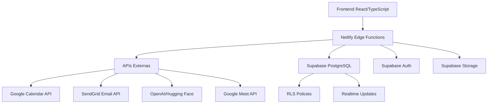

# 05. Especificações de Integrações - HumanG (MVP Supabase + Netlify)

## 1. Visão Geral das Integrações

### 1.1. Contexto do MVP
As integrações deste MVP focam em conectar o HumanG com serviços externos essenciais para operação básica, mantendo a stack Supabase + Netlify como núcleo. Priorizamos integrações que:
- **Resolvem dores imediatas** das personas Carlos e Ana
- **Aproveitam tiers gratuitos** ou freemium quando possível
- **Mantêm simplicidade arquitetural**
- **Garantem LGPD compliance** com dados de candidatos
- **Permitem fallback manual** se integração falhar

### 1.2. Princípios de Design
- **Serverless First:** Edge Functions do Netlify como proxy
- **Fail Gracefully:** Fallbacks manuais para todas as integrações críticas
- **Security by Default:** Tokens em environment variables, nunca no código
- **Observability:** Logging estruturado de todas as chamadas externas
- **Rate Limiting:** Respeitar limites de APIs terceiras desde o início

### 1.3. Relação com Arquitetura Existente


## 2. Integrações Externas Prioritárias (MVP)

### 2.1. Google Calendar API - Agendamento de Entrevistas
**Prioridade:** ALTA (Feature D1 no backlog)

#### 2.1.1. Casos de Uso
1. **Agendamento automático:** Recrutador seleciona data/hora → sistema cria evento no Google Calendar
2. **Atualização de evento:** Mudança de horário → atualiza evento existente
3. **Cancelamento:** Entrevista cancelada → remove evento do calendário
4. **Notificações:** Envio automático de convites para candidato e entrevistador

#### 2.1.2. Escopo de Permissões OAuth
```yaml
scopes_required:
  - https://www.googleapis.com/auth/calendar.events
  - https://www.googleapis.com/auth/calendar.readonly (opcional para leitura)

service_account: true (recomendado para aplicação server-to-server)
user_consent: false (não requer consentimento do usuário final)
```

#### 2.1.3. Fluxo de Autenticação
```
1. Setup inicial:
   - Criar projeto Google Cloud Console
   - Habilitar Google Calendar API
   - Criar Service Account
   - Gerar JSON credentials
   - Armazenar no Netlify Environment Variables

2. Por requisição:
   - Edge Function obtém token JWT usando credentials
   - Token válido por 1 hora (Google limita)
   - Reutilizar token enquanto válido
   - Refresh automático antes de expirar
```

#### 2.1.4. Contrato de API
```typescript
// Request para criação de evento
interface CalendarEventRequest {
  candidateName: string;
  candidateEmail: string;
  interviewerEmail: string;
  jobTitle: string;
  scheduledStart: string; // ISO 8601
  scheduledEnd: string;   // ISO 8601
  interviewType: 'screening' | 'technical' | 'cultural' | 'final';
  notes?: string;
}

// Response esperado
interface CalendarEventResponse {
  eventId: string;
  htmlLink: string;
  meetLink?: string; // Se integração com Google Meet
  status: 'confirmed' | 'tentative' | 'cancelled';
}
```

#### 2.1.5. Edge Function Specification
```
Endpoint: POST /api/calendar/create-event
Localização: netlify/edge-functions/calendar-create-event.ts

Responsabilidades:
- Validar input do frontend
- Autenticar com Google usando Service Account
- Criar evento no calendário da empresa
- Gerar link do Google Meet (opcional)
- Retornar dados do evento criado
- Logar resultado para debugging

Fallback:
- Se API falhar, retornar template de email manual
- Recrutador copia informações para criar manualmente
```

### 2.2. SendGrid API - Comunicação por Email
**Prioridade:** ALTA (Feature G1 no backlog)

#### 2.2.1. Casos de Uso
1. **Convite para entrevista:** Email ao candidato com detalhes da entrevista
2. **Status update:** Notificação de mudança no processo (avanço, reprovação)
3. **Confirmação de recebimento:** Auto-reply para candidato que enviou currículo
4. **Lembretes:** Notificação 24h antes da entrevista
5. **Feedback pós-entrevista:** Solicitação de feedback ao entrevistador

#### 2.2.2. Configuração de Autenticação
```yaml
api_key: "SG.********" # Armazenar em env var
sender_email: "nao-responda@humang.com.br"
sender_name: "HumanG - Seleção Inteligente"

templates:
  interview_invitation: "d-********"
  application_received: "d-********"
  status_update: "d-********"
  reminder_24h: "d-********"
```

#### 2.2.3. Templates Dinâmicos
```json
{
  "interview_invitation": {
    "subject": "Convite para entrevista - {{job_title}}",
    "variables": {
      "candidate_name": "Nome do Candidato",
      "job_title": "Título da Vaga",
      "company_name": "Nome da Empresa",
      "interview_date": "Data formatada",
      "interview_time": "Horário",
      "interview_type": "Tipo de Entrevista",
      "meeting_link": "Link da Reunião",
      "preparation_notes": "Notas de preparação"
    }
  }
}
```

#### 2.2.4. Edge Function Specification
```
Endpoint: POST /api/email/send
Localização: netlify/edge-functions/email-send.ts

Responsabilidades:
- Validar template e variáveis
- Chamar SendGrid API com template dinâmico
- Lidar com diferentes tipos de email
- Implementar retry lógico (3 tentativas)
- Logar delivery status

Fallback:
- Se SendGrid falhar, salvar email em drafts no Supabase
- Notificar recrutador para envio manual
- Tentar reenviar automaticamente após 1 hora
```

### 2.3. Serviços de IA - Análise de Currículos
**Prioridade:** MÉDIA-ALTA (Feature C2 no backlog)

#### 2.3.1. Opções Consideradas
```yaml
options:
  - openai:
      model: "gpt-4-turbo-preview"
      cost: ~$0.03 por análise
      features: "Análise contextual avançada"
      
  - huggingface:
      model: "distilbert-base-uncased"
      cost: "Gratuito (limites)"
      features: "Análise técnica básica"
      
  - custom:
      model: "Treinado com dados do setor"
      cost: "Alto desenvolvimento"
      features: "Específico para contratação"
```

#### 2.3.2. Escopo MVP (Simplificado)
```typescript
// Análise básica para MVP
interface ResumeAnalysis {
  skills: string[];          // Habilidades extraídas
  experience_years: number;  // Anos de experiência estimados
  job_match_score: number;   // 0-100 compatibilidade com vaga
  red_flags: string[];       // Possíveis problemas
  recommendations: string[]; // Sugestões para entrevista
}

// Processo simplificado:
// 1. Extrair texto do PDF (biblioteca cliente)
// 2. Enviar texto para serviço de IA
// 3. Parsear resposta estruturada
// 4. Salvar no Supabase
```

#### 2.3.3. Edge Function Specification
```
Endpoint: POST /api/analyze/resume
Localização: netlify/edge-functions/analyze-resume.ts

Responsabilidades:
- Receber texto extraído do currículo
- Preparar prompt estruturado
- Chamar API de IA escolhida
- Parsear resposta para schema do banco
- Calcular score técnico básico
- Salvar análise no Supabase

Fallback:
- Se IA falhar, usar análise por keywords simples
- Score baseado em match básico de termos
- Notificar recrutador para análise manual
```

## 3. Integrações Internas (Supabase)

### 3.1. Supabase Auth - Sistema de Autenticação
**Status:** Nativo (não requer integração externa)

#### 3.1.1. Configuração
```typescript
// Configuração do cliente no frontend
import { createClient } from '@supabase/supabase-js';

const supabase = createClient(
  process.env.NEXT_PUBLIC_SUPABASE_URL!,
  process.env.NEXT_PUBLIC_SUPABASE_ANON_KEY!
);

// Providers habilitados:
// 1. Email/password (obrigatório)
// 2. Magic link (opcional)
// 3. Google OAuth (futuro)
// 4. GitHub OAuth (futuro)
```

#### 3.1.2. RLS Policies e JWT Claims
```sql
-- Exemplo: Adicionar claims customizadas ao JWT
-- Via Supabase Edge Function (post-auth trigger)
CREATE OR REPLACE FUNCTION handle_auth_user()
RETURNS TRIGGER AS $$
BEGIN
  INSERT INTO public.profiles (id, company_id, role)
  VALUES (
    NEW.id,
    -- company_id baseado no domínio do email
    (SELECT id FROM companies WHERE domain = split_part(NEW.email, '@', 2)),
    'admin' -- Primeiro usuário da empresa é admin
  );
  RETURN NEW;
END;
$$ LANGUAGE plpgsql SECURITY DEFINER;
```

### 3.2. Supabase Storage - Armazenamento de Currículos
**Status:** Nativo (não requer integração externa)

#### 3.2.1. Estrutura de Buckets
```
bucket: resumes
├── {company_id}/
│   ├── {job_id}/
│   │   ├── {candidate_id}.pdf
│   │   └── {candidate_id}_extracted.txt
│   └── talent_pool/
│       └── {candidate_id}.pdf
```

#### 3.2.2. RLS Policies para Storage
```sql
-- Apenas usuários da empresa podem ver currículos da empresa
CREATE POLICY "Usuários podem ver currículos da sua empresa"
ON storage.objects FOR SELECT
USING (
  bucket_id = 'resumes'
  AND EXISTS (
    SELECT 1 FROM profiles p
    WHERE p.id = auth.uid()
    AND (storage.foldername(name))[1] = p.company_id::text
  )
);
```

### 3.3. Supabase Realtime - Notificações em Tempo Real
**Status:** Nativo para MVP básico

#### 3.3.1. Casos de Uso MVP
1. **Atualização de pipeline:** Kanban atualizado em tempo real para todos os recrutadores
2. **Novo candidato:** Notificação quando currículo é enviado
3. **Status change:** Atualização quando candidato muda de etapa
4. **Comentários em tempo real:** Chat básico sobre candidato

#### 3.3.2. Configuração
```typescript
// Subscrever para updates de candidatos
const subscription = supabase
  .channel('candidates')
  .on(
    'postgres_changes',
    { event: '*', schema: 'public', table: 'candidates' },
    (payload) => {
      // Atualizar UI em tempo real
      updateCandidateInUI(payload.new);
    }
  )
  .subscribe();
```

## 4. Automações e Webhooks

### 4.1. Webhooks Recebidos (Inbound)

#### 4.1.1. Google Calendar Webhook
```typescript
// Receber updates de eventos do calendário
Endpoint: POST /api/webhooks/calendar
Autenticação: Google Pub/Sub ou verificação de token

Eventos tratados:
- event.created → Atualizar status da entrevista para "confirmed"
- event.updated → Sincronizar mudanças de horário
- event.cancelled → Marcar entrevista como cancelada
- event.response → Registrar confirmação do candidato
```

#### 4.1.2. SendGrid Webhook
```typescript
// Receber delivery status de emails
Endpoint: POST /api/webhooks/email-events
Autenticação: SendGrid signature verification

Eventos tratados:
- delivered → Logar sucesso
- opened → Registrar visualização pelo candidato
- clicked → Registrar clique em links
- bounced → Tentar email alternativo
- spam_report → Sinalizar problema
```

### 4.2. Webhooks Enviados (Outbound)

#### 4.2.1. Para Frontend (via Supabase Realtime)
```typescript
// Atualizações em tempo real para UI
Events:
- candidate:updated → Atualizar card no kanban
- interview:scheduled → Adicionar ao calendário UI
- analysis:completed → Mostrar score no dashboard
- notification:new → Mostrar notificação push
```

#### 4.2.2. Para Administradores (via Email)
```typescript
// Notificações importantes para admins
Triggers:
- new_company_signup → Email de boas-vindas + onboarding
- subscription_expiring → Aviso 7 dias antes
- suspicious_activity → Tentativa de acesso não autorizado
- system_error → Erro crítico que requer atenção
```

## 5. Contratos de API e Protocolos

### 5.1. Edge Functions API Design

#### 5.1.1. Padrão de Response
```typescript
interface ApiResponse<T = any> {
  success: boolean;
  data?: T;
  error?: {
    code: string;
    message: string;
    details?: any;
  };
  meta?: {
    requestId: string;
    timestamp: string;
    durationMs: number;
  };
}

// Exemplo de uso em todas as Edge Functions
export default async function handler(req: Request) {
  const startTime = Date.now();
  const requestId = crypto.randomUUID();
  
  try {
    // Processamento
    const result = await processRequest(req);
    
    return new Response(
      JSON.stringify({
        success: true,
        data: result,
        meta: {
          requestId,
          timestamp: new Date().toISOString(),
          durationMs: Date.now() - startTime
        }
      }),
      { status: 200, headers: { 'Content-Type': 'application/json' } }
    );
  } catch (error) {
    // Tratamento padronizado de erro
    return handleError(error, requestId, startTime);
  }
}
```

#### 5.1.2. Rate Limiting
```typescript
// Implementação básica em Edge Functions
const RATE_LIMIT = {
  windowMs: 15 * 60 * 1000, // 15 minutos
  maxRequests: 100 // por IP
};

const rateLimitStore = new Map<string, { count: number, resetTime: number }>();

function checkRateLimit(ip: string): boolean {
  const now = Date.now();
  const record = rateLimitStore.get(ip);
  
  if (!record || now > record.resetTime) {
    rateLimitStore.set(ip, { count: 1, resetTime: now + RATE_LIMIT.windowMs });
    return true;
  }
  
  if (record.count >= RATE_LIMIT.maxRequests) {
    return false;
  }
  
  record.count++;
  return true;
}
```

### 5.2. Supabase Client Contract

#### 5.2.1. Tipos TypeScript Gerados
```bash
# Gerar tipos automaticamente do schema
npx supabase gen types typescript --project-id your-project-id > src/types/database.ts
```

#### 5.2.2. Query Patterns Padronizados
```typescript
// Exemplo: Buscar candidatos com joins otimizados
async function getCandidatesWithDetails(jobId: string) {
  return supabase
    .from('candidates')
    .select(`
      *,
      job:jobs(title, requirements),
      analyses(*),
      interviews(*)
    `)
    .eq('job_id', jobId)
    .order('score_total', { ascending: false });
}

// Exemplo: Inserir com tratamento de erro
async function safeInsert(table: string, data: any) {
  const { data: result, error } = await supabase
    .from(table)
    .insert(data)
    .select()
    .single();
    
  if (error) {
    // Log estruturado do erro
    console.error(`Error inserting into ${table}:`, {
      error,
      data,
      timestamp: new Date().toISOString()
    });
    throw new DatabaseError(error.message, error.code);
  }
  
  return result;
}
```

## 6. Segurança e Compliance

### 6.1. Gestão de Secrets
```yaml
# Netlify Environment Variables (nunca commit no código)
required_env_vars:
  - SUPABASE_URL
  - SUPABASE_ANON_KEY
  - SUPABASE_SERVICE_ROLE_KEY (apenas server-side)
  - GOOGLE_SERVICE_ACCOUNT_JSON
  - SENDGRID_API_KEY
  - OPENAI_API_KEY (opcional)
  
# Níveis de acesso:
# - Build-time: Disponíveis durante build
# - Runtime: Disponíveis em Edge Functions
# - Browser: Apenas com prefixo NEXT_PUBLIC_
```

### 6.2. LGPD Compliance para Integrações

#### 6.2.1. Consentimento Explícito
```sql
-- Campos obrigatórios na tabela candidates
consent_given: BOOLEAN DEFAULT false
consent_given_at: TIMESTAMP
consent_purpose: TEXT -- "processamento", "armazenamento", "comunicação"
consent_expires_at: TIMESTAMP -- 2 anos por padrão
```

#### 6.2.2. Anonimização em APIs Externas
```typescript
// Antes de enviar para serviços de IA
function anonymizeResumeData(text: string, candidateId: string): string {
  // Remover informações pessoais identificáveis
  const anonymized = text
    .replace(/[A-Z][a-z]+ [A-Z][a-z]+/g, '[NOME]') // Nomes
    .replace(/\b\d{3}\.\d{3}\.\d{3}-\d{2}\b/g, '[CPF]') // CPF
    .replace(/\b\d{5}-\d{3}\b/g, '[CEP]') // CEP
    .replace(/\+\d{2}\s?\(\d{2}\)\s?\d{4,5}-\d{4}/g, '[TELEFONE]'); // Telefone
  
  // Adicionar hash para tracking interno apenas
  return `[CANDIDATE:${candidateId}]\n${anonymized}`;
}
```

### 6.3. Auditoria e Logging
```typescript
// Log estruturado para todas as integrações
interface IntegrationLog {
  integration: 'google_calendar' | 'sendgrid' | 'openai';
  action: string;
  status: 'success' | 'error' | 'retry';
  durationMs: number;
  requestId: string;
  userId?: string;
  companyId?: string;
  details?: any;
  timestamp: string;
}

// Armazenar logs no Supabase para análise
const logsTable = supabase.from('integration_logs');
```

## 7. Resiliência e Tratamento de Erros

### 7.1. Estratégias de Retry
```typescript
// Implementação genérica de retry com backoff
async function withRetry<T>(
  operation: () => Promise<T>,
  maxRetries = 3,
  baseDelay = 1000
): Promise<T> {
  let lastError: Error;
  
  for (let attempt = 1; attempt <= maxRetries; attempt++) {
    try {
      return await operation();
    } catch (error) {
      lastError = error as Error;
      
      // Não retry para erros de cliente (4xx)
      if (error.status >= 400 && error.status < 500) {
        break;
      }
      
      // Backoff exponencial
      if (attempt < maxRetries) {
        const delay = baseDelay * Math.pow(2, attempt - 1);
        await new Promise(resolve => setTimeout(resolve, delay));
      }
    }
  }
  
  throw lastError!;
}
```

### 7.2. Circuit Breaker Pattern
```typescript
// Implementação básica de circuit breaker
class CircuitBreaker {
  private state: 'closed' | 'open' | 'half-open' = 'closed';
  private failureCount = 0;
  private readonly threshold = 5;
  private readonly resetTimeout = 60000; // 1 minuto
  
  async execute<T>(operation: () => Promise<T>): Promise<T> {
    if (this.state === 'open') {
      throw new Error('Circuit breaker is open');
    }
    
    try {
      const result = await operation();
      this.onSuccess();
      return result;
    } catch (error) {
      this.onFailure();
      throw error;
    }
  }
  
  private onSuccess() {
    this.failureCount = 0;
    this.state = 'closed';
  }
  
  private onFailure() {
    this.failureCount++;
    
    if (this.failureCount >= this.threshold) {
      this.state = 'open';
      setTimeout(() => {
        this.state = 'half-open';
      }, this.resetTimeout);
    }
  }
}
```

### 7.3. Fallbacks para Cada Integração

#### 7.3.1. Google Calendar Fallback
```typescript
// Se API falhar, criar template para criação manual
function createManualCalendarTemplate(eventData: CalendarEventRequest): string {
  return `
Título: Entrevista - ${eventData.candidateName} para ${eventData.jobTitle}
Data: ${new Date(eventData.scheduledStart).toLocaleDateString('pt-BR')}
Horário: ${new Date(eventData.scheduledStart).toLocaleTimeString('pt-BR')} - ${new Date(eventData.scheduledEnd).toLocaleTimeString('pt-BR')}
Participantes:
- Candidato: ${eventData.candidateName} (${eventData.candidateEmail})
- Entrevistador: ${eventData.interviewerEmail}
Tipo: ${eventData.interviewType}
Notas: ${eventData.notes || 'Nenhuma'}

Por favor, crie este evento manualmente no Google Calendar.
  `.trim();
}
```

#### 7.3.2. SendGrid Fallback
```typescript
// Salvar email em drafts no Supabase
async function saveEmailAsDraft(template: string, data: any): Promise<void> {
  await supabase.from('email_drafts').insert({
    template,
    data,
    status: 'pending',
    created_at: new Date().toISOString(),
    retry_count: 0
  });
  
  // Notificar admin via Supabase Realtime
  await supabase.channel('admin-notifications').send({
    type: 'email_fallback',
    payload: { template, data }
  });
}
```

## 8. Monitoramento e Observabilidade

### 8.1. Métricas Chave por Integração
```yaml
google_calendar:
  - events_created_total
  - events_created_success_rate
  - average_latency_ms
  - failure_reasons (rate_limit, auth_error, network)
  
sendgrid:
  - emails_sent_total
  - delivery_rate
  - open_rate
  - click_rate
  - bounce_rate
  
openai:
  - analyses_completed_total
  - average_processing_time_ms
  - token_usage_total
  - cost_per_analysis_avg
```

### 8.2. Alertas Configurados
```typescript
// Alertas via Webhook (futuro: integração com Discord/Slack)
const ALERT_THRESHOLDS = {
  google_calendar: {
    error_rate: 0.1, // 10% de erro
    latency_p95: 5000, // 5 segundos
  },
  sendgrid: {
    bounce_rate: 0.05, // 5% de bounce
    delivery_rate: 0.95, // 95% de entrega
  }
};

// Função para verificar e alertar
async function checkAndAlert(integration: string, metrics: any) {
  const thresholds = ALERT_THRESHOLDS[integration];
  let alerts: string[] = [];
  
  if (metrics.error_rate > thresholds.error_rate) {
    alerts.push(`High error rate: ${metrics.error_rate}`);
  }
  
  if (alerts.length > 0) {
    await sendAlertToAdmins(integration, alerts);
  }
}
```

## 9. Plano de Implementação

### 9.1. Fase 1: Setup Básico (Sprint 0)
- [x] Configurar projeto Supabase
- [x] Configurar projeto Netlify
- [ ] Criar Service Account Google
- [ ] Criar conta SendGrid (tier free)
- [ ] Configurar environment variables no Netlify
- [ ] Implementar logging básico

### 9.2. Fase 2: Integrações Core (Sprint 1-2)
- [ ] Edge Function: Envio de emails (SendGrid)
- [ ] Edge Function: Criação de eventos (Google Calendar)
- [ ] Setup de templates de email
- [ ] Implementar fallbacks básicos
- [ ] Configurar RLS para integrações

### 9.3. Fase 3: Análise Inteligente (Sprint 3-4)
- [ ] Avaliar opções de IA (OpenAI vs Hugging Face)
- [ ] Implementar análise básica por keywords (fallback)
- [ ] Edge Function: Análise de currículo
- [ ] Setup de rate limiting para APIs de IA
- [ ] Implementar anonimização para LGPD

### 9.4. Fase 4: Otimização e Scale (Sprint 5+)
- [ ] Implementar circuit breaker pattern
- [ ] Adicionar cache estratégico
- [ ] Setup de monitoramento detalhado
- [ ] Otimizar custos de APIs
- [ ] Planejar upgrade de tiers quando necessário

## 10. Custos Estimados (Tier Gratuito)

### 10.1. Google Calendar API
- **Tier:** Gratuito (parte do Google Cloud)
- **Limites:** 1 milhão de requests por mês
- **Custo MVP:** $0
- **Quando escalar:** > 100 empresas ativas

### 10.2. SendGrid
- **Tier:** Free (100 emails/dia)
- **Limites:** 100 emails por dia, 2,000 contatos
- **Custo MVP:** $0
- **Quando escalar:** > 30 empresas ativas

### 10.3. OpenAI/Hugging Face
- **OpenAI:** $0.03 por análise (estimado)
- **Hugging Face:** Gratuito com limites
- **Custo MVP:** $0-50/mês (dependendo do volume)
- **Recomendação:** Começar com Hugging Face, migrar para OpenAI se necessário

### 10.4. Supabase + Netlify
- **Supabase:** $0 (500MB DB, 2GB bandwidth)
- **Netlify:** $0 (300 build minutes, 100GB bandwidth)
- **Custo MVP:** $0
- **Quando escalar:** > 1,000 candidatos/mês

## 11. Riscos e Mitigações

### 11.1. Vendor Lock-in
- **Risco:** Dependência de APIs específicas
- **Mitigação:** 
  - Abstrair chamadas em services layers
  - Manter fallbacks manuais
  - Documentar processos de migração

### 11.2. Rate Limiting
- **Risco:** Atingir limites de APIs gratuitas
- **Mitigação:**
  - Implementar cache agressivo
  - Monitorar uso continuamente
  - Ter plano de upgrade definido

### 11.3. LGPD Compliance
- **Risco:** Dados de candidatos em APIs externas
- **Mitigação:**
  - Anonimizar antes de enviar
  - Obter consentimento explícito
  - Escolher providers com data centers no Brasil
  - Ter procedimento de exclusão

### 11.4. Single Point of Failure
- **Risco:** API externa cair afeta sistema inteiro
- **Mitigação:**
  - Circuit breaker pattern
  - Fallbacks manuais
  - Multi-provider strategy (futuro)

## 12. Próximos Passos

### 12.1. Imediatos
1. Criar contas nos serviços (Google Cloud, SendGrid)
2. Configurar environment variables no Netlify
3. Implementar primeira Edge Function (email de boas-vindas)
4. Testar fluxo completo de fallback

### 12.2. Curto Prazo (2 semanas)
1. Implementar todas as Edge Functions básicas
2. Configurar logging estruturado
3. Testar integrações em ambiente staging
4. Documentar procedures para fallback manual

### 12.3. Médio Prazo (1-2 meses)
1. Implementar análise de IA básica
2. Adicionar circuit breaker pattern
3. Configurar alertas básicos
4. Otimizar performance e custos

---

**Status:** Especificação completa para MVP com Supabase + Netlify  
**Próximo passo:** Implementar Edge Functions conforme especificado  
**Dependências:** Configuração de contas externas e environment variables  

*Documento gerado pelo Integrations Engineer - ET-06*  
*Base: .docs/03-arquitetura-sistema.md, .specs/04-modelagem-de-dados.md, .plans/01-backlog.md, .docs/01-visao-produto.md*  
*Foco: Integrações práticas para MVP com resiliência e LGPD*