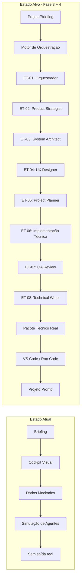

# Análise Completa do Módulo Sala Dev + Plano de Ativação

> **Data:** 31/05/2026
> **Analista:** Denise Bogado (Guardiã Sala Dev)
> **Status:** Diagnóstico concluído

---

## Sumário Executivo

O módulo **Sala Dev** está **extremamente avançado em termos de arquitetura, planejamento e código**, mas **NÃO está pronto** para "colocar um projeto numa ponta e sair pronto na outra". Ele é hoje um **cockpit visual de governança e auditoria** com dados mockados/simulados, não um **executor real de pipeline de desenvolvimento**.

---

## 1. O que JÁ EXISTE (e funciona)

### 1.1 Infraestrutura do Módulo Plugável ✅
| Componente | Status | Arquivo |
|---|---|---|
| Manifest do módulo | ✅ Pronto | [`manifest.ts`](../00_sagb/src/modules/sala-dev/manifest.ts) |
| Rotas | ✅ Pronto | [`routes.tsx`](../00_sagb/src/modules/sala-dev/routes.tsx) |
| Entrypoint | ✅ Pronto | [`index.ts`](../00_sagb/src/modules/sala-dev/index.ts) |
| Governança | ✅ Completa | [`changelog.md`](../00_sagb/src/modules/sala-dev/changelog.md), [`decisions.md`](../00_sagb/src/modules/sala-dev/decisions.md), [`plano_modulo.md`](../00_sagb/src/modules/sala-dev/plano_modulo.md) |
| Persona do agente | ✅ Pronto | [`persona.md`](../00_sagb/src/modules/sala-dev/agent/persona.md) |

### 1.2 Domínio e Tipos ✅
Todas as entidades de domínio estão modeladas em [`salaDev.domain.ts`](../00_sagb/src/modules/sala-dev/types/salaDev.domain.ts):
- `DevRunEntity`, `MacroLayerEntity`, `HandoffEntity`, `GateEntity`
- `ArtifactEntity`, `ArtifactVersionEntity`, `RunAgentEntity`
- `AgentCatalogEntity`, `RecommendedAgentEntity`
- `RunLogEntity`, `RunDecisionEntity`, `ChecklistItemEntity`
- `GateChecklistEntity`, `FinalAuditEntity`, `RunRiskEntity`
- Estados padronizados em [`salaDev.status.ts`](../00_sagb/src/modules/sala-dev/types/salaDev.status.ts)

### 1.3 Interface Visual (3 Painéis) ✅
| Painel | Componente | Função |
|---|---|---|
| Centro de Comando | [`CommandCenterPanel.tsx`](../00_sagb/src/modules/sala-dev/components/CommandCenterPanel.tsx) | Run ativa, macrocamada atual, riscos, gate pendente |
| Esteira e Fluxo | [`AgentsFlowPanel.tsx`](../00_sagb/src/modules/sala-dev/components/AgentsFlowPanel.tsx) | 6 macrocamadas, handoffs, gates, agentes |
| Artefatos e Auditoria | [`WorkspacePanel.tsx`](../00_sagb/src/modules/sala-dev/components/WorkspacePanel.tsx) | Artefatos, versões, logs, decisões, auditoria |

### 1.4 UX Core de Entrada ✅
- [`NewProjectEntryPanel.tsx`](../00_sagb/src/modules/sala-dev/components/NewProjectEntryPanel.tsx) — Jornada: Ideia → Briefing → Esteira
- Ação "Novo Projeto" no header
- Reset controlado do estado de entrada

### 1.5 Camada de Persistência ✅ (mas em mock)
| Camada | Arquivo | Status |
|---|---|---|
| Contrato do repositório | [`salaDevRepository.ts`](../00_sagb/src/modules/sala-dev/services/salaDevRepository.ts) | ✅ `ISalaDevRepository` definido |
| Mock repository | [`salaDevRepository.ts`](../00_sagb/src/modules/sala-dev/services/salaDevRepository.ts) | ✅ `SalaDevMockRepository` ativo |
| Supabase repository | [`salaDevSupabaseRepository.ts`](../00_sagb/src/modules/sala-dev/services/salaDevSupabaseRepository.ts) | ✅ `SalaDevSupabaseRepository` implementado (326 linhas) |
| Mapper | [`salaDevSupabaseMapper.ts`](../00_sagb/src/modules/sala-dev/services/salaDevSupabaseMapper.ts) | ✅ Conversão domínio ↔ persistência |
| Modelagem de dados | [`salaDev.persistence.ts`](../00_sagb/src/modules/sala-dev/types/salaDev.persistence.ts) | ✅ Todas as tabelas modeladas |

**Problema:** O provider PADRÃO é `mock`. Para ativar Supabase, precisa setar `VITE_SALA_DEV_DATA_PROVIDER=supabase` + configurar `VITE_SUPABASE_URL` e `VITE_SUPABASE_ANON_KEY`.

### 1.6 Hook Central ✅
[`useSalaDevRun.ts`](../00_sagb/src/modules/sala-dev/hooks/useSalaDevRun.ts) (289 linhas) — Gerencia:
- Estado completo da run (mock/supabase via adapter)
- 6 macrocamadas, handoffs, gates
- Agentes (convocados, disponíveis, recomendados)
- Artefatos, versões, logs, decisões, checklists, auditoria
- UX Core de entrada (formulário, briefing, pipelineStarted)
- Exportação técnica
- Ponte técnica VS Code/Roo

### 1.7 Serviços de Integração Futura ✅
| Serviço | Arquivo | Função |
|---|---|---|
| Catálogo de agentes | [`salaDevAgentCatalogAdapter.ts`](../00_sagb/src/modules/sala-dev/services/salaDevAgentCatalogAdapter.ts) | Adapta agentes oficiais do SagB para o domínio da Sala Dev |
| Exportação técnica | [`salaDevTechnicalExportService.ts`](../00_sagb/src/modules/sala-dev/services/salaDevTechnicalExportService.ts) | Gera pacote técnico auditável |
| Ponte VS Code/Roo | [`salaDevTechnicalBridgeService.ts`](../00_sagb/src/modules/sala-dev/services/salaDevTechnicalBridgeService.ts) | Contrato deny-by-default, sem execução remota |

---

## 2. O que NÃO EXISTE (gaps críticos)

### 🚨 GAP 1 — Ausência de Motor de Execução de Agentes
A metodologia multiagentes definida em [`AGENTS.md`](../00_sagb/src/modules/sala-dev/governance/metodologia_multiagentes/AGENTS.md) (11 agentes: Orquestrador, Product Strategist, System Architect, UX Designer, Project Planner, Frontend/Backend/DB/Integrations Engineers, QA Reviewer, Technical Writer) **NÃO está integrada ao módulo Sala Dev**.

- Os 11 agentes existem como documentação
- O módulo Sala Dev tem agentes mockados (`MOCK_DEV_AGENTS` com 14 agentes)
- **Não há um orquestrador real** que pegue um projeto, execute os agentes em sequência (ET-01 a ET-08) e gere saídas reais

### 🚨 GAP 2 — Ausência de Execução Técnica Real
A Onda 3C (ponte VS Code/Roo) foi feita por segurança com **deny-by-default e execução remota desabilitada**. Não há:
- Criação real de arquivos de projeto
- Execução real de comandos (npm, git, etc.)
- Geração real de código
- Deploy real

### 🚨 GAP 3 — Provider Supabase em Mock como Padrão
O `SalaDevSupabaseRepository` existe e está implementado (326 linhas), mas:
- O adapter usa `mock` como provider padrão
- Só troca para Supabase se `VITE_SALA_DEV_DATA_PROVIDER=supabase` + env configurado
- Dados reais de run NÃO estão sendo persistidos

### 🚨 GAP 4 — Ausência de Pipeline de Execução Contínua
Não há um mecanismo que:
1. Receba um projeto (briefing)
2. Execute a esteira de agentes automaticamente
3. Gere artefatos, código, documentação
4. Entregue o resultado final

O que existe hoje é:
- Interface visual que mostra SIMULAÇÃO de execução
- Dados mockados que não refletem execução real
- Ações simuladas (mudar status de handoff/gate) sem impacto real

### 🚨 GAP 5 — Sidebar Plugável não Implementada
Conforme o padrão definido em [`padrao_sidebar_plugavel_modules.md`](../plans/padrao_sidebar_plugavel_modules.md), o módulo Sala Dev **não tem sidebar própria**. Ele precisa:
- Ocultar a sidebar global do SagB
- Ter sidebar própria com navegação interna
- Botão "Voltar ao SagB"

Atualmente o módulo usa um header simples (`DevRoomView.tsx:50`) com botão de voltar, sem sidebar própria.

### 🚨 GAP 6 — Metodologia Multiagentes Separada
A pasta [`governance/metodologia_multiagentes/`](../00_sagb/src/modules/sala-dev/governance/metodologia_multiagentes/) contém:
- `PROJECT_BOOTSTRAP.md` — Define como um agente deve iniciar e executar o projeto
- `AGENTS.md` — 11 agentes com papéis definidos
- `CONTEXT.md` — Contexto do projeto (PROJETO_HUMANG, stack a definir)

Isso é um **framework de orquestração manual** (um agente lê e segue as instruções), não um **sistema automatizado integrado ao módulo Sala Dev**.

---

## 3. Diagnóstico — "Colocar projeto numa ponta e sair pronto na outra?"

### Resposta Curta: **NÃO**.

### Resposta Longa:

| Aspecto | Nota | Explicação |
|---|---|---|
| Interface visual | 9/10 | Painéis lindos, UX de entrada refinada, mas sem sidebar própria |
| Modelagem de dados | 9/10 | Domínio completo, tipado, com mappers e persistência modelada |
| Arquitetura | 9/10 | Repository pattern, adapter, injeção de dependência, fallback mock |
| Execução de agentes | 1/10 | Não existe motor de execução; só simulação visual |
| Geração de código | 0/10 | Não há pipeline que gere código/output real |
| Integração VS Code/Roo | 2/10 | Contrato existe, mas desabilitado por segurança |
| Persistência real | 3/10 | Supabase implementado, mas desligado (padrão mock) |
| Orquestração automática | 0/10 | Não há execução automática da esteira |
| Pipeline ponta-a-ponta | 0/10 | Não existe fluxo que transforme briefing em código entregue |

**Conclusão:** O módulo Sala Dev é um **cockpit de governança e auditoria** excelente, mas **NÃO é um executor de pipelines**. Para chegar lá, precisa de uma **Fase 3 completa** (e possivelmente uma Fase 4) focada em:

1. Motor de execução de agentes
2. Pipeline de transformação briefing → código
3. Ativação segura da ponte VS Code/Roo
4. Hardening e testes

---

## 4. Plano de Ativação — Roadmap para "Projeto entra, projeto sai"

### Fase 3 — Hardening e Preparação para Execução Real

#### Onda 3.1 — Sidebar Plugável do Módulo Sala Dev
**Objetivo:** Adequar o módulo ao padrão de sidebar plugável do SagB.

**Tarefas:**
1. Criar `layout/SalaDevLayout.tsx` com sidebar própria
2. Adicionar `tabId` do módulo na condição `hideSidebar` do `App.tsx`
3. Itens de navegação: Home, Runs, Workflows, Catálogos, Configurações
4. Botão "Voltar ao SagB" no rodapé
5. Registro em `decisions.md`

**Critério de aceitação:** Sidebar global some quando entra na Sala Dev; sidebar própria aparece com navegação interna.

---

#### Onda 3.2 — Ativar Provider Supabase como Padrão (com fallback)
**Objetivo:** Fazer a Sala Dev persistir dados reais no Supabase, mantendo mock como fallback de segurança.

**Tarefas:**
1. Mudar provider padrão para `supabase` (com fallback automático para mock)
2. Garantir que `VITE_SALA_DEV_DATA_PROVIDER` default seja `supabase`
3. Validar CRUD completo de runs, macroLayers, handoffs, gates
4. Testar fallback mock em falha de conexão

**Critério de aceitação:** Ao criar um projeto na Sala Dev, os dados persistem no Supabase. Se Supabase falhar, fallback para mock sem quebra de UX.

---

#### Onda 3.3 — Motor de Orquestração Multiagentes
**Objetivo:** Criar o motor que executa os 11 agentes da metodologia multiagentes de forma automatizada.

**Tarefas:**
1. Criar `services/salaDevOrchestratorEngine.ts` — Motor de execução sequencial
2. Implementar estados da run: `pending` → `orchestrating` → `strategizing` → `architecting` → `ux_designing` → `planning` → `building` → `reviewing` → `documenting` → `completed`
3. Integrar com a metodologia multiagentes (ET-01 a ET-08)
4. Cada etapa gera artefatos reais (documentos .md) em uma estrutura de pastas
5. Handoffs e gates passam a ser reais (baseados na execução real)
6. Logs e decisões passam a ser reais

**Critério de aceitação:** Ao clicar "Iniciar esteira", os agentes executam em sequência, gerando artefatos reais (documentos, especificações, planos) na estrutura de pastas do projeto alvo.

---

#### Onda 3.4 — Pipeline de Exportação Técnica Real
**Objetivo:** Transformar a saída da esteira em um pacote técnico que possa ser executado pelo VS Code/Roo Code.

**Tarefas:**
1. Evoluir `TechnicalExecutionPackage` para incluir comandos executáveis
2. Gerar estrutura de pastas do projeto alvo
3. Criar arquivos de entrada para o VS Code/Roo (briefing técnico, tarefas)
4. Manter segurança: não executar comandos automaticamente

**Critério de aceitação:** Ao final da execução da esteira, um pacote técnico completo é gerado com instruções, especificações e comandos para o VS Code/Roo executar o build do projeto.

---

#### Onda 3.5 — Testes e Hardening
**Objetivo:** Garantir robustez operacional antes de qualquer integração ativa.

**Tarefas:**
1. Testes de contrato do repositório (mock → Supabase)
2. Validação de trilha auditável completa
3. Testes de fallback mock em todos os cenários
4. Validação de segurança da ponte técnica
5. Testes de UI dos 3 painéis + UX Core

**Critério de aceitação:** Suite de testes cobre contratos, fallback, segurança e UI. Sem regressão no módulo ou no ecossistema SagB.

---

### Fase 4 — Execução Real (Futuro)

#### Onda 4.1 — Ativação Controlada da Ponte VS Code/Roo
**Objetivo:** Permitir que a Sala Dev dispare execuções controladas no VS Code/Roo Code.

**Tarefas:**
1. Revisar capability matrix (manter deny-by-default para segurança)
2. Implementar handshake real com VS Code/Roo
3. Permitir execução de comandos aprovados (criação de arquivos, npm install, git)
4. Manter bloqueio para comandos destrutivos (deploy, push, rm)

**Critério de aceitação:** Sala Dev pode criar projeto no VS Code, gerar arquivos e executar comandos seguros com aprovação humana.

---

#### Onda 4.2 — Pipeline Ponta-a-Ponta
**Objetivo:** Fechar o ciclo completo: briefing → análise → arquitetura → código → documentação → deploy.

**Tarefas:**
1. Integrar execução de Frontend Engineer, Backend Engineer, DB Engineer
2. Gerar código real (não apenas documentação)
3. Executar build e testes
4. Preparar pacote para deploy (sem executar deploy automático)

**Critério de aceitação:** Um projeto sai da Sala Dev com código real, documentação, testes e pronto para deploy.

---

## 5. Diagrama do Estado Atual vs Estado Alvo

---

## 6. Matriz de Esforço vs Impacto

| Item | Esforço | Impacto | Prioridade |
|---|---|---|---|
| Sidebar plugável (3.1) | 🟢 Baixo | 🟡 Médio | Alta |
| Ativar Supabase (3.2) | 🟢 Baixo | 🟢 Alto | **Crítica** |
| Motor de orquestração (3.3) | 🔴 Alto | 🟢 Alto | **Crítica** |
| Pipeline de exportação (3.4) | 🟡 Médio | 🟢 Alto | Alta |
| Testes e hardening (3.5) | 🟡 Médio | 🟢 Alto | Alta |
| Ponte VS Code/Roo (4.1) | 🔴 Alto | 🟢 Alto | Média (futuro) |
| Pipeline ponta-a-ponta (4.2) | 🔴 Alto | 🟢 Alto | Baixa (futuro) |

---

## 7. Recomendação de Ordem de Execução

### Imediato (Fase 3 - Onda 1)
1. **Sidebar plugável** — Baixo esforço, desbloqueia padrão arquitetural
2. **Ativar Supabase como provider padrão** — Já está implementado, só precisa trocar a flag

### Curto Prazo (Fase 3 - Onda 2)
3. **Motor de orquestração multiagentes** — O coração do sistema. Sem isso, a Sala Dev não executa nada de verdade.
4. **Pipeline de exportação técnica real** — Para gerar saída concreta da execução

### Médio Prazo (Fase 3 - Onda 3)
5. **Testes e hardening** — Garantir que tudo funciona sem quebrar o ecossistema

### Longo Prazo (Fase 4)
6. **Ponte VS Code/Roo ativa** — Para execução técnica real
7. **Pipeline ponta-a-ponta** — Para sair código pronto

---

## 8. Riscos e Mitigações

| Risco | Probabilidade | Impacto | Mitigação |
|---|---|---|---|
| Quebrar módulo existente ao mudar sidebar | Baixa | Alto | Manter header como fallback; testar em paralelo |
| Supabase connection falhar em produção | Média | Alto | Fallback mock obrigatório; já implementado |
| Motor de orquestração gerar artefatos inconsistentes | Alta | Médio | Implementar validação por etapa (gates reais) |
| Ponte VS Code/Roo executar comandos destrutivos | Baixa | Crítico | Deny-by-default + aprovação humana obrigatória |
| Usuário achar que está tudo pronto e não está | Alta | Alto | **Comunicar claramente o status atual** |

---

## 9. Conclusão

O módulo Sala Dev é uma **base arquitetural excelente** e **extremamente bem planejada**, mas falta o **coração do sistema**: o motor de execução que transforma briefing em resultado concreto.

**O que você tem hoje:**
- Um painéis de controle de F1 (cockpit visual)
- Dados simulados (mock)
- Arquitetura pronta para escalar
- Contratos de segurança bem definidos

**O que precisa para "projeto entrar e sair pronto":**
- Motor de orquestração multiagentes (Fase 3, Onda 3.3)
- Ativação da persistência real (Fase 3, Onda 3.2)
- Pipeline de exportação técnica (Fase 3, Onda 3.4)
- Ponte VS Code/Roo ativa (Fase 4)

**Estimativa de maturidade atual:** ~40% do caminho para ter um pipeline funcional ponta-a-ponta.
**Estimativa de maturidade da arquitetura:** ~90% — a base está quase toda pronta, falta o motor.

---

*Documento gerado por Denise Bogado, Guardiã da Sala Dev*
