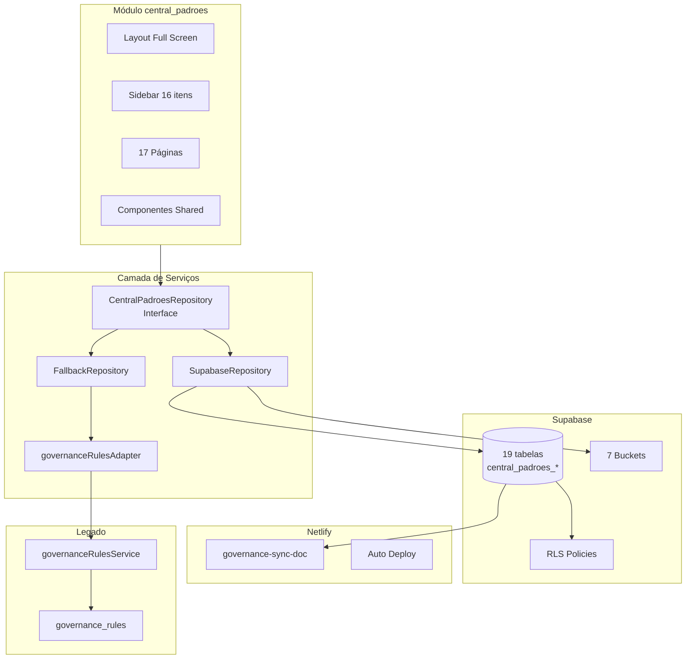
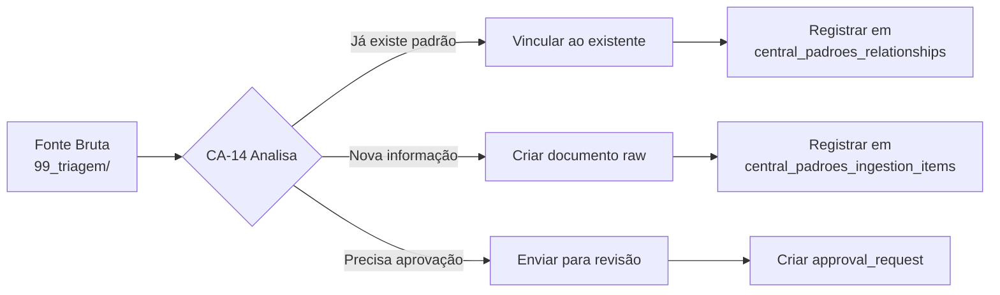
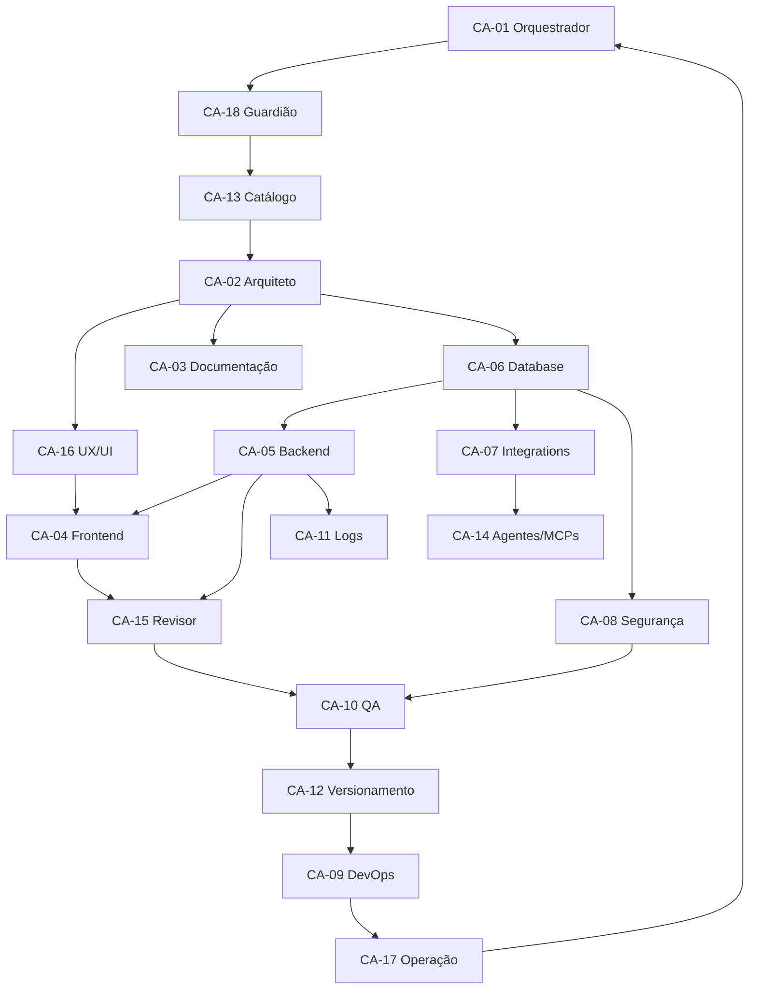

# Central de Padrões — Plano Executivo por 18 Agentes da Esteira Sala Dev

> **Baseado em:**
> - [`Plano Diretor de Implantação ET 01 a ET 08`](../../central_padroes/docs/07_validacoes/Plano%20Diretor%20de%20Implanta%C3%A7%C3%A3o%20da%20Central%20de%20Padr%C3%B5es%20V1%20%E2%80%94%20ET%2001%20a%20ET%2008) (2.667 linhas)
> - [`Auditoria Arquitetural 31-05-2026`](../../central_padroes/docs/sagb-central-padroes-auditoria-arquitetural-31-05-2026.md)
> - [`Documento dos 18 Agentes`](../docs/Sala%20Dev%20%E2%80%94%20Estrutura%20Visual%20dos%2018%20Agentes%20por%20Etapa%20da%20Esteira)
>
> **Premissa:** Supabase, Netlify, GitHub Actions já operacionais. Agentes usam de forma autônoma.
>
> **Formato de uso:** Cássio (ou executor) lê a seção de cada agente, executa, valida, e avança.

---

## Índice

- [0. Overview — Mapa de Execução](#0-overview--mapa-de-execução)
- [Bloco 1 — Entrada e Organização](#bloco-1--entrada-e-organização)
  - [CA-01 Orquestrador Técnico](#ca-01--orquestrador-técnico)
  - [CA-18 Guardião de Reaproveitamento](#ca-18--guardião-de-reaproveitamento-técnico)
  - [CA-13 Catálogo Técnico](#ca-13--catálogo-técnico)
- [Bloco 2 — Arquitetura e Documentação](#bloco-2--arquitetura-e-documentação)
  - [CA-02 Arquiteto de Sistemas](#ca-02--arquiteto-de-sistemas)
  - [CA-16 UX/UI Técnico](#ca-16--uxui-técnico)
  - [CA-03 Documentação Técnica](#ca-03--documentação-técnica)
- [Bloco 3 — Construção Técnica](#bloco-3--construção-técnica)
  - [CA-06 Database Engineer](#ca-06--supabase-database-engineer)
  - [CA-05 Backend Engineer](#ca-05--back-end-engineer)
  - [CA-04 Frontend Engineer](#ca-04--front-end-engineer)
  - [CA-07 API & Integrations Engineer](#ca-07--api--integrations-engineer)
  - [CA-14 Agentes/MCPs/Automações](#ca-14--agentes-mcps-e-automações)
- [Bloco 4 — Segurança e Qualidade](#bloco-4--segurança-e-qualidade)
  - [CA-08 Segurança Técnica](#ca-08--segurança-técnica)
  - [CA-15 Revisor de Código](#ca-15--revisor-de-código)
  - [CA-10 QA/Testes e Validação](#ca-10--qa-testes-e-validação)
  - [CA-11 Logs e Observabilidade](#ca-11--logs-e-observabilidade)
- [Bloco 5 — Deploy e Operação](#bloco-5--deploy-e-operação)
  - [CA-12 Versionamento Técnico](#ca-12--versionamento-técnico)
  - [CA-09 DevOps/Deploy Engineer](#ca-09--devops-deploy-engineer)
  - [CA-17 Operação e Runbooks](#ca-17--operação-e-runbooks)
- [6. Auditoria Final](#6-auditoria-final)
- [Apêndices](#apêndices)

---

## 0. Overview — Mapa de Execução

### Matriz resumo: Agente → ET → O que faz na Central de Padrões

| Bloco | Agente | ET | Entregável principal | Arquivos |
|---|---|---|---|---|
| **1** | CA-01 Orquestrador | Preliminar | Plano de run + coordenação | `.plans/`, `.logs/` |
| **1** | CA-18 Guardião | Preliminar | Parecer de reaproveitamento | `.docs/parecer-reaproveitamento.md` |
| **1** | CA-13 Catálogo | Preliminar | Inventário de ativos existentes | `.docs/catalogo-ativos.md` |
| **2** | CA-02 Arquiteto | ET-03 | Schema, estrutura de pastas, decisões | `.docs/03-arquitetura.md`, `.specs/` |
| **2** | CA-16 UX/UI | ET-04 | Fluxo de 17 páginas, estados, componentes | `.docs/04-fluxos.md`, `.specs/03-mapa-telas.md` |
| **2** | CA-03 Documentação | ET-03/08 | ADRs, changelog, README | `DECISIONS.md`, `CHANGELOG.md` |
| **3** | CA-06 Database | ET-01 | Migration 19 tabelas + seeds | `supabase/migrations/` |
| **3** | CA-05 Backend | ET-01/02 | Services, Repository Pattern, hooks | `services/`, `hooks/` |
| **3** | CA-04 Frontend | ET-01/02 | 17 páginas, sidebar, componentes | `pages/`, `layout/`, `components/` |
| **3** | CA-07 Integrations | ET-01/06 | Buckets, webhooks, sync function | `.specs/05-integracoes.md` |
| **3** | CA-14 Agentes/MCPs | ET-05 | Automação de triagem | `.specs/automacoes.md` |
| **4** | CA-08 Segurança | ET-07 | RLS policies, checklist segurança | `RLS`, `.docs/checklist-seguranca.md` |
| **4** | CA-15 Revisor | ET-07 | Code review, dívida técnica | `.logs/revisao-codigo.md` |
| **4** | CA-10 QA | ET-07 | Checklist QA, testes | `.docs/05-checklist-qa.md` |
| **4** | CA-11 Logs | ET-07 | Observabilidade, rastreio | `.docs/observabilidade.md` |
| **5** | CA-12 Versionamento | ET-08 | Git, branches, release | `git tag`, `release notes` |
| **5** | CA-09 DevOps | ET-08 | Deploy, build, rollback | `.logs/deploy.md` |
| **5** | CA-17 Operação | ET-08 | Runbook, manual de uso | `.docs/runbook.md` |

### Ordem de execução recomendada

```
Passo 1: CA-01 → CA-18 → CA-13    (Bloco 1 — sequencial)
Passo 2: CA-02 → CA-16 → CA-03     (Bloco 2 — sequencial)
Passo 3: CA-06 → CA-05 → CA-04     (Bloco 3 — dependente)
         CA-07 e CA-14 (paralelo com CA-06)
Passo 4: CA-08 → CA-15 → CA-10 → CA-11 (Bloco 4 — dependente)
Passo 5: CA-12 → CA-09 → CA-17     (Bloco 5 — dependente)
Passo 6: Auditoria Final            (todos os envolvidos)
```

---

## Bloco 1 — Entrada e Organização

---

### CA-01 — Orquestrador Técnico

| Campo | Valor |
|---|---|
| **ET** | Preliminar (antes da execução) |
| **Bloco** | 1 — Entrada e Organização |
| **Depende de** | Nenhum |
| **Entrega para** | CA-18 Guardião |
| **Input** | Plano Diretor ET 01-08 + Auditoria + este documento |
| **Output** | Plano de run + log de orquestração + agenda de agentes |

#### O que este agente constrói na Central de Padrões

| Arquivo | Ação | Descrição |
|---|---|---|
| `docs/central-padroes-run-01.md` | Criar | Plano de execução da run |
| `docs/central-padroes-agenda-agentes.md` | Criar | Agenda de cada agente com datas |
| `DECISIONS.md` | Atualizar | ADR-005: kickoff da run |
| `CHANGELOG.md` | Atualizar | Registrar início da execução |

#### Regras específicas

1. O Orquestrador **não implementa nada**. Ele organiza.
2. Deve verificar se Supabase está online antes de começar
3. Deve verificar se `governance_rules` está intacta
4. Deve validar que `npm run dev` funciona antes de começar
5. Deve registrar checkpoint inicial no log

#### Template de log de orquestração

```markdown
# Log de Orquestração — Central de Padrões V1

## Checkpoint Inicial
- Data: 31/05/2026
- Supabase: ✅ Online
- governance_rules: ✅ Intacta
- npm run dev: ✅ Funcionando
- Build: ✅ Passando

## Ordem dos Agentes
1. CA-18 Guardião de Reaproveitamento
2. CA-13 Catálogo Técnico
3. CA-02 Arquiteto de Sistemas
...
```

#### Checklist do Orquestrador

- [ ] Supabase online verificado
- [ ] `governance_rules` intacta
- [ ] `governanceRulesService.ts` intacto
- [ ] Build atual passa sem erros
- [ ] Plano de run criado em `docs/central-padroes-run-01.md`
- [ ] Agenda de agentes criada
- [ ] DECISIONS.md atualizado

---

### CA-18 — Guardião de Reaproveitamento Técnico

| Campo | Valor |
|---|---|
| **ET** | Preliminar |
| **Bloco** | 1 — Entrada e Organização |
| **Depende de** | CA-01 Orquestrador |
| **Entrega para** | CA-13 Catálogo Técnico |
| **Input** | Plano de run + escopo da Central de Padrões |
| **Output** | Parecer de reaproveitamento |

#### O que este agente constrói na Central de Padrões

| Arquivo | Ação | Descrição |
|---|---|---|
| `docs/parecer-reaproveitamento-central-padroes.md` | Criar | Análise do que já existe e pode ser reaproveitado |

#### O que o Guardião verifica

Antes de construir qualquer coisa nova, verificar:

1. **Módulos existentes no SagB** que podem ser reaproveitados
2. **Componentes de UI** que já existem (sidebar, cards, tables)
3. **Services/helpers** que já estão prontos (`restFetch`, `supabase.ts`)
4. **Padrões de layout** que podem ser estendidos (não recriados)
5. **Tipos/domínios** que já foram modelados em outros módulos

#### Parecer esperado do Guardião

```markdown
# Parecer de Reaproveitamento — Central de Padrões

## Itens reaproveitáveis
1. `services/supabase.ts` — ✅ Já existe, usar direto
2. `restFetch` — ✅ Já existe, usado em governanceRulesService
3. `CentralPadroesLayout.tsx` — ⚠️ Existe mas precisa expandir sidebar
4. `CentralPadroesPage.tsx` — ⚠️ Existe, manter como legado
5. `governanceRulesService.ts` — ✅ Manter intacto, criar adapter
6. `Alice UI Standard` — ✅ Documento de referência

## Itens a criar (sem equivalente)
1. Migration com 19 tabelas — 🔴 Novo
2. Repository Pattern — 🔴 Novo
3. 17 páginas — 🔴 Novo (só 1 existe)
4. Sidebar com 16 itens — 🔴 Novo (só 1 existe)
5. Componentes reutilizáveis — 🔴 Novo
6. FallbackData — 🔴 Novo
7. RLS policies — 🔴 Novo
```

#### Checklist do Guardião

- [ ] Mapeou todos os módulos existentes no SagB
- [ ] Identificou componentes de UI reaproveitáveis
- [ ] Verificou services/helpers prontos
- [ ] Documentou o que é novo vs reaproveitado
- [ ] Parecer salvo em `docs/parecer-reaproveitamento.md`

---

### CA-13 — Catálogo Técnico

| Campo | Valor |
|---|---|
| **ET** | Preliminar |
| **Bloco** | 1 — Entrada e Organização |
| **Depende de** | CA-18 Guardião |
| **Entrega para** | CA-02 Arquiteto |
| **Input** | Parecer de reaproveitamento |
| **Output** | Catálogo de ativos técnicos existentes |

#### O que este agente constrói na Central de Padrões

| Arquivo | Ação | Descrição |
|---|---|---|
| `docs/catalogo-ativos-central-padroes.md` | Criar | Inventário detalhado de todos os ativos |

#### Inventário que o Catálogo deve gerar

O Catálogo Técnico cruza as informações do Guardião e gera um inventário estruturado:

```markdown
# Catálogo de Ativos Técnicos — Central de Padrões

## Módulos
| Módulo | Status | Pode reutilizar? |
|---|---|---|
| central_padroes | ✅ Existe | Sim, expandir |
| sala-dev | ✅ Existe | Pattern de referência |

## Components
| Componente | Local | Reaproveitável? |
|---|---|---|
| PageHeader | sala-dev/components/ | Sim, adaptar |
| MetricCard | vários | Sim, criar versão central |

## Services
| Service | Local | Reaproveitável? |
|---|---|---|
| restFetch | services/supabase.ts | ✅ Sim |
| governanceRulesService | central_padroes/services/ | ✅ Manter |

## Tabelas Supabase
| Tabela | Migration | Precisa migrar? |
|---|---|---|
| governance_rules | governance_rules_phase1 | ❌ Não mexer |
| central_padroes_* | (nova) | ✅ Criar 19 tabelas |
```

#### Checklist do Catálogo

- [ ] Inventário de módulos completo
- [ ] Inventário de componentes completo
- [ ] Inventário de services completo
- [ ] Inventário de tabelas Supabase completo
- [ ] Catálogo salvo em `docs/catalogo-ativos.md`
- [ ] Entregue para CA-02 Arquiteto

---

## Bloco 2 — Arquitetura e Documentação

---

### CA-02 — Arquiteto de Sistemas

| Campo | Valor |
|---|---|
| **ET** | ET-03 do Plano Diretor (Arquitetura Técnica) |
| **Bloco** | 2 — Arquitetura e Documentação |
| **Depende de** | CA-13 Catálogo, CA-18 Guardião |
| **Entrega para** | CA-16 UX/UI, CA-06 Database, CA-05 Backend, CA-04 Frontend |
| **Input** | Catálogo de ativos + Parecer de reaproveitamento |
| **Output** | Arquitetura completa + Specs técnicas |

#### O que este agente constrói na Central de Padrões

**Referência no Plano Diretor:** Seções 4 (Estrutura de navegação), 5 (Páginas obrigatórias), 7 (Estrutura de arquivos), 9 (Tabelas obrigatórias)

| Arquivo | Ação | Descrição |
|---|---|---|
| `.docs/03-arquitetura-central-padroes.md` | Criar | Arquitetura completa do módulo |
| `.specs/01-entidades-e-dados.md` | Criar | Definição de todas as entidades e relacionamentos |
| `.specs/02-estrutura-tecnica.md` | Criar | Estrutura de pastas, dependências, stack |

#### Diagrama de arquitetura



#### Estrutura de pastas definida

```
src/modules/central_padroes/
├── index.ts
├── manifest.ts
├── routes.tsx
├── module-doc.ts
├── README.md
├── DECISIONS.md
├── CHANGELOG.md
├── PLANNED.md
│
├── layout/
│   ├── CentralPadroesLayout.tsx      ← MODIFICAR
│   ├── CentralPadroesSidebar.tsx     ← CRIAR
│   ├── CentralPadroesTopbar.tsx       ← CRIAR
│   └── CentralPadroesMobileNav.tsx    ← CRIAR
│
├── pages/                            ← 17 páginas (CRIAR)
├── components/shared/                ← 10 componentes (CRIAR)
├── hooks/                            ← Hooks (CRIAR)
├── services/                         ← Services + Repository (CRIAR)
├── store/                            ← Contexto (CRIAR se necessário)
├── types/                            ← Tipos (CRIAR)
├── constants/                        ← Constantes (CRIAR)
├── docs/                             ← Documentação (CRIAR)
└── agent/                            ← Agente Zico Padron (MANTER)
```

#### Decisões arquiteturais registradas

```markdown
## ADR-010 — Repository Pattern com Fallback
**Decisão:** Usar ICentralPadroesRepository com duas implementações:
SupabaseRepository (real) e FallbackRepository (local)

## ADR-011 — Prefixo central_padroes_ para tabelas
**Decisão:** Todas as novas tabelas usam prefixo central_padroes_

## ADR-012 — Sidebar própria oculta sidebar global
**Decisão:** Dentro do módulo, sidebar global do SagB não aparece

## ADR-013 — governance_rules preservado como legado
**Decisão:** governance_rules NÃO é alterado. Adapter faz ponte.

## ADR-014 — Fallback local como provider padrão
**Decisão:** FallbackRepository é o provider inicial. SupabaseRepository
é ativado após validação. Alternância por feature flag.
```

#### Checklist do Arquiteto

- [ ] Diagrama de arquitetura criado
- [ ] Estrutura de pastas definida
- [ ] 19 tabelas modeladas com campos e relacionamentos
- [ ] ADRs registradas em DECISIONS.md
- [ ] `.docs/03-arquitetura.md` criado
- [ ] `.specs/01-entidades-e-dados.md` criado
- [ ] `.specs/02-estrutura-tecnica.md` criado
- [ ] Stack validada (React, TS, Supabase, Netlify)
- [ ] Decisão de fallback registrada

---

### CA-16 — UX/UI Técnico

| Campo | Valor |
|---|---|
| **ET** | ET-04 do Plano Diretor (Experiência do Usuário) |
| **Bloco** | 2 — Arquitetura e Documentação |
| **Depende de** | CA-02 Arquiteto |
| **Entrega para** | CA-04 Frontend Engineer |
| **Input** | Arquitetura, estrutura de pastas, definição de páginas |
| **Output** | Fluxo de UX + Mapa de telas + Especificação de componentes |

#### O que este agente constrói na Central de Padrões

**Referência no Plano Diretor:** Seção 5 (Função de cada página), Seção 6 (Detalhamento das 17 páginas)

| Arquivo | Ação | Descrição |
|---|---|---|
| `.docs/04-fluxos-usuario-central-padroes.md` | Criar | Fluxo de navegação entre as 17 páginas |
| `.specs/03-mapa-de-telas.md` | Criar | Mapa detalhado de cada tela com componentes |

#### Mapa das 17 telas

```markdown
## Mapa de Telas — Central de Padrões

### 1. Visão Geral (Dashboard)
**Rota:** /central_padroes
**Componentes:** CentralMetricCard(x4), PageHeader, ActivityFeed, BeforeCreateBlock
**Estados:** loading, empty, error, populated
**Fallback:** "Não foi possível carregar os dados online agora."

### 2. Arquitetura Mestra
**Rota:** /central_padroes/architecture
**Componentes:** PageHeader, ArchitectureDiagram, InfoCards
**Estados:** estático (conteúdo fixo)

### 3. Responsáveis
**Rota:** /central_padroes/responsibles
**Componentes:** PageHeader, SearchInput, FilterChip, ResponsibleCard(x12)
**Estados:** loading, empty, error, populated, filtered

### 4. Padrões
**Rota:** /central_padroes/standards
**Componentes:** PageHeader, SearchInput, FilterChip, StandardCard, ActionButtons
**Estados:** loading, empty, error, populated, filtered

### 5. Detalhe do Padrão
**Rota:** /central_padroes/standards/:id
**Componentes:** PageHeader, StandardDetail, VersionHistory, ActionButtons
**Estados:** loading, error, populated, notFound

### 6. Documentos
**Rota:** /central_padroes/documents
**Componentes:** PageHeader, SearchInput, FilterChip, DocumentCard, ActionButtons
**Estados:** loading, empty, error, populated, filtered

### 7. Detalhe do Documento
**Rota:** /central_padroes/documents/:id
**Componentes:** PageHeader, DocumentDetail, VersionHistory, ActionButtons
**Estados:** loading, error, populated, notFound

### 8. Registro Mestre
**Rota:** /central_padroes/ecosystem
**Componentes:** PageHeader, EcosystemGrid, ClassificationChips
**Estados:** loading, empty, error, populated

### 9. Módulos
**Rota:** /central_padroes/modules
**Componentes:** PageHeader, SearchInput, ModuleCard, ModuleFilters
**Estados:** loading, empty, error, populated

### 10. Módulos Base
**Rota:** /central_padroes/base-modules
**Componentes:** PageHeader, BaseModuleGrid, ModuleTypeChips
**Estados:** loading, empty, error, populated

### 11. Agentes
**Rota:** /central_padroes/agents
**Componentes:** PageHeader, AgentCard, StandardLinks
**Estados:** loading, empty, error, populated

### 12. Decisões
**Rota:** /central_padroes/decisions
**Componentes:** PageHeader, DecisionCard, TimelineView
**Estados:** loading, empty, error, populated

### 13. Checklists
**Rota:** /central_padroes/checklists
**Componentes:** PageHeader, ChecklistCard, ChecklistItem
**Estados:** loading, empty, error, populated

### 14. Auditorias
**Rota:** /central_padroes/audits
**Componentes:** PageHeader, AuditCard, EvidenceList
**Estados:** loading, empty, error, populated

### 15. Triagem
**Rota:** /central_padroes/triage
**Componentes:** PageHeader, TriageCard, StatusFlow
**Estados:** loading, empty, error, populated

### 16. Modo Dev
**Rota:** /central_padroes/dev-mode
**Componentes:** PageHeader, DevActionCard(x8), ReuseMatrix
**Estados:** estático + busca

### 17. Modo Agente
**Rota:** /central_padroes/agent-mode
**Componentes:** PageHeader, AgentRulesCard, PromptReference
**Estados:** estático + busca

### 18. Configurações
**Rota:** /central_padroes/settings
**Componentes:** PageHeader, SettingsCard, TechInfo
**Estados:** estático
```

#### Estados visuais obrigatórios em cada tela

```typescript
// Template de estado visual
type PageState = 
  | { type: 'loading'; message?: string }
  | { type: 'empty'; message: string; action?: { label: string; onClick: () => void } }
  | { type: 'error'; message: string; error?: Error; onRetry?: () => void }
  | { type: 'populated'; data: unknown };

// Componente de estado padrão
const PageStateDisplay: React.FC<{ state: PageState }> = ({ state }) => {
  switch (state.type) {
    case 'loading':
      return <LoadingState message={state.message ?? 'Carregando...'} />;
    case 'empty':
      return <EmptyState message={state.message} action={state.action} />;
    case 'error':
      return <ErrorState message={state.message} onRetry={state.onRetry} />;
    case 'populated':
      return null; // Renderiza o conteúdo normal
  }
};
```

#### Regras Alice UI a aplicar

- **Fonte:** Rubik em toda a interface
- **Paleta:** GrupoB (dark mode sem preto puro) — `--sagb-bg: #0f0f1a`
- **Cards:** Compactos, borda suave (`border-radius: 8px`), sombra controlada
- **Chips:** Legíveis para status, com cor de fundo suave
- **Ícones:** Lineares (Lucide React ou Heroicons), sem emoji como ícone principal
- **Cor:** Nos elementos, não no fundo inteiro
- **Responsivo:** Mobile Compact Clean obrigatório
- **Full screen:** Módulo ocupa tela inteira, sidebar global oculta

#### Checklist do UX Designer

- [ ] Mapa de 17 telas criado em `.specs/03-mapa-de-telas.md`
- [ ] Estados (loading, empty, error, populated) definidos por tela
- [ ] Fluxo de navegação documentado em `.docs/04-fluxos.md`
- [ ] Regras Alice UI especificadas
- [ ] Componentes reutilizáveis identificados
- [ ] Fallback visual definido

---

### CA-03 — Documentação Técnica

| Campo | Valor |
|---|---|
| **ET** | ET-03 e ET-08 |
| **Bloco** | 2 — Arquitetura e Documentação |
| **Depende de** | CA-02 Arquiteto, CA-16 UX/UI |
| **Entrega para** | CA-06 Database, CA-05 Backend, CA-04 Frontend |
| **Input** | Arquitetura, specs, mapa de telas |
| **Output** | Documentação técnica, ADRs, changelog |

#### O que este agente constrói na Central de Padrões

**Referência no Plano Diretor:** Seção 24 (Resposta final esperada), Seção 25 (Documentação)

| Arquivo | Ação | Descrição |
|---|---|---|
| `docs/central-padroes-decisoes-arquiteturais-v1.md` | Criar | Compilado de decisões arquiteturais |
| `DECISIONS.md` | Atualizar | ADRs 001-014 registradas |
| `CHANGELOG.md` | Criar/Atualizar | Changelog do módulo |

#### Template de DECISIONS.md

```markdown
# DECISIONS.md — Central de Padrões

## ADR-001: Repository Pattern com Fallback
**Data:** 31/05/2026
**Decisão:** Usar interface ICentralPadroesRepository com
SupabaseRepository (real) e FallbackRepository (local/mock)
**Motivo:** Resiliência offline e facilidade de teste

## ADR-002: Prefixo central_padroes_ para tabelas
**Data:** 31/05/2026
**Decisão:** Todas as novas tabelas usam prefixo central_padroes_
**Motivo:** Isolamento do legado governance_rules

... (etc)
```

#### Template de CHANGELOG.md

```markdown
# CHANGELOG.md — Central de Padrões

## v1.0.0 (31/05/2026)
### Adicionado
- Estrutura base do módulo com 19 tabelas Supabase
- Dashboard com métricas da Central
- Sidebar própria com 16 itens de navegação
- 17 páginas funcionais
- Repository Pattern com fallback local
- Seeds de áreas, responsáveis e padrões
- RLS policies básicas
- Compatibilidade com governance_rules legado

### Preservado
- governance_rules intacta
- governanceRulesService.ts intacto
- governance-sync-doc.mjs intacto
- CentralPadroesPage.tsx original mantido
```

#### Checklist do Documentador

- [ ] DECISIONS.md criado/atualizado com ADRs
- [ ] CHANGELOG.md criado/atualizado
- [ ] README.md criado/atualizado
- [ ] Documentos de decisões salvas em `docs/`
- [ ] Links entre documentos estabelecidos

---

## Bloco 3 — Construção Técnica

---

### CA-06 — Supabase / Database Engineer

| Campo | Valor |
|---|---|
| **ET** | ET-01 (fundação) + ET-02 (CRUD) + ET-03 (approval) |
| **Bloco** | 3 — Construção Técnica |
| **Depende de** | CA-02 Arquiteto (schema definido) |
| **Entrega para** | CA-05 Backend, CA-08 Segurança |
| **Input** | Schema de 19 tabelas com campos |
| **Output** | Migration SQL + Seeds + Buckets |

#### O que este agente constrói na Central de Padrões

**Referência no Plano Diretor:** Seção 8 (Migration), Seção 9 (19 tabelas), Seção 10 (Campos mínimos), Seção 11 (Seeds), Seção 12 (Buckets)

| Arquivo | Ação | Descrição |
|---|---|---|
| `supabase/migrations/20260531210000_central_padroes_core_v1.sql` | Criar | Migration principal com 19 tabelas |
| `.specs/04-modelagem-de-dados-central-padroes.md` | Criar | Documentação do schema |
| `.tasks/02-banco-de-dados.md` | Criar | Tasks de banco |

#### Migration — Template SQL (19 tabelas)

```sql
-- Migration: central_padroes_core_v1
-- Descrição: Estrutura base da Central de Padrões
-- Data: 31/05/2026

-- ============================================
-- 1. TABELAS DE LOOKUP
-- ============================================

-- 1.1 central_padroes_areas
CREATE TABLE central_padroes_areas (
  id UUID PRIMARY KEY DEFAULT gen_random_uuid(),
  slug TEXT UNIQUE NOT NULL,
  name TEXT NOT NULL,
  description TEXT,
  owner_name TEXT,
  owner_role TEXT,
  color TEXT,
  status TEXT DEFAULT 'active',
  created_at TIMESTAMPTZ DEFAULT now(),
  updated_at TIMESTAMPTZ DEFAULT now()
);

-- 1.2 central_padroes_responsibles
CREATE TABLE central_padroes_responsibles (
  id UUID PRIMARY KEY DEFAULT gen_random_uuid(),
  slug TEXT UNIQUE NOT NULL,
  name TEXT NOT NULL,
  area_id UUID REFERENCES central_padroes_areas(id),
  scope TEXT,
  defines TEXT,
  not_defines TEXT,
  dependencies TEXT,
  status TEXT DEFAULT 'active',
  created_at TIMESTAMPTZ DEFAULT now(),
  updated_at TIMESTAMPTZ DEFAULT now()
);

-- ============================================
-- 2. TABELAS PRINCIPAIS
-- ============================================

-- 2.1 central_padroes_standards
CREATE TABLE central_padroes_standards (
  id UUID PRIMARY KEY DEFAULT gen_random_uuid(),
  title TEXT NOT NULL,
  summary TEXT,
  content TEXT,
  type TEXT NOT NULL DEFAULT 'standard',
  status TEXT NOT NULL DEFAULT 'draft',
  area_id UUID REFERENCES central_padroes_areas(id),
  responsible_id UUID REFERENCES central_padroes_responsibles(id),
  version TEXT DEFAULT '0.1.0',
  is_canonical BOOLEAN DEFAULT false,
  visibility TEXT DEFAULT 'internal',
  sensitivity TEXT DEFAULT 'normal',
  risk TEXT DEFAULT 'low',
  tags TEXT[] DEFAULT '{}',
  scope_in TEXT,
  scope_out TEXT,
  source TEXT,
  created_at TIMESTAMPTZ DEFAULT now(),
  updated_at TIMESTAMPTZ DEFAULT now()
);

-- 2.2 central_padroes_standard_versions
CREATE TABLE central_padroes_standard_versions (
  id UUID PRIMARY KEY DEFAULT gen_random_uuid(),
  standard_id UUID REFERENCES central_padroes_standards(id) ON DELETE CASCADE,
  version TEXT NOT NULL,
  content_snapshot TEXT,
  summary TEXT,
  author TEXT,
  created_at TIMESTAMPTZ DEFAULT now()
);

-- 2.3 central_padroes_documents
CREATE TABLE central_padroes_documents (
  id UUID PRIMARY KEY DEFAULT gen_random_uuid(),
  title TEXT NOT NULL,
  summary TEXT,
  content TEXT,
  type TEXT NOT NULL DEFAULT 'internal',
  status TEXT NOT NULL DEFAULT 'raw',
  maturity TEXT DEFAULT 'initial',
  area_id UUID REFERENCES central_padroes_areas(id),
  responsible_id UUID REFERENCES central_padroes_responsibles(id),
  version TEXT DEFAULT '0.1.0',
  is_canonical BOOLEAN DEFAULT false,
  visibility TEXT DEFAULT 'internal',
  sensitivity TEXT DEFAULT 'normal',
  tags TEXT[] DEFAULT '{}',
  scope_in TEXT,
  scope_out TEXT,
  source TEXT,
  created_at TIMESTAMPTZ DEFAULT now(),
  updated_at TIMESTAMPTZ DEFAULT now()
);

-- 2.4 central_padroes_document_versions
CREATE TABLE central_padroes_document_versions (
  id UUID PRIMARY KEY DEFAULT gen_random_uuid(),
  document_id UUID REFERENCES central_padroes_documents(id) ON DELETE CASCADE,
  version TEXT NOT NULL,
  content_snapshot TEXT,
  summary TEXT,
  author TEXT,
  created_at TIMESTAMPTZ DEFAULT now()
);

-- 2.5 central_padroes_decisions
CREATE TABLE central_padroes_decisions (
  id UUID PRIMARY KEY DEFAULT gen_random_uuid(),
  title TEXT NOT NULL,
  description TEXT,
  type TEXT NOT NULL DEFAULT 'architectural',
  status TEXT DEFAULT 'approved',
  area_id UUID REFERENCES central_padroes_areas(id),
  responsible_id UUID REFERENCES central_padroes_responsibles(id),
  standard_id UUID REFERENCES central_padroes_standards(id),
  document_id UUID REFERENCES central_padroes_documents(id),
  module_slug TEXT,
  impact TEXT,
  created_at TIMESTAMPTZ DEFAULT now(),
  updated_at TIMESTAMPTZ DEFAULT now()
);

-- 2.6 central_padroes_checklists
CREATE TABLE central_padroes_checklists (
  id UUID PRIMARY KEY DEFAULT gen_random_uuid(),
  title TEXT NOT NULL,
  slug TEXT UNIQUE NOT NULL,
  type TEXT NOT NULL DEFAULT 'before_create',
  area_id UUID REFERENCES central_padroes_areas(id),
  description TEXT,
  status TEXT DEFAULT 'active',
  created_at TIMESTAMPTZ DEFAULT now(),
  updated_at TIMESTAMPTZ DEFAULT now()
);

-- 2.7 central_padroes_checklist_items
CREATE TABLE central_padroes_checklist_items (
  id UUID PRIMARY KEY DEFAULT gen_random_uuid(),
  checklist_id UUID REFERENCES central_padroes_checklists(id) ON DELETE CASCADE,
  text TEXT NOT NULL,
  order_index INTEGER DEFAULT 0,
  is_required BOOLEAN DEFAULT true,
  created_at TIMESTAMPTZ DEFAULT now()
);

-- 2.8 central_padroes_modules
CREATE TABLE central_padroes_modules (
  id UUID PRIMARY KEY DEFAULT gen_random_uuid(),
  slug TEXT UNIQUE NOT NULL,
  name TEXT NOT NULL,
  type TEXT NOT NULL DEFAULT 'module',
  status TEXT DEFAULT 'active',
  description TEXT,
  risk TEXT DEFAULT 'low',
  coverage TEXT DEFAULT 'partial',
  created_at TIMESTAMPTZ DEFAULT now(),
  updated_at TIMESTAMPTZ DEFAULT now()
);

-- 2.9 central_padroes_base_modules
CREATE TABLE central_padroes_base_modules (
  id UUID PRIMARY KEY DEFAULT gen_random_uuid(),
  slug TEXT UNIQUE NOT NULL,
  name TEXT NOT NULL,
  type TEXT NOT NULL DEFAULT 'base',
  category TEXT,
  description TEXT,
  status TEXT DEFAULT 'active',
  created_at TIMESTAMPTZ DEFAULT now(),
  updated_at TIMESTAMPTZ DEFAULT now()
);

-- 2.10 central_padroes_agents
CREATE TABLE central_padroes_agents (
  id UUID PRIMARY KEY DEFAULT gen_random_uuid(),
  slug TEXT UNIQUE NOT NULL,
  name TEXT NOT NULL,
  ca_code TEXT,
  domain TEXT,
  area_id UUID REFERENCES central_padroes_areas(id),
  responsible_id UUID REFERENCES central_padroes_responsibles(id),
  status TEXT DEFAULT 'active',
  risks TEXT,
  limits TEXT,
  gaps TEXT,
  created_at TIMESTAMPTZ DEFAULT now(),
  updated_at TIMESTAMPTZ DEFAULT now()
);

-- 2.11 central_padroes_audits
CREATE TABLE central_padroes_audits (
  id UUID PRIMARY KEY DEFAULT gen_random_uuid(),
  title TEXT NOT NULL,
  description TEXT,
  severity TEXT DEFAULT 'medium',
  responsible_id UUID REFERENCES central_padroes_responsibles(id),
  status TEXT DEFAULT 'open',
  next_steps TEXT,
  created_at TIMESTAMPTZ DEFAULT now(),
  updated_at TIMESTAMPTZ DEFAULT now()
);

-- 2.12 central_padroes_evidence
CREATE TABLE central_padroes_evidence (
  id UUID PRIMARY KEY DEFAULT gen_random_uuid(),
  audit_id UUID REFERENCES central_padroes_audits(id) ON DELETE CASCADE,
  title TEXT NOT NULL,
  file_path TEXT,
  bucket_name TEXT,
  description TEXT,
  created_at TIMESTAMPTZ DEFAULT now()
);

-- ============================================
-- 3. TABELAS RELACIONAIS E DE LOG
-- ============================================

-- 3.1 central_padroes_relationships
CREATE TABLE central_padroes_relationships (
  id UUID PRIMARY KEY DEFAULT gen_random_uuid(),
  source_type TEXT NOT NULL,
  source_id UUID NOT NULL,
  target_type TEXT NOT NULL,
  target_id UUID NOT NULL,
  relation_type TEXT DEFAULT 'references',
  description TEXT,
  created_at TIMESTAMPTZ DEFAULT now(),
  UNIQUE(source_type, source_id, target_type, target_id, relation_type)
);

-- 3.2 central_padroes_activity_log
CREATE TABLE central_padroes_activity_log (
  id UUID PRIMARY KEY DEFAULT gen_random_uuid(),
  entity_type TEXT NOT NULL,
  entity_id UUID NOT NULL,
  event_type TEXT NOT NULL,
  description TEXT,
  author TEXT,
  metadata JSONB,
  created_at TIMESTAMPTZ DEFAULT now()
);

-- ============================================
-- 4. TABELAS DE INGESTÃO
-- ============================================

-- 4.1 central_padroes_ingestion_sources
CREATE TABLE central_padroes_ingestion_sources (
  id UUID PRIMARY KEY DEFAULT gen_random_uuid(),
  slug TEXT UNIQUE NOT NULL,
  name TEXT NOT NULL,
  type TEXT DEFAULT 'file',
  path TEXT,
  status TEXT DEFAULT 'pending',
  created_at TIMESTAMPTZ DEFAULT now(),
  updated_at TIMESTAMPTZ DEFAULT now()
);

-- 4.2 central_padroes_ingestion_items
CREATE TABLE central_padroes_ingestion_items (
  id UUID PRIMARY KEY DEFAULT gen_random_uuid(),
  source_id UUID REFERENCES central_padroes_ingestion_sources(id) ON DELETE CASCADE,
  title TEXT,
  content TEXT,
  suggested_destination TEXT,
  status TEXT DEFAULT 'pending',
  is_treated BOOLEAN DEFAULT false,
  target_document_id UUID REFERENCES central_padroes_documents(id),
  created_at TIMESTAMPTZ DEFAULT now(),
  updated_at TIMESTAMPTZ DEFAULT now()
);

-- ============================================
-- 5. TABELAS DE EXCEÇÕES
-- ============================================

-- 5.1 central_padroes_exceptions
CREATE TABLE central_padroes_exceptions (
  id UUID PRIMARY KEY DEFAULT gen_random_uuid(),
  standard_id UUID REFERENCES central_padroes_standards(id),
  title TEXT NOT NULL,
  reason TEXT,
  approved_by TEXT,
  expires_at TIMESTAMPTZ,
  status TEXT DEFAULT 'active',
  created_at TIMESTAMPTZ DEFAULT now(),
  updated_at TIMESTAMPTZ DEFAULT now()
);

-- ============================================
-- 6. TABELAS DE APROVAÇÃO (ET-03)
-- ============================================

-- 6.1 central_padroes_approval_requests
CREATE TABLE central_padroes_approval_requests (
  id UUID PRIMARY KEY DEFAULT gen_random_uuid(),
  entity_type TEXT NOT NULL,
  entity_id UUID NOT NULL,
  requested_by TEXT,
  requested_to TEXT,
  status TEXT DEFAULT 'pending',
  reason TEXT,
  decision_note TEXT,
  approved_by TEXT,
  approved_at TIMESTAMPTZ,
  rejected_by TEXT,
  rejected_at TIMESTAMPTZ,
  returned_by TEXT,
  returned_at TIMESTAMPTZ,
  created_at TIMESTAMPTZ DEFAULT now(),
  updated_at TIMESTAMPTZ DEFAULT now()
);

-- 6.2 central_padroes_review_comments
CREATE TABLE central_padroes_review_comments (
  id UUID PRIMARY KEY DEFAULT gen_random_uuid(),
  entity_type TEXT NOT NULL,
  entity_id UUID NOT NULL,
  author_name TEXT,
  comment TEXT NOT NULL,
  comment_type TEXT DEFAULT 'general',
  status TEXT DEFAULT 'open',
  created_at TIMESTAMPTZ DEFAULT now(),
  updated_at TIMESTAMPTZ DEFAULT now()
);

-- ============================================
-- 7. ÍNDICES
-- ============================================

CREATE INDEX idx_standards_area ON central_padroes_standards(area_id);
CREATE INDEX idx_standards_status ON central_padroes_standards(status);
CREATE INDEX idx_standards_type ON central_padroes_standards(type);
CREATE INDEX idx_documents_area ON central_padroes_documents(area_id);
CREATE INDEX idx_documents_status ON central_padroes_documents(status);
CREATE INDEX idx_relationships_source ON central_padroes_relationships(source_type, source_id);
CREATE INDEX idx_relationships_target ON central_padroes_relationships(target_type, target_id);
CREATE INDEX idx_activity_log_entity ON central_padroes_activity_log(entity_type, entity_id);
CREATE INDEX idx_approval_entity ON central_padroes_approval_requests(entity_type, entity_id);
CREATE INDEX idx_approval_status ON central_padroes_approval_requests(status);

-- ============================================
-- 8. ENABLE RLS
-- ============================================

ALTER TABLE central_padroes_areas ENABLE ROW LEVEL SECURITY;
ALTER TABLE central_padroes_responsibles ENABLE ROW LEVEL SECURITY;
ALTER TABLE central_padroes_standards ENABLE ROW LEVEL SECURITY;
ALTER TABLE central_padroes_standard_versions ENABLE ROW LEVEL SECURITY;
ALTER TABLE central_padroes_documents ENABLE ROW LEVEL SECURITY;
ALTER TABLE central_padroes_document_versions ENABLE ROW LEVEL SECURITY;
ALTER TABLE central_padroes_decisions ENABLE ROW LEVEL SECURITY;
ALTER TABLE central_padroes_checklists ENABLE ROW LEVEL SECURITY;
ALTER TABLE central_padroes_checklist_items ENABLE ROW LEVEL SECURITY;
ALTER TABLE central_padroes_modules ENABLE ROW LEVEL SECURITY;
ALTER TABLE central_padroes_base_modules ENABLE ROW LEVEL SECURITY;
ALTER TABLE central_padroes_agents ENABLE ROW LEVEL SECURITY;
ALTER TABLE central_padroes_audits ENABLE ROW LEVEL SECURITY;
ALTER TABLE central_padroes_evidence ENABLE ROW LEVEL SECURITY;
ALTER TABLE central_padroes_relationships ENABLE ROW LEVEL SECURITY;
ALTER TABLE central_padroes_activity_log ENABLE ROW LEVEL SECURITY;
ALTER TABLE central_padroes_ingestion_sources ENABLE ROW LEVEL SECURITY;
ALTER TABLE central_padroes_ingestion_items ENABLE ROW LEVEL SECURITY;
ALTER TABLE central_padroes_exceptions ENABLE ROW LEVEL SECURITY;
ALTER TABLE central_padroes_approval_requests ENABLE ROW LEVEL SECURITY;
ALTER TABLE central_padroes_review_comments ENABLE ROW LEVEL SECURITY;
```

#### Seeds — Template SQL

```sql
-- ============================================
-- SEEDS — Central de Padrões
-- ============================================

-- 12 Áreas
INSERT INTO central_padroes_areas (slug, name, owner_name, color) VALUES
  ('governanca', 'Governança', 'Pietro Carboni', '#4f46e5'),
  ('tecnica', 'Técnica', 'Sávio Codare', '#0891b2'),
  ('ui_ux', 'UI/UX', 'Alice Montini', '#7c3aed'),
  ('seguranca', 'Segurança', 'Pedro Gazan', '#dc2626'),
  ('agentes', 'Agentes', 'Pierre Zanulli', '#059669'),
  ('modelos_ia', 'Modelos de IA', 'Klaus Wagen', '#d97706'),
  ('processos', 'Processos', 'Yuri Sague', '#0284c7'),
  ('naming', 'Naming', 'Noah Verdili', '#9333ea'),
  ('ideias_labs', 'Ideias Labs', 'Dante Montoya', '#ea580c'),
  ('metodologias', 'Metodologias', 'Nilo Barret', '#16a34a'),
  ('acadb', 'AcadB', 'Júlio Mosqueira', '#6366f1'),
  ('ventures', 'Ventures', 'César Tulli', '#e11d48');

-- 10 Checklists
INSERT INTO central_padroes_checklists (title, slug, type) VALUES
  ('Antes de criar sistema', 'before-create-system', 'before_create'),
  ('Antes de criar módulo', 'before-create-module', 'before_create'),
  ('Antes de criar tabela', 'before-create-table', 'before_create'),
  ('Antes de criar API', 'before-create-api', 'before_create'),
  ('Antes de deploy', 'before-deploy', 'before_deploy'),
  ('Antes de publicar documento externo', 'before-publish-external', 'before_publish'),
  ('Antes de liberar agente', 'before-release-agent', 'before_release'),
  ('Antes de aprovar padrão', 'before-approve-standard', 'before_approve'),
  ('Antes de transformar conversa em documento', 'before-convert-chat', 'before_convert'),
  ('Antes de mover para canônico', 'before-canonical', 'before_canonical');
```

#### Checklist do Database Engineer

- [ ] Migration SQL criada com 21 tabelas (19 + 2 approval)
- [ ] Seeds de áreas criados (12)
- [ ] Seeds de checklists criados (10)
- [ ] Seeds de responsáveis criados (12)
- [ ] Seeds de padrões iniciais criados (13)
- [ ] Seeds de módulos criados (6)
- [ ] RLS habilitado em todas as tabelas
- [ ] Índices criados
- [ ] `.specs/04-modelagem-de-dados.md` criado
- [ ] `.tasks/02-banco-de-dados.md` criado
- [ ] Buckets Storage planejados (7)

---

### CA-05 — Back-end Engineer

| Campo | Valor |
|---|---|
| **ET** | ET-01 (fundação) + ET-02 (CRUD) + ET-03 (approval) |
| **Bloco** | 3 — Construção Técnica |
| **Depende de** | CA-06 Database (migration pronta), CA-02 Arquiteto |
| **Entrega para** | CA-04 Frontend Engineer |
| **Input** | Schema de tabelas, estrutura de pastas, interface do repository |
| **Output** | Services + Repository Pattern + Hooks + Fallback + Adapter |

#### O que este agente constrói na Central de Padrões

**Referência no Plano Diretor:** Seção 7 (Estrutura de arquivos), Seção 14 (Services), Seção 15 (Repository Pattern)

| Arquivo | Ação | Descrição |
|---|---|---|
| `services/centralPadroesRepository.ts` | Criar | Interface + 2 implementações |
| `services/centralPadroesDashboardService.ts` | Criar | Agrega métricas do dashboard |
| `services/centralStandardsService.ts` | Criar | CRUD de padrões |
| `services/centralDocumentsService.ts` | Criar | CRUD de documentos |
| `services/centralResponsiblesService.ts` | Criar | CRUD de responsáveis |
| `services/centralDecisionsService.ts` | Criar | CRUD de decisões |
| `services/centralChecklistsService.ts` | Criar | CRUD de checklists |
| `services/centralModulesService.ts` | Criar | CRUD de módulos |
| `services/centralAgentsService.ts` | Criar | CRUD de agentes |
| `services/centralAuditsService.ts` | Criar | CRUD de auditorias |
| `services/centralTriageService.ts` | Criar | CRUD de triagem |
| `services/centralRelationshipsService.ts` | Criar | Vínculos entre entidades |
| `services/centralApprovalService.ts` | Criar | Workflow de aprovação (ET-03) |
| `services/centralPadroesFallbackData.ts` | Criar | Dados locais de fallback |
| `services/governanceRulesAdapter.ts` | Criar | Adapta governance_rules legado |
| `types/centralPadroesTypes.ts` | Criar | Tipos TypeScript fortes |
| `hooks/useCentralPadroes.ts` | Criar | Hook principal |
| `hooks/useDashboard.ts` | Criar | Métricas do dashboard |
| `hooks/useStandards.ts` | Criar | Operações de padrão |
| `hooks/useDocuments.ts` | Criar | Operações de documento |
| `hooks/useApproval.ts` | Criar | Operações de aprovação (ET-03) |

#### Template — Repository Pattern

```typescript
// services/centralPadroesRepository.ts
// Interface principal do repositório

export interface ICentralPadroesRepository {
  // Dashboard
  getDashboardSummary(): Promise<CentralDashboardSummary>;
  
  // Standards
  listStandards(filters?: StandardFilter): Promise<CentralStandard[]>;
  getStandard(id: string): Promise<CentralStandard>;
  createStandard(data: CreateStandardInput): Promise<CentralStandard>;
  updateStandard(id: string, data: UpdateStandardInput): Promise<CentralStandard>;
  deleteStandard(id: string): Promise<void>;
  
  // Documents
  listDocuments(filters?: DocumentFilter): Promise<CentralDocument[]>;
  getDocument(id: string): Promise<CentralDocument>;
  createDocument(data: CreateDocumentInput): Promise<CentralDocument>;
  updateDocument(id: string, data: UpdateDocumentInput): Promise<CentralDocument>;
  deleteDocument(id: string): Promise<void>;
  
  // Responsibles
  listResponsibles(): Promise<CentralResponsible[]>;
  
  // Decisions
  listDecisions(filters?: DecisionFilter): Promise<CentralDecision[]>;
  
  // Checklists
  listChecklists(): Promise<CentralChecklist[]>;
  
  // Relationships
  listRelationships(sourceType: string, sourceId: string): Promise<CentralRelationship[]>;
  createRelationship(data: CreateRelationshipInput): Promise<CentralRelationship>;
  
  // Activity Log
  listActivityLog(entityType: string, entityId: string): Promise<ActivityLogEntry[]>;
  logActivity(data: CreateActivityLogInput): Promise<void>;
  
  // Approval (ET-03)
  requestApproval(data: ApprovalRequestInput): Promise<void>;
  approveRequest(id: string, approver: string, note?: string): Promise<void>;
  rejectRequest(id: string, rejector: string, reason: string): Promise<void>;
  returnRequest(id: string, reviewer: string, comment: string): Promise<void>;
}

// Implementação Supabase
export class CentralPadroesSupabaseRepository implements ICentralPadroesRepository {
  async getDashboardSummary(): Promise<CentralDashboardSummary> {
    const [standards, documents, modules, agents] = await Promise.all([
      this.fetchAll<CentralStandard>('central_padroes_standards'),
      this.fetchAll<CentralDocument>('central_padroes_documents'),
      this.fetchAll<CentralModule>('central_padroes_modules'),
      this.fetchAll<CentralAgent>('central_padroes_agents'),
    ]);
    
    return {
      totalStandards: standards.length,
      activeStandards: standards.filter(s => s.status === 'published' || s.status === 'canonical').length,
      totalDocuments: documents.length,
      documentsInReview: documents.filter(d => d.status === 'review').length,
      totalModules: modules.length,
      totalAgents: agents.length,
      recentActivity: await this.getRecentActivity(),
    };
  }
  
  private async fetchAll<T>(table: string): Promise<T[]> {
    const { data, error } = await supabase
      .from(table)
      .select('*');
    if (error) throw error;
    return data as T[];
  }
  
  private async getRecentActivity(): Promise<ActivityLogEntry[]> {
    const { data, error } = await supabase
      .from('central_padroes_activity_log')
      .select('*')
      .order('created_at', { ascending: false })
      .limit(10);
    if (error) throw error;
    return data as ActivityLogEntry[];
  }
  
  // ... demais métodos seguem o mesmo padrão
}

// Implementação Fallback
export class CentralPadroesFallbackRepository implements ICentralPadroesRepository {
  async getDashboardSummary(): Promise<CentralDashboardSummary> {
    const fallbackData = CentralPadroesFallbackData.getInstance();
    return fallbackData.getDashboardSummary();
  }
  
  async listStandards(filters?: StandardFilter): Promise<CentralStandard[]> {
    const fallbackData = CentralPadroesFallbackData.getInstance();
    let standards = fallbackData.getStandards();
    if (filters) {
      if (filters.areaId) standards = standards.filter(s => s.area_id === filters.areaId);
      if (filters.status) standards = standards.filter(s => s.status === filters.status);
      if (filters.type) standards = standards.filter(s => s.type === filters.type);
      if (filters.search) {
        const q = filters.search.toLowerCase();
        standards = standards.filter(s => 
          s.title.toLowerCase().includes(q) || 
          s.summary?.toLowerCase().includes(q)
        );
      }
    }
    return standards;
  }
  
  // ... demais métodos seguem o mesmo padrão
}

// Provider
export function createCentralPadroesRepository(): ICentralPadroesRepository {
  const useSupabase = import.meta.env.VITE_CENTRAL_PADROES_DATA_PROVIDER === 'supabase';
  if (useSupabase) {
    try {
      return new CentralPadroesSupabaseRepository();
    } catch {
      console.warn('Supabase unavailable, using fallback');
      return new CentralPadroesFallbackRepository();
    }
  }
  return new CentralPadroesFallbackRepository();
}
```

#### Template — FallbackData

```typescript
// services/centralPadroesFallbackData.ts
// Dados locais de fallback para quando Supabase estiver offline

export class CentralPadroesFallbackData {
  private static instance: CentralPadroesFallbackData;
  
  static getInstance(): CentralPadroesFallbackData {
    if (!this.instance) {
      this.instance = new CentralPadroesFallbackData();
    }
    return this.instance;
  }
  
  getDashboardSummary(): CentralDashboardSummary {
    return {
      totalStandards: 13,
      activeStandards: 8,
      totalDocuments: 48,
      documentsInReview: 3,
      totalModules: 6,
      totalAgents: 18,
      recentActivity: [
        { event_type: 'standard_created', description: 'Novo padrão: Arquitetura Mestra', created_at: '2026-05-31T10:00:00Z' },
        { event_type: 'document_canonical', description: 'Documento marcado como canônico: Alice UI Standard', created_at: '2026-05-31T09:30:00Z' },
      ],
    };
  }
  
  getStandards(): CentralStandard[] {
    return [
      {
        id: 'fallback-001',
        title: 'Arquitetura Mestra do SagB',
        summary: 'Estrutura macro do ecossistema SagB',
        type: 'standard',
        status: 'canonical',
        area_id: 'area-governanca',
        version: '1.0.0',
        is_canonical: true,
        tags: ['arquitetura', 'sagb', 'core'],
        created_at: '2026-01-01T00:00:00Z',
        updated_at: '2026-05-01T00:00:00Z',
      },
      // ... mais 12 padrões de fallback
    ];
  }
  
  getDocuments(): CentralDocument[] {
    return [
      {
        id: 'fallback-doc-001',
        title: 'Alice UI Standard v1',
        summary: 'Padrão de interface do GrupoB',
        type: 'external',
        status: 'canonical',
        area_id: 'area-ui-ux',
        version: '1.0.0',
        is_canonical: true,
        created_at: '2026-03-15T00:00:00Z',
        updated_at: '2026-05-15T00:00:00Z',
      },
      // ... mais documentos de fallback
    ];
  }
}
```

#### Template — Adapter de governance_rules

```typescript
// services/governanceRulesAdapter.ts
// Adapta dados de governance_rules para o formato central_padroes_standards

export class GovernanceRulesAdapter {
  static toStandard(row: GovernanceRule): CentralStandard {
    return {
      id: `legacy-${row.id}`,
      title: row.rule_name || 'Regra sem nome',
      summary: row.description || '',
      content: row.content || '',
      type: 'rule',
      status: this.mapStatus(row.status),
      area_id: `area-${row.domain?.toLowerCase() || 'governanca'}`,
      version: '1.0.0',
      is_canonical: row.status === 'published' || row.status === 'canonical',
      tags: row.domain ? [row.domain.toLowerCase()] : [],
      created_at: row.created_at,
      updated_at: row.updated_at,
    };
  }
  
  static toStandardList(rows: GovernanceRule[]): CentralStandard[] {
    return rows.map(r => this.toStandard(r));
  }
  
  private static mapStatus(status: string): string {
    const map: Record<string, string> = {
      'active': 'published',
      'inactive': 'draft',
      'draft': 'draft',
      'published': 'published',
    };
    return map[status] || 'draft';
  }
}
```

#### Template — Hook principal

```typescript
// hooks/useCentralPadroes.ts
import { useState, useEffect, useCallback } from 'react';
import { createCentralPadroesRepository } from '../services/centralPadroesRepository';

const repo = createCentralPadroesRepository();

export function useCentralPadroes() {
  const [dashboardSummary, setDashboardSummary] = useState<CentralDashboardSummary | null>(null);
  const [loading, setLoading] = useState(true);
  const [error, setError] = useState<string | null>(null);
  const [isFallback, setIsFallback] = useState(false);

  const loadDashboard = useCallback(async () => {
    setLoading(true);
    setError(null);
    try {
      const summary = await repo.getDashboardSummary();
      setDashboardSummary(summary);
      setIsFallback(repo instanceof CentralPadroesFallbackRepository);
    } catch (err) {
      setError('Não foi possível carregar os dados online agora. Exibindo base local de referência.');
      setIsFallback(true);
      // Fallback automático
      const fallbackRepo = new CentralPadroesFallbackRepository();
      const fallbackSummary = await fallbackRepo.getDashboardSummary();
      setDashboardSummary(fallbackSummary);
    } finally {
      setLoading(false);
    }
  }, []);

  useEffect(() => {
    loadDashboard();
  }, [loadDashboard]);

  return { dashboardSummary, loading, error, isFallback, reload: loadDashboard };
}
```

#### Regras de implementação

1. **NÃO quebrar** `governanceRulesService.ts` — ele continua operacional
2. `governanceRulesAdapter.ts` permite leitura compatível
3. Tentar Supabase primeiro; se falhar, fallback silencioso
4. Mensagem de fallback: "Não foi possível carregar os dados online agora. Exibindo base local de referência."
5. Feature flag: `VITE_CENTRAL_PADROES_DATA_PROVIDER` — 'supabase' ou 'fallback'

#### Checklist do Backend Engineer

- [ ] `centralPadroesRepository.ts` criado com interface + 2 implementações
- [ ] Todos os 15 services criados
- [ ] `centralPadroesFallbackData.ts` criado com dados completos
- [ ] `governanceRulesAdapter.ts` criado
- [ ] `types/centralPadroesTypes.ts` criado com tipos fortes
- [ ] 5 hooks criados
- [ ] `governanceRulesService.ts` NÃO foi alterado
- [ ] Build passa sem erros

---

### CA-04 — Front-end Engineer

| Campo | Valor |
|---|---|
| **ET** | ET-01 (fundação) + ET-02 (CRUD) |
| **Bloco** | 3 — Construção Técnica |
| **Depende de** | CA-05 Backend (services/hooks prontos), CA-16 UX/UI (mapa de telas) |
| **Entrega para** | CA-15 Revisor de Código |
| **Input** | Services + Hooks + Mapa de telas + Sidebar design |
| **Output** | 17 páginas + Sidebar + Componentes |

#### O que este agente constrói na Central de Padrões

**Referência no Plano Diretor:** Seção 4 (Sidebar), Seção 5 (17 páginas), Seção 6 (Função de cada página), Seção 13 (Componentes)

##### Layout
| Arquivo | Ação | Descrição |
|---|---|---|
| `layout/CentralPadroesLayout.tsx` | **MODIFICAR** | Expandir sidebar, ocultar sidebar global |
| `layout/CentralPadroesSidebar.tsx` | Criar | Sidebar com 16 itens + "Voltar ao SagB" |
| `layout/CentralPadroesTopbar.tsx` | Criar | Topo com breadcrumb |
| `layout/CentralPadroesMobileNav.tsx` | Criar | Navegação mobile |

##### Páginas (17)
| Arquivo | Ação |
|---|---|
| `pages/CentralPadroesDashboardPage.tsx` | Criar |
| `pages/ArchitecturePage.tsx` | Criar |
| `pages/ResponsiblesPage.tsx` | Criar |
| `pages/StandardsPage.tsx` | Criar |
| `pages/StandardDetailPage.tsx` | Criar |
| `pages/DocumentsPage.tsx` | Criar |
| `pages/DocumentDetailPage.tsx` | Criar |
| `pages/EcosystemRegistryPage.tsx` | Criar |
| `pages/ModulesPage.tsx` | Criar |
| `pages/BaseModulesPage.tsx` | Criar |
| `pages/AgentsPage.tsx` | Criar |
| `pages/DecisionsPage.tsx` | Criar |
| `pages/ChecklistsPage.tsx` | Criar |
| `pages/AuditsPage.tsx` | Criar |
| `pages/TriagePage.tsx` | Criar |
| `pages/DevModePage.tsx` | Criar |
| `pages/AgentModePage.tsx` | Criar |
| `pages/SettingsPage.tsx` | Criar |

##### Componentes reutilizáveis (10)
| Arquivo | Descrição |
|---|---|
| `components/shared/PageHeader.tsx` | Header padronizado com título + ações |
| `components/shared/CentralMetricCard.tsx` | Card de métrica do dashboard |
| `components/shared/StatusPill.tsx` | Chip de status com cor |
| `components/shared/SearchInput.tsx` | Campo de busca com debounce |
| `components/shared/FilterChip.tsx` | Chip de filtro selecionável |
| `components/shared/EmptyState.tsx` | Estado vazio com mensagem + ação |
| `components/shared/LoadingState.tsx` | Estado de carregamento |
| `components/shared/ErrorState.tsx` | Estado de erro com retry |
| `components/shared/BeforeCreateBlock.tsx` | Bloco "Antes de criar" (obrigatório) |
| `components/shared/ActivityFeed.tsx` | Feed de atividade recente |

#### Template — Sidebar

```tsx
// layout/CentralPadroesSidebar.tsx
import { NavLink } from 'react-router-dom';
import { 
  LayoutDashboard, 
  Sitemap, 
  Users, 
  BookText, 
  FileText,
  Globe,
  Puzzle,
  Bot,
  Scale,
  ClipboardCheck,
  Shield,
  Inbox,
  Terminal,
  Radio,
  Settings,
  ArrowLeft
} from 'lucide-react';

const sidebarItems = [
  { label: 'Visão Geral', icon: LayoutDashboard, path: '/central_padroes' },
  { label: 'Arquitetura Mestra', icon: Sitemap, path: '/central_padroes/architecture' },
  { label: 'Responsáveis', icon: Users, path: '/central_padroes/responsibles' },
  { label: 'Padrões', icon: BookText, path: '/central_padroes/standards' },
  { label: 'Documentos', icon: FileText, path: '/central_padroes/documents' },
  { label: 'Registro Mestre', icon: Globe, path: '/central_padroes/ecosystem' },
  { label: 'Módulos', icon: Puzzle, path: '/central_padroes/modules' },
  { label: 'Módulos Base', icon: Puzzle, path: '/central_padroes/base-modules' },
  { label: 'Agentes', icon: Bot, path: '/central_padroes/agents' },
  { label: 'Decisões', icon: Scale, path: '/central_padroes/decisions' },
  { label: 'Checklists', icon: ClipboardCheck, path: '/central_padroes/checklists' },
  { label: 'Auditorias', icon: Shield, path: '/central_padroes/audits' },
  { label: 'Triagem', icon: Inbox, path: '/central_padroes/triage' },
  { label: 'Modo Dev', icon: Terminal, path: '/central_padroes/dev-mode' },
  { label: 'Modo Agente', icon: Radio, path: '/central_padroes/agent-mode' },
  { label: 'Configurações', icon: Settings, path: '/central_padroes/settings' },
];

export function CentralPadroesSidebar() {
  return (
    <aside className="central-padroes-sidebar">
      <div className="sidebar-header">
        <h2>Central de Padrões</h2>
      </div>
      <nav className="sidebar-nav">
        {sidebarItems.map(item => (
          <NavLink
            key={item.path}
            to={item.path}
            className={({ isActive }) => 
              `sidebar-item ${isActive ? 'active' : ''}`
            }
          >
            <item.icon size={18} />
            <span>{item.label}</span>
          </NavLink>
        ))}
      </nav>
      <div className="sidebar-footer">
        <a href="/sagb" className="back-link">
          <ArrowLeft size={16} />
          Voltar ao SagB
        </a>
      </div>
    </aside>
  );
}
```

#### Template — Página de Dashboard

```tsx
// pages/CentralPadroesDashboardPage.tsx
import { useCentralPadroes } from '../hooks/useCentralPadroes';
import { PageHeader } from '../components/shared/PageHeader';
import { CentralMetricCard } from '../components/shared/CentralMetricCard';
import { BeforeCreateBlock } from '../components/shared/BeforeCreateBlock';
import { ActivityFeed } from '../components/shared/ActivityFeed';
import { LoadingState } from '../components/shared/LoadingState';
import { ErrorState } from '../components/shared/ErrorState';

export function CentralPadroesDashboardPage() {
  const { dashboardSummary, loading, error, isFallback, reload } = useCentralPadroes();

  if (loading) return <LoadingState message="Carregando Central de Padrões..." />;
  
  if (error && !dashboardSummary) {
    return <ErrorState message={error} onRetry={reload} />;
  }

  return (
    <div className="dashboard-page">
      <PageHeader 
        title="Visão Geral"
        subtitle={isFallback ? 'Exibindo dados de referência local' : 'Portal Vivo de Governança'}
        isFallback={isFallback}
      />
      
      <div className="metrics-grid">
        <CentralMetricCard 
          title="Padrões Ativos" 
          value={dashboardSummary?.activeStandards ?? 0}
          total={dashboardSummary?.totalStandards ?? 0}
          color="primary"
        />
        <CentralMetricCard 
          title="Documentos" 
          value={dashboardSummary?.totalDocuments ?? 0}
          subtitle={`${dashboardSummary?.documentsInReview ?? 0} em revisão`}
          color="accent"
        />
        <CentralMetricCard 
          title="Módulos" 
          value={dashboardSummary?.totalModules ?? 0}
          color="success"
        />
        <CentralMetricCard 
          title="Agentes" 
          value={dashboardSummary?.totalAgents ?? 0}
          color="info"
        />
      </div>

      <BeforeCreateBlock />
      <ActivityFeed entries={dashboardSummary?.recentActivity ?? []} />
    </div>
  );
}
```

#### Template — Componente BeforeCreateBlock (obrigatório)

```tsx
// components/shared/BeforeCreateBlock.tsx
import { Plus, Database, Code2, Layout, Bot, FileUp } from 'lucide-react';

const actions = [
  { label: 'Criar sistema', icon: Code2, action: 'create-system' },
  { label: 'Criar módulo', icon: Layout, action: 'create-module' },
  { label: 'Criar tabela', icon: Database, action: 'create-table' },
  { label: 'Criar API', icon: Code2, action: 'create-api' },
  { label: 'Criar agente', icon: Bot, action: 'create-agent' },
  { label: 'Publicar documento', icon: FileUp, action: 'publish-document' },
];

export function BeforeCreateBlock() {
  return (
    <div className="before-create-block">
      <p className="before-create-message">
        Antes de criar algo novo, veja se já existe padrão, módulo ou decisão sobre isso.
      </p>
      <div className="action-grid">
        {actions.map(action => (
          <button key={action.action} className="action-card">
            <action.icon size={20} />
            <span>{action.label}</span>
          </button>
        ))}
      </div>
    </div>
  );
}
```

#### Regras de implementação

1. **Preservar** `CentralPadroesPage.tsx` existente — não apagar
2. **Adicionar** novas páginas sem quebrar rota existente
3. **Manter** `governanceRulesService.ts` intacto
4. **Seguir** Alice UI Standard (Rubik, paleta GrupoB, dark mode)
5. **Fallback visual**: "Não foi possível carregar os dados online agora. Exibindo base local de referência."
6. **Sidebar global do SagB** NÃO deve aparecer dentro do módulo

#### Checklist do Frontend Engineer

- [ ] `CentralPadroesLayout.tsx` modificado com sidebar expandida
- [ ] `CentralPadroesSidebar.tsx` criado com 16 itens
- [ ] `CentralPadroesTopbar.tsx` criado
- [ ] `CentralPadroesMobileNav.tsx` criado
- [ ] 17 páginas criadas
- [ ] 10 componentes reutilizáveis criados
- [ ] `BeforeCreateBlock` presente no dashboard
- [ ] Estados (loading, empty, error) tratados em todas as páginas
- [ ] Fallback visual funcionando
- [ ] `CentralPadroesPage.tsx` original preservado
- [ ] Build passa sem erros

---

### CA-07 — API & Integrations Engineer

| Campo | Valor |
|---|---|
| **ET** | ET-01 (fundação) + ET-06 (integrações) |
| **Bloco** | 3 — Construção Técnica |
| **Depende de** | CA-06 Database (buckets), CA-02 Arquiteto (contratos) |
| **Entrega para** | CA-09 DevOps |
| **Input** | Schema, buckets definidos, contracts de API |
| **Output** | Integrações configuradas + Specs |

#### O que este agente constrói na Central de Padrões

| Arquivo | Ação | Descrição |
|---|---|---|
| `.specs/05-integracoes-central-padroes.md` | Criar | Documentação de integrações |
| `supabase/storage-buckets.sql` | Criar | Script de criação de buckets |

#### Buckets Storage a criar

```sql
-- Buckets para Central de Padrões
insert into storage.buckets (id, name, public, file_size_limit, allowed_mime_types)
values
  ('central-padroes-documents', 'central-padroes-documents', false, 10485760, '{application/pdf,text/plain,text/markdown}'),
  ('central-padroes-canonical', 'central-padroes-canonical', true, 10485760, '{application/pdf,text/markdown}'),
  ('central-padroes-ingestion', 'central-padroes-ingestion', false, 52428800, null),
  ('central-padroes-triage', 'central-padroes-triage', false, 10485760, '{text/plain,text/markdown}'),
  ('central-padroes-evidence', 'central-padroes-evidence', false, 10485760, '{image/*,application/pdf}'),
  ('central-padroes-module-docs', 'central-padroes-module-docs', true, 10485760, '{text/markdown}'),
  ('central-padroes-exports', 'central-padroes-exports', false, 10485760, '{application/json,text/csv}');
```

#### Integrações existentes (já operacionais — não mexer)

| Integração | Status | Uso |
|---|---|---|
| Supabase REST | ✅ Operacional | `restFetch` no CRUD |
| Netlify function | ✅ Operacional | `governance-sync-doc.mjs` |
| Auth Supabase | ✅ Operacional | `auth` em `services/supabase.ts` |
| React Router | ✅ Operacional | Rotas do módulo |

#### Checklist do Integrations Engineer

- [ ] `.specs/05-integracoes.md` criado
- [ ] 7 buckets Storage planejados
- [ ] `governance-sync-doc.mjs` NÃO foi alterado
- [ ] Integrações existentes documentadas
- [ ] Fluxo de deploy documentado

---

### CA-14 — Agentes, MCPs e Automações

| Campo | Valor |
|---|---|
| **ET** | ET-05 (Triagem) |
| **Bloco** | 3 — Construção Técnica |
| **Depende de** | CA-07 Integrations, CA-06 Database |
| **Entrega para** | CA-10 QA |
| **Input** | Schema de triagem, fluxo de ingestão |
| **Output** | Automação de triagem + Specs |

#### O que este agente constrói na Central de Padrões

| Arquivo | Ação | Descrição |
|---|---|---|
| `.specs/automacoes-triagem.md` | Criar | Automação do fluxo de triagem |

#### Fluxo de triagem automatizado



#### Checklist do Agentes/MCPs

- [ ] Fluxo de automação de triagem documentado
- [ ] `.specs/automacoes-triagem.md` criado
- [ ] Integração com agente Zico Padron documentada

---

## Bloco 4 — Segurança e Qualidade

---

### CA-08 — Segurança Técnica

| Campo | Valor |
|---|---|
| **ET** | ET-07 |
| **Bloco** | 4 — Segurança e Qualidade |
| **Depende de** | CA-06 Database (RLS habilitado), CA-05 Backend (services) |
| **Entrega para** | CA-09 DevOps, CA-10 QA |
| **Input** | Migration com RLS, services, endpoints |
| **Output** | RLS policies + Checklist de segurança |

#### O que este agente constrói na Central de Padrões

| Arquivo | Ação | Descrição |
|---|---|---|
| `docs/checklist-seguranca-central-padroes.md` | Criar | Checklist de segurança |

#### RLS Policies a implementar

```sql
-- Políticas básicas de RLS para Central de Padrões
-- Policy 1: Leitura para authenticated
CREATE POLICY "authenticated_can_read_areas"
  ON central_padroes_areas FOR SELECT
  TO authenticated
  USING (true);

CREATE POLICY "authenticated_can_read_standards"
  ON central_padroes_standards FOR SELECT
  TO authenticated
  USING (true);

CREATE POLICY "authenticated_can_read_documents"
  ON central_padroes_documents FOR SELECT
  TO authenticated
  USING (true);

-- Policy 2: Escrita para authenticated (controle via app)
CREATE POLICY "authenticated_can_insert_standards"
  ON central_padroes_standards FOR INSERT
  TO authenticated
  WITH CHECK (true);

CREATE POLICY "authenticated_can_update_standards"
  ON central_padroes_standards FOR UPDATE
  TO authenticated
  USING (true)
  WITH CHECK (true);

-- Policy 3: Activity log — insert only, select own
CREATE POLICY "authenticated_can_insert_activity_log"
  ON central_padroes_activity_log FOR INSERT
  TO authenticated
  WITH CHECK (true);

CREATE POLICY "authenticated_can_read_activity_log"
  ON central_padroes_activity_log FOR SELECT
  TO authenticated
  USING (true);
```

**Observação:** Se existir estrutura de roles mais madura no SagB, as policies devem ser refinadas para restringir escrita por papel. Se não existir, documentar como pendência para ET-02.

#### Checklist do Segurança

- [ ] RLS policies criadas para todas as 21 tabelas
- [ ] Checklist de segurança criado em `docs/checklist-seguranca.md`
- [ ] Policies de buckets Storage documentadas
- [ ] Pendências de roles registradas
- [ ] Nenhuma chave exposta no frontend

---

### CA-15 — Revisor de Código

| Campo | Valor |
|---|---|
| **ET** | ET-07 |
| **Bloco** | 4 — Segurança e Qualidade |
| **Depende de** | CA-04 Frontend, CA-05 Backend (código implementado) |
| **Entrega para** | CA-10 QA |
| **Input** | Todo o código produzido por CA-04, CA-05, CA-06, CA-07 |
| **Output** | Parecer de revisão + Sugestões |

#### O que este agente constrói na Central de Padrões

| Arquivo | Ação | Descrição |
|---|---|---|
| `.logs/revisao-codigo-central-padroes.md` | Criar | Relatório de revisão de código |

#### Checklist de revisão

- [ ] Tipos estão fortes (sem `any` desnecessário)?
- [ ] Imports estão corretos e sem circularidade?
- [ ] Nomes de componentes, funções e variáveis claros?
- [ ] Não há código morto/comentado?
- [ ] Componentes estão divididos corretamente?
- [ ] Repository pattern foi seguido corretamente?
- [ ] Fallback funciona sem crash?
- [ ] `governance_rules` não foi importada indevidamente?
- [ ] Não há duplicação de lógica?
- [ ] Performance ok (sem renders desnecessários)?

---

### CA-10 — QA / Testes e Validação

| Campo | Valor |
|---|---|
| **ET** | ET-07 |
| **Bloco** | 4 — Segurança e Qualidade |
| **Depende de** | CA-15 Revisor, CA-08 Segurança |
| **Entrega para** | CA-01 Orquestrador (auditoria final) |
| **Input** | Código + RLS + serviços |
| **Output** | Checklist QA + Relatório de testes |

#### O que este agente constrói na Central de Padrões

| Arquivo | Ação | Descrição |
|---|---|---|
| `.docs/05-checklist-qa-central-padroes.md` | Criar | Checklist completo de QA |
| `.logs/revisao-qa-central-padroes.md` | Criar | Relatório de QA |

#### Checklist de QA

**Infraestrutura:**
- [ ] Migration aplicada sem erros?
- [ ] Todas as 21 tabelas existem?
- [ ] Seeds populados corretamente?
- [ ] `governance_rules` NÃO foi alterada?
- [ ] `governanceRulesService.ts` continua funcionando?

**Frontend:**
- [ ] Sidebar própria aparece com 16 itens?
- [ ] Sidebar global oculta dentro do módulo?
- [ ] Todas as 17 páginas carregam sem erro?
- [ ] Fallback funciona quando Supabase offline?
- [ ] "Antes de criar" aparece no dashboard?
- [ ] Loading, vazio e erro tratados?
- [ ] Responsivo básico funciona?

**Backend:**
- [ ] Repository pattern implementado?
- [ ] SupabaseRepository funciona com dados reais?
- [ ] FallbackRepository retorna dados locais?
- [ ] Adapter adapta dados legados?

**Build:**
- [ ] `npm run build` passa?

---

### CA-11 — Logs e Observabilidade

| Campo | Valor |
|---|---|
| **ET** | ET-07 |
| **Bloco** | 4 — Segurança e Qualidade |
| **Depende de** | CA-05 Backend (activity log service) |
| **Entrega para** | CA-17 Operação |
| **Input** | Activity log, services, rotas |
| **Output** | Relatório de observabilidade |

#### O que este agente constrói na Central de Padrões

| Arquivo | Ação | Descrição |
|---|---|---|
| `docs/observabilidade-central-padroes.md` | Criar | Documento de observabilidade |

#### Pontos de observabilidade

1. **Activity Log** — `central_padroes_activity_log` registra eventos
2. **Console** — `console.warn` quando fallback é ativado
3. **Erros** — `ErrorState` captura e exibe erros amigavelmente
4. **Performance** — Navegação entre páginas (React Router lazy loading)
5. **Build** — `npm run build` como verificação de integridade

---

## Bloco 5 — Deploy e Operação

---

### CA-12 — Versionamento Técnico

| Campo | Valor |
|---|---|
| **ET** | ET-08 |
| **Bloco** | 5 — Deploy e Operação |
| **Depende de** | Todo o código implementado |
| **Entrega para** | CA-09 DevOps |
| **Input** | Código completo + documentação |
| **Output** | Git commit + release |

#### O que este agente constrói na Central de Padrões

| Ação | Descrição |
|---|---|
| `git add . && git commit -m "feat(central-padroes): implanta portal vivo de governança v1"` | Commit inicial |
| `git tag v1.0.0-central-padroes` | Tag de release |
| `git push origin main --tags` | Push |

---

### CA-09 — DevOps / Deploy Engineer

| Campo | Valor |
|---|---|
| **ET** | ET-08 |
| **Bloco** | 5 — Deploy e Operação |
| **Depende de** | CA-12 Versionamento |
| **Entrega para** | CA-17 Operação |
| **Input** | Código commitado + tag de release |
| **Output** | Deploy realizado + validação |

#### O que este agente constrói na Central de Padrões

| Arquivo | Ação | Descrição |
|---|---|---|
| `.logs/deploy-central-padroes.md` | Criar | Log do deploy |

#### Passos de deploy

1. Validar que `npm run build` passa
2. Verificar variáveis de ambiente (VITE_SUPABASE_URL, VITE_SUPABASE_ANON_KEY, VITE_CENTRAL_PADROES_DATA_PROVIDER)
3. Fazer push para GitHub
4. Acompanhar deploy no Netlify
5. Validar preview/deploy

---

### CA-17 — Operação e Runbooks

| Campo | Valor |
|---|---|
| **ET** | ET-08 |
| **Bloco** | 5 — Deploy e Operação |
| **Depende de** | CA-09 DevOps |
| **Entrega para** | CA-01 Orquestrador (auditoria final) |
| **Input** | Sistema implantado |
| **Output** | Runbook + Manual de uso |

#### O que este agente constrói na Central de Padrões

| Arquivo | Ação | Descrição |
|---|---|---|
| `docs/runbook-central-padroes.md` | Criar | Runbook operacional |

#### Template de Runbook

```markdown
# Runbook — Central de Padrões V1

## Acessar
URL: https://sagb.app/central_padroes

## Pré-requisitos
- Node.js 20+
- VITE_SUPABASE_URL configurado
- VITE_SUPABASE_ANON_KEY configurado
- VITE_CENTRAL_PADROES_DATA_PROVIDER = 'supabase' | 'fallback'

## Fallback
Se Supabase falhar, o sistema automaticamente:
1. Usa dados locais de `CentralPadroesFallbackData`
2. Exibe aviso: "Não foi possível carregar dados online"
3. Continua operacional com dados de referência

## Rollback
1. Set VITE_CENTRAL_PADROES_DATA_PROVIDER = 'fallback'
2. Redeploy
3. Corrigir Supabase
4. Voltar provider para 'supabase'

## Manutenção
- Migration: `supabase/migrations/`
- Seeds: executar novamente se necessário
- Buckets: verificar permissões no Storage
```

---

## 6. Auditoria Final

### Agentes envolvidos

| Agente | Papel na auditoria |
|---|---|
| CA-01 Orquestrador | Consolida tudo, gera resumo final |
| CA-03 Documentação | Fecha documentação |
| CA-08 Segurança | Valida segurança final |
| CA-10 QA | Parecer final de qualidade |
| CA-15 Revisor | Parecer final de código |

### Checklist final de validação

- [ ] Todas as 21 tabelas criadas no Supabase
- [ ] RLS habilitado em todas as tabelas
- [ ] Seeds populados
- [ ] Sidebar própria com 16 itens funcionando
- [ ] Sidebar global oculta no módulo
- [ ] 17 páginas carregando sem erro
- [ ] Fallback funcionando quando Supabase offline
- [ ] `governance_rules` intacta
- [ ] `governanceRulesService.ts` intacto
- [ ] `governance-sync-doc.mjs` intacto
- [ ] `npm run build` passando
- [ ] DECISIONS.md atualizado
- [ ] CHANGELOG.md atualizado
- [ ] README.md atualizado
- [ ] Commit feito
- [ ] Push feito
- [ ] Deploy realizado

### Resumo final

```markdown
# Resumo Executivo — Central de Padrões V1

## Status
✅ ET 01 concluída
📋 ET 02 pendente (CRUD real)
📋 ET 03 pendente (approval flow)

## O que foi criado
- 21 tabelas Supabase
- 1 migration
- 12 seeds de áreas
- 10 seeds de checklists
- 18 serviços
- 17 páginas
- 10 componentes reutilizáveis
- 1 sidebar com 16 itens
- 1 adapter de compatibilidade
- 1 fallback data local
- RLS policies
- Documentação completa

## Preservado
- governance_rules ✅
- governanceRulesService.ts ✅
- governance-sync-doc.mjs ✅
- CentralPadroesPage.tsx ✅
- ADRs 001-008 ✅
- DECISIONS.md ✅
- CHANGELOG.md ✅
```

---

## Apêndices

### A. Dependências entre Agentes



### B. Ordem de Execução Linear

```
1. CA-01  → Plano de run + verificação inicial
2. CA-18  → Parecer de reaproveitamento
3. CA-13  → Catálogo de ativos
4. CA-02  → Arquitetura + Specs
5. CA-16  → UX/UI + Mapa de telas
6. CA-03  → Documentação inicial
7. CA-06  → Migration + Seeds (BLOQUEANTE)
8. CA-05  → Services + Repository (DEPENDE DE 7)
9. CA-04  → Páginas + Sidebar + Componentes (DEPENDE DE 8)
10. CA-07 → Integrações + Buckets (PARALELO COM 7)
11. CA-14 → Automação de triagem (DEPENDE DE 10)
12. CA-08 → RLS + Segurança (DEPENDE DE 7)
13. CA-15 → Code Review (DEPENDE DE 9)
14. CA-10 → QA + Testes (DEPENDE DE 12, 13)
15. CA-11 → Logs + Observabilidade (DEPENDE DE 8)
16. CA-12 → Git + Versionamento (DEPENDE DE 14)
17. CA-09 → Deploy (DEPENDE DE 16)
18. CA-17 → Runbook + Operação (DEPENDE DE 17)
19. CA-01 → Auditoria Final (DEPENDE DE TODOS)
```

### C. Sumário de Artefatos por Agente

| Agente | Arquivos criados |
|---|---|
| CA-01 | `docs/central-padroes-run-01.md`, `docs/central-padroes-agenda.md` |
| CA-18 | `docs/parecer-reaproveitamento.md` |
| CA-13 | `docs/catalogo-ativos.md` |
| CA-02 | `.docs/03-arquitetura.md`, `.specs/01-entidades.md`, `.specs/02-estrutura.md` |
| CA-16 | `.docs/04-fluxos.md`, `.specs/03-mapa-telas.md` |
| CA-03 | `DECISIONS.md`, `CHANGELOG.md` (atualizados) |
| CA-06 | 1 migration SQL, `.specs/04-modelagem.md`, `.tasks/02-banco.md` |
| CA-05 | 15 services, 5 hooks, 1 types, 1 adapter, 1 fallback |
| CA-04 | 1 layout, 1 sidebar, 1 topbar, 1 mobile nav, 17 pages, 10 components |
| CA-07 | `.specs/05-integracoes.md`, storage script |
| CA-14 | `.specs/automacoes-triagem.md` |
| CA-08 | `docs/checklist-seguranca.md`, RLS policies |
| CA-15 | `.logs/revisao-codigo.md` |
| CA-10 | `.docs/05-checklist-qa.md`, `.logs/revisao-qa.md` |
| CA-11 | `docs/observabilidade.md` |
| CA-12 | Commit + Tag + Push |
| CA-09 | `.logs/deploy.md` |
| CA-17 | `docs/runbook.md` |

**Total estimado:** ~80 arquivos de código + ~20 documentos + ~5 logs/specs

---

### D. Checklist de Validação Final (para o executor)

```markdown
## Checklist — Central de Padrões implantada?

- [ ] `npm run build` passa
- [ ] Sidebar própria aparece ao acessar /central_padroes
- [ ] Sidebar global NÃO aparece dentro do módulo
- [ ] Dashboard carrega com métricas
- [ ] Página de Padrões lista dados (fallback ou real)
- [ ] Página de Documentos lista dados
- [ ] Todas as 17 páginas acessíveis pela sidebar
- [ ] "Voltar ao SagB" no rodapé da sidebar
- [ ] Fallback funciona (testar offline)
- [ ] `governance_rules` intacta
- [ ] `governanceRulesService.ts` funcionando
- [ ] DECISIONS.md atualizado
- [ ] CHANGELOG.md atualizado
- [ ] README.md atualizado
- [ ] Git commit feito
- [ ] Git push feito
- [ ] Deploy realizado
```

---

*Documento gerado em 31 de maio de 2026.*
*2.667 linhas do Plano Diretor + Auditoria + 18 Agentes da Sala Dev.*
*Formato: executável por agente. Cássio lê a seção, executa, valida, avança.*
