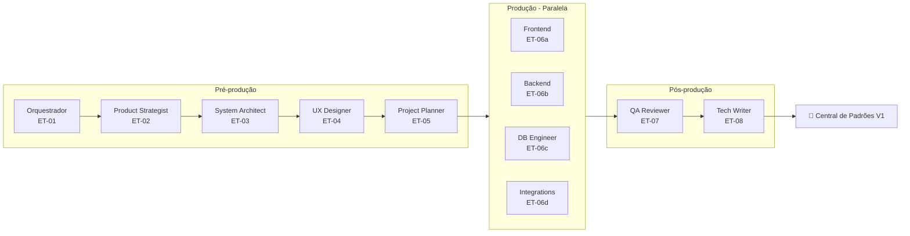
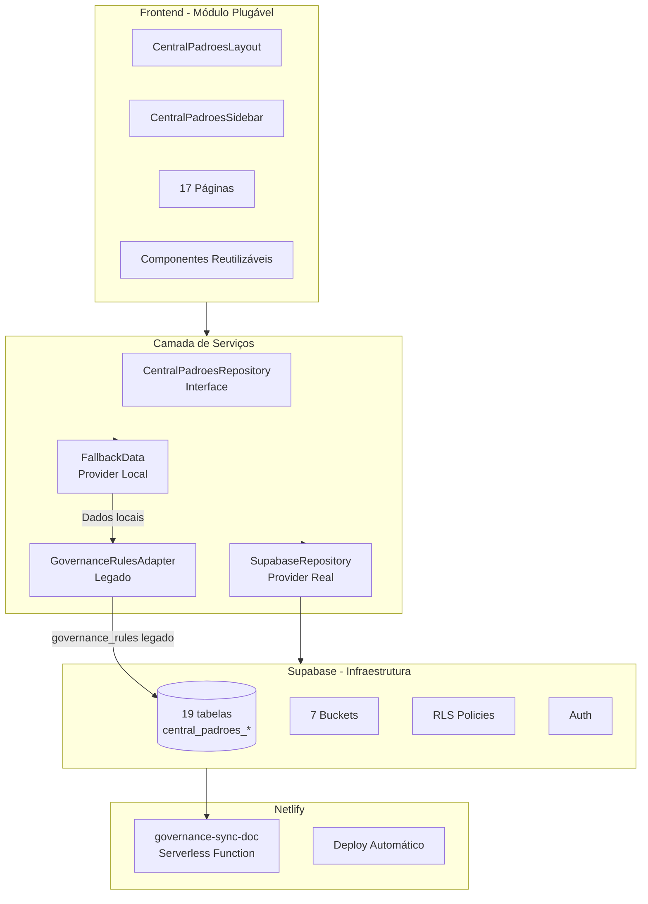
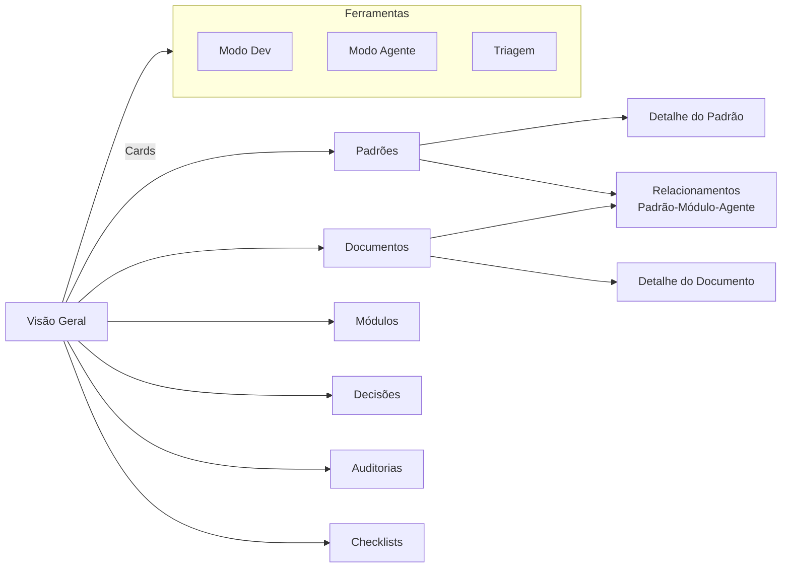
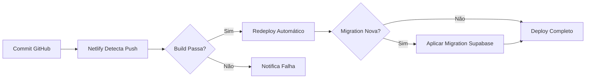
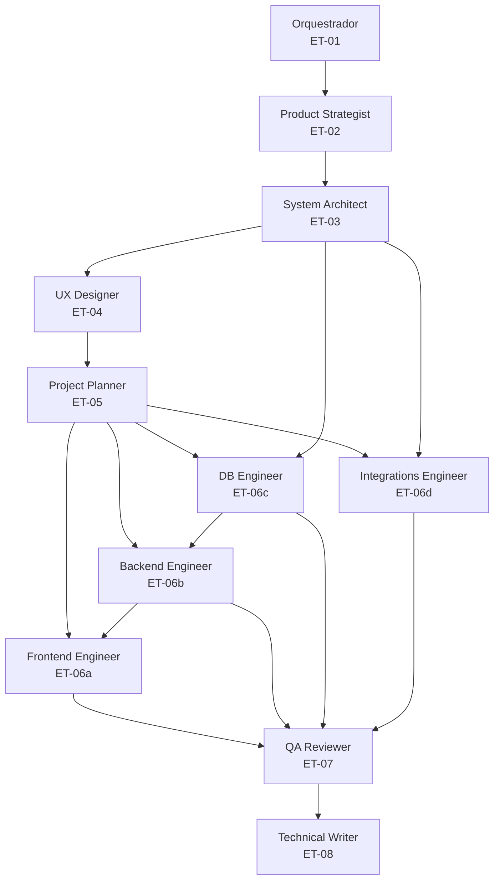

# Plano Diretor da Central de Padrões V1 — Execução por Agentes da Esteira Multiagentes

> **Baseado em:**
> - [`Plano Diretor de Implantação ET 01 a ET 08`](../00_sagb/src/modules/central_padroes/docs/07_validacoes/Plano%20Diretor%20de%20Implanta%C3%A7%C3%A3o%20da%20Central%20de%20Padr%C3%B5es%20V1%20%E2%80%94%20ET%2001%20a%20ET%2008)
> - [`Auditoria Arquitetural 31-05-2026`](../00_sagb/src/modules/central_padroes/docs/sagb-central-padroes-auditoria-arquitetural-31-05-2026.md)
> - [`Metodologia Multiagentes`](../00_sagb/src/modules/sala-dev/governance/metodologia_multiagentes/AGENTS.md)
>
> **Premissa:** Supabase, Netlify, GitHub Actions e demais serviços já estão operacionais e disponíveis para os agentes usarem de forma autônoma.

---

## Índice

1. [Fluxo Geral da Execução](#fluxo-geral)
2. [ET-01: Orquestrador](#et-01-orquestrador)
3. [ET-02: Product Strategist](#et-02-product-strategist)
4. [ET-03: System Architect](#et-03-system-architect)
5. [ET-04: UX and Flow Designer](#et-04-ux-and-flow-designer)
6. [ET-05: Project Planner](#et-05-project-planner)
7. [ET-06a: Frontend Engineer](#et-06a-frontend-engineer)
8. [ET-06b: Backend Engineer](#et-06b-backend-engineer)
9. [ET-06c: Database Engineer](#et-06c-database-engineer)
10. [ET-06d: Integrations Engineer](#et-06d-integrations-engineer)
11. [ET-07: QA Reviewer](#et-07-qa-reviewer)
12. [ET-08: Technical Writer](#et-08-technical-writer)
13. [Matriz de Dependências entre Agentes](#matriz-de-dependencias)
14. [Estimativa de Artefatos Gerados](#artefatos-gerados)

---

## Fluxo Geral da Execução



---

## ET-01: Orquestrador

### Missão nesta etapa
Receber o Plano Diretor + Auditoria, organizar o fluxo completo de execução, decidir a ordem das etapas, verificar dependências entre agentes e manter coerência entre todos os entregáveis.

### O que já existe (diagnosticado pela auditoria)
- Módulo `central_padroes` com 7 arquivos de código (manifest, routes, layout, page, service)
- 48 documentos .md no módulo, 12 docs externos v1
- Migration `governance_rules_phase1` no Supabase
- Função serverless `governance-sync-doc.mjs` na Netlify
- CRUD funcional baseado em `governance_rules`
- Agente Zico Padron com persona, prompt, falas e session_log

### O que está faltando (gaps capturados pela auditoria)
- Taxonomia normativa inexistente no runtime
- Approval flow inexistente
- Sem owner por área nos dados
- Sem dependências entre padrões
- Sem relação módulo ↔ padrão ↔ agente
- Classificação documental fraca
- Permissões RLS genéricas (authenticated pode tudo)
- Sem busca/filtros
- Sem histórico/versionamento visual
- Sem buckets de Storage dedicados
- Sem fallback local (quebra silenciosa se Supabase falhar)

### Plano de ação do Orquestrador

| # | Ação | Arquivo gerado | Depende de |
|---|---|---|---|
| 1 | Consolidar Plano Diretor + Auditoria em fluxo executável | `.plans/00-fluxo-geral-central-padroes.md` | Nenhuma |
| 2 | Criar `.logs/00-orquestracao.md` com registro de decisões | `.logs/00-orquestracao.md` | Ação 1 |
| 3 | Verificar pré-condições: Supabase online, Netlify functions operando | Checkpoint no log | Ação 2 |
| 4 | Validar que `governance_rules` NÃO será quebrada | Registro em DECISIONS.md | Ação 1 |
| 5 | Definir ordem de ativação dos agentes e dependências críticas | `.plans/01-agenda-agentes.md` | Ação 1-4 |
| 6 | Kickoff do Product Strategist (ET-02) | Trigger no log | Ação 5 |

### Entregáveis do Orquestrador
```
.plans/00-fluxo-geral-central-padroes.md
.plans/01-agenda-agentes.md
.logs/00-orquestracao.md
```

### Observação importante
O Orquestrador **não implementa nada**. Ele organiza, coordena e verifica. Sua saída é o plano de voo que todos os outros agentes seguirão.

---

## ET-02: Product Strategist

### Missão nesta etapa
Transformar o Plano Diretor ("Portal Vivo de Governança") em visão de produto clara, com proposta de valor, público-alvo, funcionalidades prioritárias e separação MVP vs expansão.

### Contexto do "produto"
A Central de Padrões não é um produto comercial — é um **produto interno de governança**. Mas precisa ser tratada como produto: com visão, público, funcionalidades e roadmap.

### O que já existe
- Diretriz clara: "Transformar a Central de Padrões em um Portal Vivo de Governança do SagB"
- 12 áreas de domínio definidas (governança, sistemas, ux, seguranca, agentes, etc.)
- 12 responsáveis mapeados (Pietro a César)
- Taxonomia de 21 tipos normativos proposta na auditoria
- 9 checklists obrigatórios propostos

### O que o Product Strategist precisa definir

| Pergunta | Resposta proposta | Impacto nos agentes seguintes |
|---|---|---|
| Quem é o público primário? | Pietro (guardião), Cássio (programador), Agentes (consumo automatizado) | Define UI, permissões e modo agente |
| Qual o MVP mínimo? | ET-01 do Plano Diretor: estrutura base, sidebar, dashboard, 15 páginas, schema Supabase, fallback | Define escopo da ET-06 |
| Qual a proposta de valor? | "Antes de construir, verificar o que já existe" — princípio guia | Guia toda a comunicação |
| Quais métricas de sucesso? | Padrões cadastrados, padrões canônicos, módulos vinculados, agentes consumindo | Define dashboard |
| O que é expansão futura? | CRUD real (ET-02), approval flow (ET-03), relacionamentos (ET-04), triagem (ET-05), busca semântica (futuro) | Define o que NÃO fazer agora |

### Entregáveis do Product Strategist
```
.docs/01-visao-produto-central-padroes.md
.docs/02-prd-central-padroes.md
```

### Nota especial
Como Supabase e Netlify já estão operacionais, o Product Strategist pode assumir **persistência real como padrão** (não mock), com fallback local para resiliência. Isso influencia as decisões de arquitetura.

---

## ET-03: System Architect

### Missão nesta etapa
Definir a arquitetura técnica completa da Central de Padrões V1, incluindo módulos, estrutura de pastas, entidades, integrações, stack e separação entre frontend, backend, banco e serviços.

### Stack já disponível (premissa)
| Serviço | Status | Uso na Central |
|---|---|---|
| Supabase | ✅ Operacional | Tabelas `central_padroes_*`, RLS, Storage, Auth |
| Netlify | ✅ Operacional | Functions (governance-sync-doc), deploy, CI/CD |
| React + Vite | ✅ No SagB | Frontend do módulo |
| TypeScript | ✅ No SagB | Types fortes em todo o módulo |
| GitHub | ✅ Operacional | Repositório, Actions, PRs |

### O que já existe na arquitetura atual
- Layout com sidebar própria (`CentralPadroesLayout.tsx`)
- Rota `/central_padroes/*`
- Service `governanceRulesService.ts` com REST Fetch
- Migration `governance_rules_phase1` com RLS básico

### O que o System Architect precisa definir/projetar

| Decisão Arquitetural | Opção recomendada | Justificativa |
|---|---|---|
| Schema de dados | 19 tabelas `central_padroes_*` | Plano Diretor ET-01, seções 9-10 |
| Padrão de repositório | Repository Pattern com interface + fallback | Consistente com Sala Dev |
| Provider padrão | Supabase com fallback local automático | Já implementado na Sala Dev, reutilizar padrão |
| Estrutura de pastas | Conforme seção 7 do Plano Diretor | pages/, components/, services/, types/, hooks/, store/ |
| Sidebar | Sidebar própria, ocultando sidebar global | Já existe no layout, expandir navegação |
| Roteamento | React Router com 17 rotas | Todas as páginas da seção 18 |
| Fallback | FallbackData local se Supabase offline | Sala Dev já usa este padrão |
| Buckets Storage | 7 buckets (seção 12) | documents, canonical, ingestion, triage, evidence, module-docs, exports |

### Diagrama de arquitetura proposta



### Entregáveis do System Architect
```
.docs/03-arquitetura-central-padroes.md
.specs/01-entidades-e-dados.md
.specs/02-estrutura-tecnica.md
```

---

## ET-04: UX and Flow Designer

### Missão nesta etapa
Estruturar a jornada do usuário na Central de Padrões, mapear todas as telas, fluxos de navegação, estados (carregando, vazio, erro, sucesso) e garantir uma experiência clara e consistente com o Alice UI Standard.

### O que já existe de UX
- Layout com sidebar minimalista (1 view: "Visão Geral")
- Cards de status (total, synced, failed, pending)
- Lista de regras por domínio
- Modal de editor markdown + preview + salvar/publicar
- Loading/falha tratados com feedback básico
- Botão "Voltar ao SagB"

### O que precisa ser projetado (17 páginas)

| Página | Navegação | Função principal | Estados críticos |
|---|---|---|---|
| **Visão Geral** | Sidebar > 1º item | Dashboard com métricas, "Antes de criar", atividade recente | Loading, vazio (sem dados), erro, populado |
| **Arquitetura Mestra** | Sidebar > 2º item | Página informativa sobre estrutura da Central | Estático (conteúdo fixo) |
| **Responsáveis** | Sidebar > 3º item | Lista dos 12 responsáveis com detalhes | Loading, vazio, erro |
| **Padrões** | Sidebar > 4º item | Lista + criar/editar padrões | Loading, vazio, erro, filtros ativos |
| **Detalhe do Padrão** | Click no padrão | Visualização completa + versões + ações | Loading, erro, canônico vs rascunho |
| **Documentos** | Sidebar > 5º item | Biblioteca documental com filtros | Loading, vazio, erro |
| **Detalhe do Documento** | Click no documento | Visualização + versões + status | Loading, erro |
| **Registro Mestre** | Sidebar > 6º item | Classificação do ecossistema | Loading, vazio |
| **Módulos** | Sidebar > 7º item | Lista de módulos com vínculos | Loading, vazio |
| **Módulos Base** | Sidebar > 8º item | Catálogo de módulos reutilizáveis | Loading, vazio |
| **Agentes** | Sidebar > 9º item | Agentes + padrões que consomem | Loading, vazio |
| **Decisões** | Sidebar > 10º item | Registro de decisões + ADRs | Loading, vazio |
| **Checklists** | Sidebar > 11º item | 10 checklists obrigatórios | Loading, vazio |
| **Auditorias** | Sidebar > 12º item | Auditorias + evidências | Loading, vazio |
| **Triagem** | Sidebar > 13º item | Fluxo de ingestão de conteúdo | Loading, vazio |
| **Modo Dev** | Sidebar > 14º item | Atalhos técnicos para programadores | Estático + busca |
| **Modo Agente** | Sidebar > 15º item | Regras para agentes consumirem | Estático + busca |
| **Configurações** | Sidebar > 16º item | Informações técnicas do módulo | Estático |

### Fluxo de navegação principal



### Regras de UX obrigatórias (do Alice UI Standard)
- Rubik como fonte principal
- Paleta GrupoB (dark mode sem preto puro)
- Cards compactos com borda suave e sombra controlada
- Chips legíveis para status
- Ícones lineares (sem emoji como ícone principal)
- Cor deve aparecer nos elementos, não no fundo inteiro
- Mobile Compact Clean: responsivo básico obrigatório
- Module Full Screen: módulo ocupa tela inteira

### Entregáveis do UX Designer
```
.docs/04-fluxos-usuario-central-padroes.md
.specs/03-mapa-de-telas.md
```

---

## ET-05: Project Planner

### Missão nesta etapa
Quebrar todo o escopo da Central de Padrões V1 em backlog priorizado, roadmap executável e tarefas granulares que os engenheiros (ET-06) possam implementar de forma independente.

### Contexto
O Plano Diretor já define ET-01 a ET-08. O Project Planner precisa **refinar** isso em tarefas reais de código, considerando o que já existe e o que precisa ser criado.

### Backlog priorizado (para ET-06)

| Prioridade | Tarefa | Agente responsável | Esforço estimado | Depende de |
|---|---|---|---|---|
| **P0** | Criar migration `central_padroes_core_v1.sql` com 19 tabelas | DB Engineer | Alta | Schema definido pelo Arch |
| **P0** | Criar seeds iniciais (áreas, responsáveis, padrões, checklists, módulos) | DB Engineer | Média | Migration pronta |
| **P0** | Implementar `CentralPadroesLayout.tsx` com sidebar completa | Frontend | Média | Design do UX |
| **P0** | Implementar `CentralPadroesSidebar.tsx` com 16 itens + "Voltar ao SagB" | Frontend | Média | Layout definido |
| **P0** | Criar `CentralPadroesRepository.ts` (interface + mock + supabase) | Backend | Alta | Schema definido |
| **P0** | Criar `CentralPadroesFallbackData.ts` com dados locais | Backend | Média | Seeds definidos |
| **P0** | Criar `governanceRulesAdapter.ts` para compatibilidade legado | Backend | Média | Schema definido |
| **P1** | Implementar DashboardPage com cards de métricas | Frontend | Média | Repository pronto |
| **P1** | Implementar StandardsPage + StandardDetailPage | Frontend | Alta | Repository pronto |
| **P1** | Implementar DocumentsPage + DocumentDetailPage | Frontend | Alta | Repository pronto |
| **P1** | Implementar ResponsiblesPage | Frontend | Baixa | Repository pronto |
| **P1** | Implementar ModulesPage + BaseModulesPage | Frontend | Média | Repository pronto |
| **P1** | Criar services individuais (standards, documents, responsibles, etc.) | Backend | Alta | Repository pronto |
| **P2** | Implementar DecisionsPage | Frontend | Média | Repository pronto |
| **P2** | Implementar ChecklistsPage | Frontend | Média | Repository pronto |
| **P2** | Implementar AgentsPage | Frontend | Média | Repository pronto |
| **P2** | Implementar AuditsPage | Frontend | Média | Repository pronto |
| **P2** | Implementar TriagePage | Frontend | Média | Repository pronto |
| **P2** | Implementar EcosystemRegistryPage | Frontend | Média | Repository pronto |
| **P2** | Implementar DevModePage | Frontend | Baixa | Repository pronto |
| **P2** | Implementar AgentModePage | Frontend | Baixa | Repository pronto |
| **P2** | Implementar SettingsPage | Frontend | Baixa | Repository pronto |
| **P3** | Criar componentes reutilizáveis (PageHeader, MetricCard, StatusPill, etc.) | Frontend | Média | Design System |
| **P3** | Configurar RLS policies para todas as tabelas | Backend | Alta | Schema pronto |
| **P3** | Criar buckets Storage e políticas de acesso | Backend | Média | Schema pronto |
| **P3** | Implementar fallback automático mock → supabase | Backend | Baixa | Repository pronto |

### Observação sobre paralelismo
Frontend Engineer e Backend Engineer podem trabalhar **em paralelo** após o Repository Pattern estar definido pelo System Architect. O DB Engineer precisa entregar a migration **antes** do Backend Engineer.

### Entregáveis do Project Planner
```
.plans/01-backlog-central-padroes.md
.plans/02-roadmap-central-padroes.md
.tasks/01-quebra-de-tarefas.md
```

---

## ET-06a: Frontend Engineer

### Missão nesta etapa
Materializar todas as 17 páginas + sidebar + componentes reutilizáveis da Central de Padrões, seguindo o Alice UI Standard e o mapa de telas definido pelo UX Designer.

### O que já existe no frontend
- [`CentralPadroesLayout.tsx`](../00_sagb/src/modules/central_padroes/layout/CentralPadroesLayout.tsx) (121 linhas) — Layout com sidebar atual
- [`CentralPadroesPage.tsx`](../00_sagb/src/modules/central_padroes/pages/CentralPadroesPage.tsx) (310 linhas) — Página principal com CRUD
- Estilo com tokens CSS (`--sagb-primary`, `--sagb-line`, `--sagb-surface`)
- Uso de `ReactMarkdown` para preview

### O que precisa ser criado/modificado

#### Layout
```
layout/
├── CentralPadroesLayout.tsx      ← MODIFICAR: expandir sidebar
├── CentralPadroesSidebar.tsx     ← CRIAR: 16 itens de navegação
├── CentralPadroesTopbar.tsx       ← CRIAR: topo com breadcrumb
└── CentralPadroesMobileNav.tsx    ← CRIAR: navegação mobile
```

#### Páginas (17)
```
pages/
├── CentralPadroesDashboardPage.tsx     ← CRIAR
├── ArchitecturePage.tsx                 ← CRIAR
├── ResponsiblesPage.tsx                 ← CRIAR
├── StandardsPage.tsx                    ← CRIAR
├── StandardDetailPage.tsx               ← CRIAR
├── DocumentsPage.tsx                    ← CRIAR
├── DocumentDetailPage.tsx               ← CRIAR
├── EcosystemRegistryPage.tsx            ← CRIAR
├── ModulesPage.tsx                      ← CRIAR
├── BaseModulesPage.tsx                  ← CRIAR
├── AgentsPage.tsx                       ← CRIAR
├── DecisionsPage.tsx                    ← CRIAR
├── ChecklistsPage.tsx                   ← CRIAR
├── AuditsPage.tsx                       ← CRIAR
├── TriagePage.tsx                       ← CRIAR
├── DevModePage.tsx                      ← CRIAR
├── AgentModePage.tsx                    ← CRIAR
└── SettingsPage.tsx                     ← CRIAR
```

#### Componentes reutilizáveis
```
components/shared/
├── PageHeader.tsx          ← CRIAR
├── SectionHeader.tsx       ← CRIAR
├── CentralMetricCard.tsx   ← CRIAR
├── StatusPill.tsx          ← CRIAR
├── ActionCard.tsx          ← CRIAR
├── SearchInput.tsx         ← CRIAR
├── FilterChip.tsx          ← CRIAR
├── EmptyState.tsx          ← CRIAR
├── LoadingState.tsx        ← CRIAR
└── ErrorState.tsx          ← CRIAR
```

### Regras de implementação
1. **Preservar** `CentralPadroesPage.tsx` existente — não apagar
2. **Adicionar** as novas páginas sem quebrar a rota existente
3. **Manter** `governanceRulesService.ts` intacto — ele será adaptado pelo `governanceRulesAdapter.ts`
4. **Seguir** Alice UI Standard (Rubik, paleta GrupoB, dark mode, cards compactos)
5. **Fallback visual**: se Supabase falhar, mostrar "Não foi possível carregar os dados online agora. Exibindo base local de referência."

### Entregáveis do Frontend Engineer
```
Código em src/modules/central_padroes/pages/*.tsx
Código em src/modules/central_padroes/layout/*.tsx
Código em src/modules/central_padroes/components/shared/*.tsx
.logs/frontend-execucao.md
```

---

## ET-06b: Backend Engineer

### Missão nesta etapa
Implementar toda a camada de serviços, repositórios, hooks e store da Central de Padrões, garantindo persistência real no Supabase com fallback local, adaptação do legado `governance_rules` e integridade dos dados.

### O que já existe no backend
- [`governanceRulesService.ts`](../00_sagb/src/modules/central_padroes/services/governanceRulesService.ts) (120 linhas) — CRUD de regras
- `restFetch` de [`services/supabase.ts`](../00_sagb/services/supabase.ts)
- Migration `governance_rules_phase1` no Supabase
- Função `governance-sync-doc.mjs` na Netlify

### O que precisa ser criado

#### Services (15)
```
services/
├── centralPadroesRepository.ts         ← CRIAR: Interface + MockRepository + SupabaseRepository
├── centralPadroesDashboardService.ts   ← CRIAR: agrega métricas do dashboard
├── centralStandardsService.ts          ← CRIAR: CRUD de padrões
├── centralDocumentsService.ts          ← CRIAR: CRUD de documentos
├── centralResponsiblesService.ts       ← CRIAR: CRUD de responsáveis
├── centralEcosystemService.ts          ← CRIAR: registro mestre
├── centralModulesService.ts            ← CRIAR: CRUD de módulos
├── centralBaseModulesService.ts        ← CRIAR: CRUD de módulos base
├── centralAgentsService.ts             ← CRIAR: CRUD de agentes
├── centralDecisionsService.ts          ← CRIAR: CRUD de decisões
├── centralChecklistsService.ts         ← CRIAR: CRUD de checklists
├── centralAuditsService.ts             ← CRIAR: CRUD de auditorias
├── centralTriageService.ts             ← CRIAR: CRUD de triagem
├── centralRelationshipsService.ts      ← CRIAR: vínculos entre entidades
├── centralPadroesFallbackData.ts       ← CRIAR: dados locais de fallback
└── governanceRulesAdapter.ts           ← CRIAR: adapta governance_rules para o novo schema
```

#### Hooks
```
hooks/
├── useCentralPadroes.ts        ← CRIAR: hook principal
├── useStandards.ts             ← CRIAR: operações de padrão
├── useDocuments.ts             ← CRIAR: operações de documento
├── useDashboard.ts             ← CRIAR: métricas do dashboard
└── useSupabaseFallback.ts      ← CRIAR: fallback automático
```

#### Store (se necessário)
```
store/
└── centralPadroesContext.tsx   ← CRIAR: contexto global se houver necessidade
```

### Padrão de repository (a ser seguido)

```typescript
// centralPadroesRepository.ts
interface ICentralPadroesRepository {
  // Standards
  listStandards(filters?: StandardFilter): Promise<CentralStandard[]>;
  getStandard(id: string): Promise<CentralStandard>;
  saveStandard(standard: CentralStandard): Promise<CentralStandard>;
  deleteStandard(id: string): Promise<void>;

  // Documents (mesmo padrão)
  listDocuments(filters?: DocumentFilter): Promise<CentralDocument[]>;
  // ... etc

  // Dashboard
  getDashboardSummary(): Promise<CentralDashboardSummary>;
}

class CentralPadroesSupabaseRepository implements ICentralPadroesRepository {
  // Implementação real usando restFetch
}

class CentralPadroesFallbackRepository implements ICentralPadroesRepository {
  // Dados locais para quando Supabase estiver offline
}
```

### Regras de implementação
1. **NÃO quebrar** `governanceRulesService.ts` — ele continua operacional
2. `governanceRulesAdapter.ts` deve permitir leitura compatível de `governance_rules` como item legado
3. Tentar Supabase primeiro; se falhar, usar fallback silencioso
4. Mensagem amigável no fallback: "Não foi possível carregar os dados online agora. Exibindo base local de referência."

### Entregáveis do Backend Engineer
```
Código em src/modules/central_padroes/services/*.ts
Código em src/modules/central_padroes/hooks/*.ts
Código em src/modules/central_padroes/store/*.tsx (se necessário)
.logs/backend-execucao.md
```

---

## ET-06c: Database Engineer

### Missão nesta etapa
Modelar e criar a estrutura de dados completa da Central de Padrões no Supabase, incluindo migration com 19 tabelas, seeds iniciais, RLS policies, buckets Storage e índices necessários.

### Premissa
Supabase já está operacional com:
- `VITE_SUPABASE_URL` e `VITE_SUPABASE_ANON_KEY` configurados
- Migration `governance_rules_phase1` já aplicada
- Tabela `governance_rules` com dados existentes
- RLS habilitado

### Migration principal

**Arquivo:** `supabase/migrations/20260531210000_central_padroes_core_v1.sql`

#### Tabelas (19)

| Ordem | Tabela | Tipo | Depende de |
|---|---|---|---|
| 1 | `central_padroes_areas` | Lookup | Nenhuma |
| 2 | `central_padroes_responsibles` | Principal | `areas` |
| 3 | `central_padroes_standards` | Principal | `areas`, `responsibles` |
| 4 | `central_padroes_standard_versions` | Histórico | `standards` |
| 5 | `central_padroes_documents` | Principal | `areas`, `responsibles` |
| 6 | `central_padroes_document_versions` | Histórico | `documents` |
| 7 | `central_padroes_decisions` | Principal | `areas`, `responsibles` |
| 8 | `central_padroes_checklists` | Principal | `areas` |
| 9 | `central_padroes_checklist_items` | Detalhe | `checklists` |
| 10 | `central_padroes_modules` | Principal | Nenhuma |
| 11 | `central_padroes_base_modules` | Principal | Nenhuma |
| 12 | `central_padroes_agents` | Principal | `areas`, `responsibles` |
| 13 | `central_padroes_audits` | Principal | Nenhuma |
| 14 | `central_padroes_evidence` | Storage ref | `audits` |
| 15 | `central_padroes_relationships` | Relacional | Todas (polimórfico) |
| 16 | `central_padroes_activity_log` | Log | Todas (polimórfico) |
| 17 | `central_padroes_ingestion_sources` | Ingestão | Nenhuma |
| 18 | `central_padroes_ingestion_items` | Ingestão | `ingestion_sources`, `areas` |
| 19 | `central_padroes_exceptions` | Exceção | `standards` |

#### Seeds obrigatórios

**Áreas (12):**
```sql
INSERT INTO central_padroes_areas (slug, name) VALUES
  ('governanca', 'Governança'),
  ('tecnica', 'Técnica'),
  ('ui_ux', 'UI/UX'),
  ('seguranca', 'Segurança'),
  ('agentes', 'Agentes'),
  ('modelos_ia', 'Modelos de IA'),
  ('processos', 'Processos'),
  ('naming', 'Naming'),
  ('ideias_labs', 'Ideias Labs'),
  ('metodologias', 'Metodologias'),
  ('acadb', 'AcadB'),
  ('ventures', 'Ventures');
```

**Responsáveis (12):** Pietro Carboni a César Tulli com seus slugs, áreas e escopos.

**Padrões iniciais (13):** Arquitetura Mestra, Tipos Normativos, Módulos Plugáveis, Matriz de Reaproveitamento, etc.

**Checklists (10):** Antes de criar sistema, módulo, tabela, API, deploy, publicar documento externo, liberar agente, aprovar padrão, transformar conversa em documento, mover para canônico.

**Módulos iniciais (6):** Central de Padrões, Agenda Inteligente, Documentos, Monitoramento, API SagB, MCP SagB.

#### RLS Policies

Seguir padrão do projeto:
- Habilitar RLS em todas as tabelas
- Leitura para `authenticated`
- Escrita restrita conforme papel (se estrutura de roles existir)
- Se não existir roles maduros: RLS mínima segura + documentar pendência

#### Buckets Storage

```sql
-- Buckets sugeridos
central-padroes-documents
central-padroes-canonical
central-padroes-ingestion
central-padroes-triage
central-padroes-evidence
central-padroes-module-docs
central-padroes-exports
```

**Nota:** Se a criação automática de buckets não estiver no fluxo do projeto, criar código preparado e registrar recomendação.

### Entregáveis do Database Engineer
```
supabase/migrations/20260531210000_central_padroes_core_v1.sql
.specs/04-modelagem-de-dados-central-padroes.md
.tasks/02-banco-de-dados.md
```

---

## ET-06d: Integrations Engineer

### Missão nesta etapa
Mapear e preparar todas as integrações externas e internas da Central de Padrões, garantindo que os serviços de terceiros (Supabase, Netlify, GitHub) estejam conectados e operacionais.

### Integrações existentes (já operacionais)

| Integração | Status | O que faz |
|---|---|---|
| Supabase REST | ✅ Operacional | `restFetch` para CRUD de `governance_rules` |
| Netlify Function | ✅ Operacional | `governance-sync-doc.mjs` — sync de documentos para .md |
| Auth Supabase | ✅ Operacional | `auth` importado de `services/supabase.ts` |
| React Router | ✅ Operacional | Roteamento do módulo |

### Integrações a preparar/configurar

| Integração | O que precisa ser feito | Prioridade |
|---|---|---|
| **Supabase Storage** | Configurar 7 buckets com RLS policies | P1 |
| **Supabase Realtime** | (Opcional)订阅mudanças em `central_padroes_*` para UI reativa | P3 |
| **Netlify Deploy** | Garantir que redeploy automático está configurado para o módulo | P1 |
| **GitHub Actions** | (Se aplicável) CI para validar migration antes de aplicar | P2 |
| **Sync Function v2** | Evoluir `governance-sync-doc.mjs` para suportar múltiplos destinos | P2 |
| **Fallback offline** | Preparar mecanismo de cache local para quando Supabase estiver offline | P1 |

### Fluxo de deploy



### Regras de segurança para integrações
1. **NUNCA** expor `SUPABASE_SERVICE_ROLE_KEY` no frontend
2. **SEMPRE** usar RLS para controlar acesso a dados
3. **SEMPRE** validar path em sync functions (bloquear path traversal)
4. **SEMPRE** manter fallback local para quando serviços externos falharem
5. **SEMPRE** registrar erro sem expor detalhes internos

### Entregáveis do Integrations Engineer
```
.specs/05-integracoes-central-padroes.md
```

---

## ET-07: QA Reviewer

### Missão nesta etapa
Revisar toda a implementação da Central de Padrões V1 — frontend, backend, banco de dados, integrações e documentação — validando consistência, funcionamento, clareza e aderência ao Plano Diretor.

### Checklist de validação

#### Infraestrutura e Dados
- [ ] Migration `central_padroes_core_v1.sql` foi aplicada sem erros?
- [ ] Todas as 19 tabelas existem no Supabase?
- [ ] Seeds foram populados corretamente?
- [ ] RLS policies estão ativas e funcionando?
- [ ] Buckets Storage foram criados?
- [ ] `governance_rules` NÃO foi alterada/quebrada?
- [ ] `governanceRulesService.ts` continua funcionando?

#### Frontend
- [ ] Sidebar própria aparece com 16 itens?
- [ ] Sidebar global do SagB está oculta dentro do módulo?
- [ ] Todas as 17 páginas carregam sem erro?
- [ ] Fallback funciona quando Supabase está offline?
- [ ] Mensagem de fallback é amigável?
- [ ] Loading, vazio e erro estão tratados em todas as páginas?
- [ ] Responsivo básico funciona (mobile)?
- [ ] Dark mode está consistente?
- [ ] Build passa (`npm run build`)?

#### Backend/Services
- [ ] Repository pattern está implementado?
- [ ] SupabaseRepository funciona com dados reais?
- [ ] FallbackRepository retorna dados locais?
- [ ] `governanceRulesAdapter.ts` adapta dados legados sem quebrar?
- [ ] Hooks funcionam com ambos os providers?

#### Consistência
- [ ] Tipos estão fortes (sem `any` desnecessário)?
- [ ] Imports estão corretos?
- [ ] Não há código morto/comentado?
- [ ] ADRs e decisões foram respeitadas?
- [ ] CHANGELOG.md foi atualizado?
- [ ] DECISIONS.md foi atualizado?

### Pontos de atenção especiais
1. **Preservação do legado:** `governance_rules` NÃO pode ser quebrada
2. **Sidebar:** A sidebar global NÃO deve aparecer dentro do módulo
3. **Fallback:** Deve funcionar silenciosamente, sem crash
4. **RLS:** Não pode travar a implantação visual, mas precisa existir
5. **Build:** `npm run build` precisa passar 100%

### Entregáveis do QA Reviewer
```
.docs/05-checklist-qa-central-padroes.md
.logs/revisao-qa-central-padroes.md
```

---

## ET-08: Technical Writer

### Missão nesta etapa
Organizar toda a documentação final da Central de Padrões V1, garantindo que o projeto esteja documentado, legível e preparado para continuidade por qualquer agente ou humano que acesse o módulo.

### Documentos a criar/atualizar

#### Obrigatórios
| Documento | Ação | Conteúdo |
|---|---|---|
| [`README.md`](../00_sagb/src/modules/central_padroes/README.md) | Atualizar | Visão geral, pré-requisitos, como usar, estrutura |
| [`DECISIONS.md`](../00_sagb/src/modules/central_padroes/DECISIONS.md) | Atualizar | Todas as decisões da V1: schema, sidebar, fallback, adapter |
| [`CHANGELOG.md`](../00_sagb/src/modules/central_padroes/CHANGELOG.md) | Atualizar | Registro de versão v1.0.0 com todas as mudanças |
| [`PLANNED.md`](../00_sagb/src/modules/central_padroes/PLANNED.md) | Atualizar | Pendências para ET-02 a ET-08 original |

#### Novos (em docs/)
| Documento | Conteúdo |
|---|---|
| `central-padroes-implantacao-et-01-31-05-2026.md` | Relatório completo da implantação |
| `central-padroes-schema-v1.md` | Documentação do schema de dados |
| `central-padroes-ui-v1.md` | Documentação da interface |
| `central-padroes-rotas-v1.md` | Mapa de rotas |
| `central-padroes-governance-rules-compatibilidade.md` | Como o legado foi preservado |
| `central-padroes-validacao-final-et-01.md` | Resultado das validações |

### Estrutura recomendada do README.md

```markdown
# Central de Padrões — Portal Vivo de Governança

## Visão Geral
A Central de Padrões é o portal vivo de governança do SagB...

## Status
✅ ET-01 concluída (data)
📋 ET-02 pendente (CRUD real)
📋 ET-03 pendente (approval flow)

## Pré-requisitos
- Node.js 20+
- Supabase configurado (VITE_SUPABASE_URL, VITE_SUPABASE_ANON_KEY)
- Netlify CLI (para functions)

## Como usar
1. Acesse /central_padroes no SagB
2. Navegue pela sidebar
3. ...

## Estrutura do módulo
...

## Decisões arquiteturais
...

## Compatibilidade com legado
governance_rules foi preservado como embrião funcional.
```

### Entregáveis do Technical Writer
```
README.md (atualizado)
DECISIONS.md (atualizado)
CHANGELOG.md (atualizado)
PLANNED.md (atualizado)
docs/central-padroes-implantacao-et-01-31-05-2026.md
docs/central-padroes-schema-v1.md
docs/central-padroes-ui-v1.md
docs/central-padroes-rotas-v1.md
docs/central-padroes-governance-rules-compatibilidade.md
docs/central-padroes-validacao-final-et-01.md
.docs/06-guia-de-continuidade-central-padroes.md
```

---

## Matriz de Dependências entre Agentes



### Regras de dependência
1. **ET-01 a ET-05 são sequenciais** — cada uma depende da anterior
2. **ET-06 é paralela** — FE, BE, DE, IE podem rodar juntos, mas:
   - DE precisa entregar migration **antes** de BE usar Supabase
   - SA precisa definir schema **antes** de DE criar migration
   - UX precisa entregar mapa de telas **antes** de FE criar páginas
3. **ET-07 depende de ET-06 completa** — QA revisa o que foi construído
4. **ET-08 depende de ET-07** — Tech Writer documenta o que foi validado

---

## Artefatos Gerados (resumo)

| Agente | ET | Arquivos | Total estimado |
|---|---|---|---|
| Orquestrador | ET-01 | `.plans/00-fluxo-geral.md`, `.plans/01-agenda.md`, `.logs/00-orquestracao.md` | 3 |
| Product Strategist | ET-02 | `.docs/01-visao-produto.md`, `.docs/02-prd.md` | 2 |
| System Architect | ET-03 | `.docs/03-arquitetura.md`, `.specs/01-entidades.md`, `.specs/02-estrutura.md` | 3 |
| UX Designer | ET-04 | `.docs/04-fluxos.md`, `.specs/03-mapa-telas.md` | 2 |
| Project Planner | ET-05 | `.plans/01-backlog.md`, `.plans/02-roadmap.md`, `.tasks/01-tarefas.md` | 3 |
| Frontend Engineer | ET-06a | 17 páginas, 1 layout, 1 sidebar, 10 componentes, 1 log | ~30 |
| Backend Engineer | ET-06b | 15 services, 5 hooks, 1 store, 1 log | ~22 |
| Database Engineer | ET-06c | 1 migration, 1 spec, 1 task | 3 |
| Integrations Engineer | ET-06d | 1 spec | 1 |
| QA Reviewer | ET-07 | 1 checklist, 1 log | 2 |
| Technical Writer | ET-08 | README, DECISIONS, CHANGELOG, PLANNED, 6 docs, 1 guia | 10 |

**Total estimado de artefatos:** ~80 arquivos entre código, documentação, specs e logs.

---

## Considerações Finais

### Supabase e Netlify já liberados
Todos os agentes podem assumir que:
- Supabase está operacional (URL, anon key, service role key configurados)
- Netlify está operacional (deploy automático, functions operando)
- GitHub está operacional (push, CI/CD se aplicável)

Isso significa que **não há necessidade de mockar dados** — a persistência real pode ser o padrão desde o início, com fallback local apenas para resiliência.

### Guardião da execução
O **Orquestrador** (ET-01) é o guardião de todo o fluxo. Nenhum agente avança sem o checkpoint do Orquestrador. Cada etapa deve reportar ao Orquestrador antes do próximo agente começar.

### Próximo passo após este documento
1. Orquestrador lê este documento e cria o fluxo executável em `.plans/00-fluxo-geral-central-padroes.md`
2. Product Strategist inicia ET-02 com base no fluxo
3. Sequência segue até ET-08
4. Ao final: **Central de Padrões V1 implantada como Portal Vivo de Governança**

---

*Documento gerado em 31 de maio de 2026.*
*Baseado no Plano Diretor ET 01-08 + Auditoria Arquitetural + Metodologia Multiagentes Sala Dev.*
