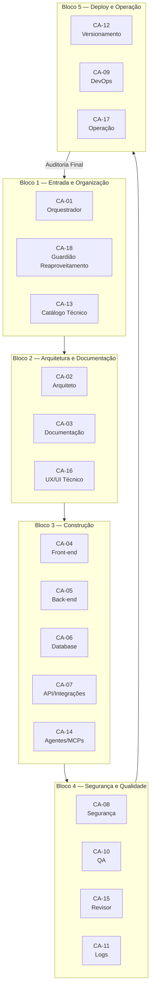
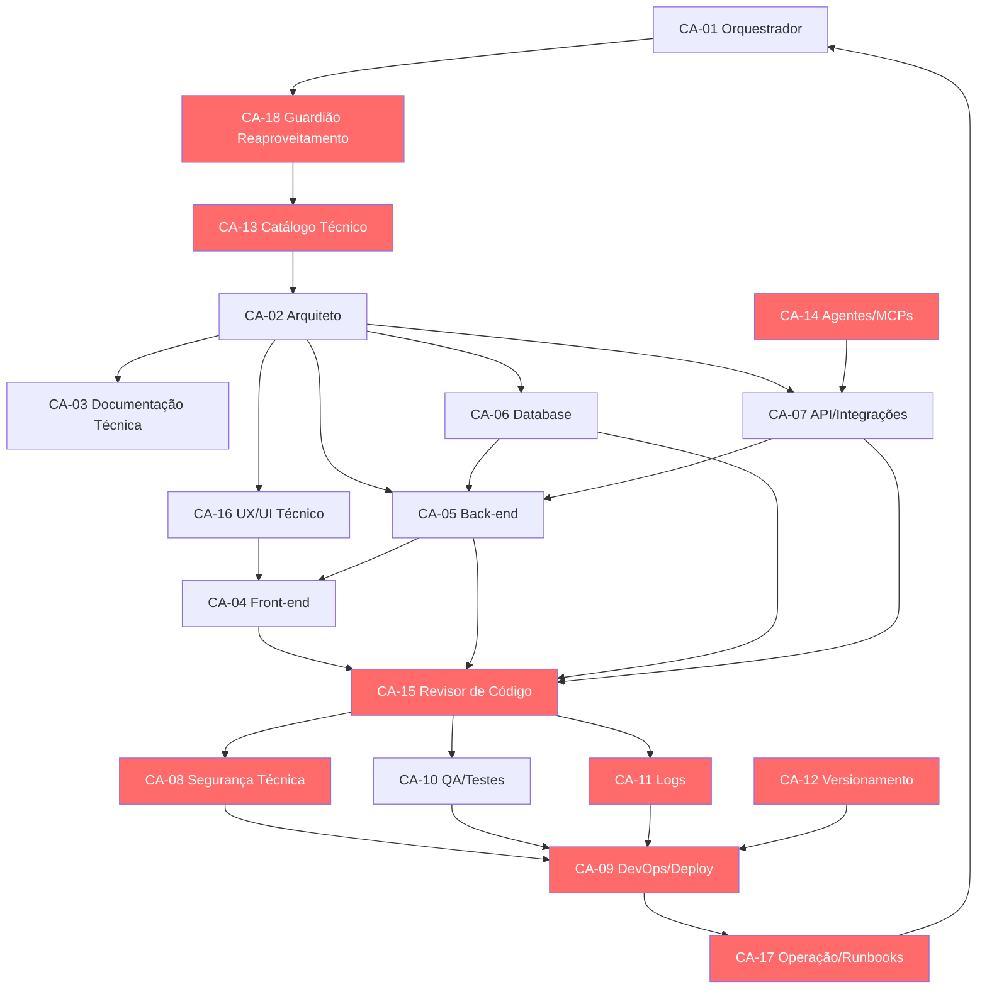

# Plano de Evolução: 11 → 18 Agentes na Sala Dev

> **Data:** 31 de maio de 2026
> **Contexto:** A Sala Dev está em v2.5.0 (Fase 2 concluída). O modelo atual tem 11 agentes no [`AGENTS.md`](../governance/metodologia_multiagentes/AGENTS.md), mas já existe um design de 18 agentes (CA-01 a CA-18) em [`docs/Sala Dev — Estrutura Visual dos 18 Agentes por Etapa da Esteira`](../docs/Sala%20Dev%20%E2%80%94%20Estrutura%20Visual%20dos%2018%20Agentes%20por%20Etapa%20da%20Esteira). O objetivo é evoluir o modelo para 18 agentes para distribuir carga, evitar alucinação, perda de memória e sobrecarga em agentes específicos.

---

## 1. Diagnóstico: O Problema de Ter Apenas 11 Agentes

```mermaid
flowchart LR
    subgraph PROBLEMA["Problema com 11 Agentes"]
        A1[Agentes acumulam<br/>múltiplas funções]
        A2[Contexto grande demais<br/>para um agente]
        A3[Overload cognitivo<br/>leva a alucinação]
        A4[Perda de memória<br/>entre etapas]
        A5[Dados inconsistentes<br/>por cansaço do agente]
    end

    subgraph SOLUCAO["Solução com 18 Agentes"]
        B1[Cada agente tem<br/>1 função específica]
        B2[Contexto menor<br/>e mais focado]
        B3[Menos alucinação<br/>por escopo reduzido]
        B4[Memória preservada<br/>por tarefa menor]
        B5[Dados consistentes<br/>por especialização]
    end

    PROBLEMA --> SOLUCAO
```



### Exemplos de sobrecarga no modelo atual de 11 agentes

| Agente atual (11) | Funções acumuladas | Problema |
|---|---|---|
| **System Architect** | Arquitetura + entidades + integrações + stack + pastas | Muita coisa para um agente só |
| **Frontend Engineer** | Páginas + componentes + hooks + estilos + estados | Contexto gigante, perde detalhes |
| **Backend Engineer** | Services + regras + rotas + integrações + dados | Idem |
| **QA Reviewer** | Revisar docs + código + banco + integrações + consistência | Precisa ser especialista em tudo |

---

## 2. Mapeamento: 11 Agentes → 18 Agentes

### Correspondência direta

| Código | Agente Novo (18) | Origem (11) | Especialização |
|---|---|---|---|
| CA-01 | Orquestrador Técnico | Orquestrador | Organiza fluxo, coordena handoffs |
| CA-02 | Arquiteto de Sistemas | System Architect | Só arquitetura, sem DB nem integrações |
| CA-03 | Documentação Técnica | Technical Writer | Só documentação, ADRs, changelog |
| CA-04 | Front-end Engineer | Frontend Engineer | Só React/TS/componentes |
| CA-05 | Back-end Engineer | Backend Engineer | Só lógica/serviços/regras |
| CA-06 | Supabase/Database Engineer | Database Engineer | Só banco/migrations/RLS |
| CA-07 | API & Integrations Engineer | Integrations Engineer | Só APIs/webhooks/contratos |
| CA-08 | Segurança Técnica | **NOVO** | Auth/RLS/tokens/dados sensíveis |
| CA-09 | DevOps/Deploy Engineer | **NOVO** | Build/deploy/rollback/Netlify |
| CA-10 | QA/Testes e Validação | QA Reviewer | Só testes/validação/checklist |
| CA-11 | Logs e Observabilidade | **NOVO** | Erros/logs/incidentes/rastreio |
| CA-12 | Versionamento Técnico | **NOVO** | Git/branches/releases/changelog |
| CA-13 | Catálogo Técnico | **NOVO** | Catálogo de módulos/tabelas/APIs |
| CA-14 | Agentes/MCPs/Automações | **NOVO** | IA/agentes/n8n/bridges |
| CA-15 | Revisor de Código | **NOVO** | Code review/dívida técnica |
| CA-16 | UX/UI Técnico | UX and Flow Designer | Só fluxo/telas/componentes visuais |
| CA-17 | Operação e Runbooks | **NOVO** | Manuais/incidentes/suporte |
| CA-18 | Guardião de Reaproveitamento | Product Strategist | Verificar duplicidade antes de construir |

### Agentes removidos ou absorvidos
- **Product Strategist** → Absorvido pelo CA-18 (Guardião de Reaproveitamento) + CA-01 (Orquestrador)
- **Project Planner** → Distribuído entre CA-01 (Orquestrador), CA-12 (Versionamento), CA-17 (Operação)

### Novos agentes (7) que precisam ser criados do zero
| Código | Agente | Justificativa |
|---|---|---|
| CA-08 | Segurança Técnica | Segurança é crítica demais para ser tratada como subtarefa |
| CA-09 | DevOps/Deploy Engineer | Deploy tem riscos de ambiente que exigem dedicação exclusiva |
| CA-11 | Logs e Observabilidade | Sem logs dedicados, problemas viram invisíveis |
| CA-12 | Versionamento Técnico | Git mal feito gera conflito, perda e retrabalho |
| CA-13 | Catálogo Técnico | Sem catálogo, ninguém sabe o que já existe |
| CA-14 | Agentes/MCPs/Automações | IA operacional exige agente dedicado |
| CA-15 | Revisor de Código | Código não revisado acumula dívida técnica |
| CA-17 | Operação e Runbooks | Sem runbook, só quem construiu sabe operar |

---

## 3. Estrutura dos 18 Agentes na Esteira



---

## 4. Plano de Implementação em 8 Etapas

### ET-01: Atualizar Documentos da Metodologia Multiagentes

**Objetivo:** Evoluir os documentos centrais da metodologia de 11 para 18 agentes

**Arquivos a modificar:**

| Arquivo | O que fazer |
|---|---|
| [`AGENTS.md`](../governance/metodologia_multiagentes/AGENTS.md) | Expandir de 11 para 18 agentes com CA-01 a CA-18, missão, ordem, entregáveis |
| [`PROJECT_BOOTSTRAP.md`](../governance/metodologia_multiagentes/PROJECT_BOOTSTRAP.md) | Atualizar agentes oficiais, regras de execução, estrutura |
| [`CONTEXT.md`](../governance/metodologia_multiagentes/CONTEXT.md) | Atualizar status, próximo passo, foco atual |

**Verificação:** AGENTS.md passa a listar 18 agentes com CA-01 a CA-18, não 11.

---

### ET-02: Criar Arquivos de Persona para os 7 Novos Agentes

**Objetivo:** Cada novo agente precisa de seu arquivo de persona (seguindo o padrão existente em [`agent/persona.md`](../agent/persona.md))

**Novos arquivos a criar (7):**

```
agent/
├── persona.md                    (existente — manter)
├── ca-08-seguranca-tecnica.md    ← CRIAR
├── ca-09-devops-deploy.md        ← CRIAR
├── ca-11-logs-observabilidade.md ← CRIAR
├── ca-12-versionamento.md        ← CRIAR
├── ca-13-catalogo-tecnico.md     ← CRIAR
├── ca-14-agentes-mcp.md          ← CRIAR
├── ca-15-revisor-codigo.md       ← CRIAR
└── ca-17-operacao-runbooks.md    ← CRIAR
```

**Observação:** CA-03 (Documentação Técnica) já existe como Technical Writer — apenas renomear/atualizar persona. CA-16 (UX/UI Técnico) já existe como UX and Flow Designer — atualizar persona.

**Cada persona deve conter:**
- Nome/código CA
- Missão específica
- Responsabilidades
- Entregáveis
- Input que recebe
- Output que produz
- Gatilhos de ativação

---

### ET-03: Atualizar o Plano da Central de Padrões para 18 Agentes

**Objetivo:** O documento [`central_padroes_por_agente_esteira.md`](central_padroes_por_agente_esteira.md) foi feito para 11 agentes. Precisa ser refeito para 18.

**Mapeamento novo para a Central de Padrões:**

| Agente (18) | Papel na Central de Padrões |
|---|---|
| CA-01 Orquestrador | Coordena toda a run da Central de Padrões |
| CA-02 Arquiteto | Define schema, módulos, estrutura de pastas |
| CA-03 Documentação | Cria docs técnicos, ADRs, changelog |
| CA-04 Front-end | Implementa 17 páginas, sidebar, componentes |
| CA-05 Back-end | Cria services, repository pattern, hooks |
| CA-06 Database | Cria migration de 19 tabelas, seeds, RLS |
| CA-07 API/Integrações | Conecta Supabase Storage, Netlify, webhooks |
| **CA-08 Segurança** | **NOVO:** Revisa RLS, tokens, dados sensíveis |
| **CA-09 DevOps** | **NOVO:** Configura deploy, build, variáveis |
| CA-10 QA | Valida checklist de 30 itens |
| **CA-11 Logs** | **NOVO:** Auditoria de execução, rastreabilidade |
| **CA-12 Versionamento** | **NOVO:** Organiza branches, releases |
| **CA-13 Catálogo** | **NOVO:** Registra módulos e componentes existentes |
| **CA-14 Agentes/MCPs** | **NOVO:** Prepara automações de ingestão |
| **CA-15 Revisor** | **NOVO:** Revisa código, aponta dívida técnica |
| CA-16 UX/UI | Define fluxo das 17 páginas, estados, componentes |
| **CA-17 Operação** | **NOVO:** Documenta procedimentos de uso |
| CA-18 Guardião | Verifica duplicidade antes de construir |

---

### ET-04: Criar Prompts de Ativação para os 7 Novos Agentes

**Objetivo:** Cada agente precisa de um arquivo de prompt de ativação (no padrão já usado pelos 11 agentes existentes).

**Formato do prompt:** Instruções claras sobre como o agente deve ser invocado, o que ele recebe como input, o que ele produz como output, em que contexto ele atua.

**Arquivos a criar:**
```
agent/prompts/
├── ca-01-orquestrador.md         (atualizar se existir)
├── ...
├── ca-08-seguranca.md            ← CRIAR
├── ca-09-devops.md               ← CRIAR
├── ca-11-logs.md                 ← CRIAR
├── ca-12-versionamento.md        ← CRIAR
├── ca-13-catalogo.md             ← CRIAR
├── ca-14-agentes-mcp.md          ← CRIAR
├── ca-15-revisor.md              ← CRIAR
└── ca-17-operacao.md             ← CRIAR
```

---

### ET-05: Atualizar o fluxo de Execução (plano_modulo.md)

**Objetivo:** O [`plano_modulo.md`](../plano_modulo.md) registra a evolução da Sala Dev. Precisa registrar:
- A evolução de 11 para 18 agentes
- A decisão de expandir para evitar sobrecarga
- O novo fluxo de execução com 6 blocos e 18 agentes
- A versão v3.0.0

---

### ET-06: Atualizar o Documento de 18 Agentes

**Objetivo:** O documento [`docs/Sala Dev — Estrutura Visual dos 18 Agentes por Etapa da Esteira`](../docs/Sala%20Dev%20%E2%80%94%20Estrutura%20Visual%20dos%2018%20Agentes%20por%20Etapa%20da%20Esteira) já tem o DESIGN dos 18 agentes. Mas pode precisar de ajustes finos:

- Validar se CA-18 (Guardião de Reaproveitamento) está bem definido
- Validar se CA-03 (Documentação Técnica) + CA-17 (Operação) não têm sobreposição
- Validar se CA-11 (Logs) não conflita com CA-10 (QA)
- Adicionar seções de "Como usar este agente" para cada CA

---

### ET-07: Atualizar Sistema de Agentes no Código (Frontend)

**Objetivo:** Se o frontend da Sala Dev faz referência a lista de agentes em código (mock data, tipos, hooks), precisa ser atualizado para 18 agentes.

**Possíveis arquivos a verificar/modificar:**
- `src/modules/sala-dev/types/*.ts` — tipos de agente
- `src/modules/sala-dev/services/*.ts` — mocks de agente
- `src/modules/sala-dev/hooks/*.ts` — hooks que usam agentes
- `src/modules/sala-dev/components/*.tsx` — componentes que exibem agentes

---

### ET-08: Testar e Validar a Transição

**Objetivo:** Garantir que a transição de 11 para 18 agentes não quebrou nada.

**Checklist de validação:**
- [ ] AGENTS.md lista 18 agentes (CA-01 a CA-18)
- [ ] PROJECT_BOOTSTRAP.md reflete 18 agentes
- [ ] CONTEXT.md atualizado
- [ ] 7 novas personas criadas em `agent/`
- [ ] 7 novos prompts criados em `agent/prompts/`
- [ ] Central de Padrões mapeada para 18 agentes
- [ ] plano_modulo.md atualizado com v3.0.0
- [ ] Documento dos 18 agentes revisado e ajustado
- [ ] Frontend (se aplicável) reflete 18 agentes
- [ ] Build passa sem erros (`npm run build`)

---

## 5. Detalhamento dos 7 Novos Agentes

### CA-08 — Segurança Técnica

| Campo | Valor |
|---|---|
| **Missão** | Garantir que tudo que é construído é seguro: autenticação, permissões, tokens, chaves, dados sensíveis, RLS, produção |
| **Quando entra** | Sempre que houver dados, usuários, permissões, tokens, integrações, banco ou produção |
| **Input** | Arquitetura, schema de banco, políticas de acesso, endpoints |
| **Output** | Checklist de segurança, riscos identificados, correções recomendadas, aprovação ou bloqueio |
| **Entregável** | `.docs/checklist-seguranca.md` |
| **Não faz** | Não implementa segurança sozinho — ele revisa e aponta |

### CA-09 — DevOps / Deploy Engineer

| Campo | Valor |
|---|---|
| **Missão** | Cuidar de Netlify, ambientes, variáveis, deploy, rollback, build, publicação e estabilidade |
| **Quando entra** | Na etapa de publicação, preview, deploy ou validação de ambiente |
| **Input** | Código pronto, configurações de ambiente, variáveis |
| **Output** | Preview/deploy, status de build, validação de ambiente, plano de rollback |
| **Entregável** | `.logs/deploy-execucao.md` |
| **Não faz** | Não escreve código de funcionalidade |

### CA-11 — Logs e Observabilidade

| Campo | Valor |
|---|---|
| **Missão** | Cuidar de registros de erros, bugs, falhas de execução, incidentes técnicos, logs e rastreabilidade |
| **Quando entra** | Durante e depois da implementação, antes da publicação |
| **Input** | Código implementado, rotas, serviços |
| **Output** | Logs analisados, pontos de observabilidade, incidentes registrados |
| **Entregável** | `.docs/observabilidade.md` |
| **Não faz** | Não testa funcionalidade (isso é QA) |

### CA-12 — Versionamento Técnico

| Campo | Valor |
|---|---|
| **Missão** | Cuidar de GitHub, branches, commits, releases, changelog técnico e organização de versões |
| **Quando entra** | Quando uma entrega precisa ser versionada ou preparada para release |
| **Input** | Código completo, documentação, decisões |
| **Output** | Versão organizada, release notes, changelog técnico |
| **Entregável** | Release tag no GitHub |
| **Não faz** | Não decide o que entra na release (isso é Orquestrador) |

### CA-13 — Catálogo Técnico

| Campo | Valor |
|---|---|
| **Missão** | Consultar e manter o catálogo de módulos, tabelas, APIs, services, integrações, automações e componentes reaproveitáveis |
| **Quando entra** | Junto com CA-18 (Guardião), logo no início da run |
| **Input** | Ideia do projeto, requisitos |
| **Output** | Lista de ativos técnicos existentes, módulos relacionados, componentes reaproveitáveis |
| **Entregável** | `.docs/catalogo-referencias.md` |
| **Não faz** | Não decide se reaproveita ou não (isso é CA-18) |

### CA-14 — Agentes, MCPs e Automações

| Campo | Valor |
|---|---|
| **Missão** | Cuidar de agentes técnicos, MCPs, bridges, automações com n8n e integração entre IA e sistemas |
| **Quando entra** | Quando o projeto exige automação, agentes, IA operacional, MCP ou ponte entre sistemas |
| **Input** | Requisitos de automação, fluxos manuais existentes |
| **Output** | Fluxo automatizado, agente configurado, MCP/bridge planejado |
| **Entregável** | `.specs/automacoes.md` |
| **Não faz** | Não implementa features core do sistema |

### CA-15 — Revisor de Código

| Campo | Valor |
|---|---|
| **Missão** | Revisar qualidade, duplicidade, manutenção, clareza, riscos e dívida técnica do código produzido |
| **Quando entra** | Depois do desenvolvimento e antes da validação final (CA-10 QA) |
| **Input** | Código implementado por CA-04, CA-05, CA-06, CA-07 |
| **Output** | Parecer de código, riscos de manutenção, sugestões de melhoria |
| **Entregável** | `.logs/revisao-codigo.md` |
| **Não faz** | Não testa funcionalidade (isso é QA), não testa segurança (isso é CA-08) |

### CA-17 — Operação e Runbooks

| Campo | Valor |
|---|---|
| **Missão** | Cuidar de manuais operacionais, procedimentos de uso, recuperação, incidentes, suporte e operação diária |
| **Quando entra** | No fechamento da entrega e preparação para uso real |
| **Input** | Sistema completo, arquitetura, decisões, changelog |
| **Output** | Runbook, manual operacional, instruções de suporte, plano de recuperação |
| **Entregável** | `.docs/runbook-operacional.md` |
| **Não faz** | Não modifica o código do sistema |

### CA-18 — Guardião de Reaproveitamento Técnico

| Campo | Valor |
|---|---|
| **Missão** | Antes de construir qualquer coisa, verificar se já existe algo parecido no SagB |
| **Quando entra** | Logo após CA-01, antes de qualquer construção |
| **Input** | Ideia do projeto, requisitos |
| **Output** | Itens reaproveitáveis, riscos de duplicação, recomendação: usar, adaptar ou criar |
| **Entregável** | `.docs/parecer-reaproveitamento.md` |
| **Não faz** | Não implementa — apenas analisa e recomenda |

---

## 6. Matriz de Dependências entre os 18 Agentes



**Legenda:** 🔴 Vermelho = Novos agentes (7) que precisam ser criados do zero.

---

## 7. Regras de Transição

1. **11 agentes NÃO são apagados** — AGENTS.md original é substituído pelo novo, mas o conteúdo dos 11 agentes existentes é mantido e expandido
2. **Personas existentes NÃO são deletadas** — apenas atualizadas para refletir o novo código CA e escopo
3. **Arquivos existentes de agentes (persona.md, prompt, falas, session_log)** são preservados e servem de template para os 7 novos
4. **Central de Padrões** foi mapeada para 11 agentes — precisa ser refeita para 18
5. **Frontend da Sala Dev** (se referenciar agentes por código) precisa ser atualizado
6. **plano_modulo.md** recebe entrada v3.0.0 registrando a evolução

---

## 8. Resumo Executivo

| Item | Valor |
|---|---|
| **Estado atual** | Sala Dev v2.5.0 com 11 agentes |
| **Estado desejado** | Sala Dev v3.0.0 com 18 agentes |
| **Novos agentes** | 7 (CA-08, CA-09, CA-11, CA-12, CA-13, CA-14, CA-15, CA-17) |
| **Agentes atualizados** | 4 (CA-01, CA-03, CA-16, CA-18) |
| **Agentes mantidos** | 7 (CA-02, CA-04, CA-05, CA-06, CA-07, CA-10) |
| **Documentos a modificar** | AGENTS.md, PROJECT_BOOTSTRAP.md, CONTEXT.md, plano_modulo.md |
| **Documentos a criar** | 7 personas, 7 prompts, 1 plano Central de Padrões v2 |
| **Benefício principal** | Distribuição de carga entre agentes → menos alucinação, menos perda de memória, dados mais consistentes |

---

*Documento gerado em 31 de maio de 2026.*
*Baseado na análise do estado atual da Sala Dev + documento de 18 agentes + necessidade de evitar sobrecarga em agentes.*
