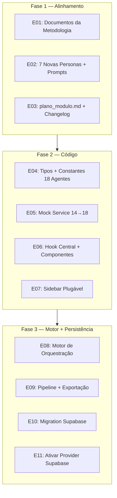
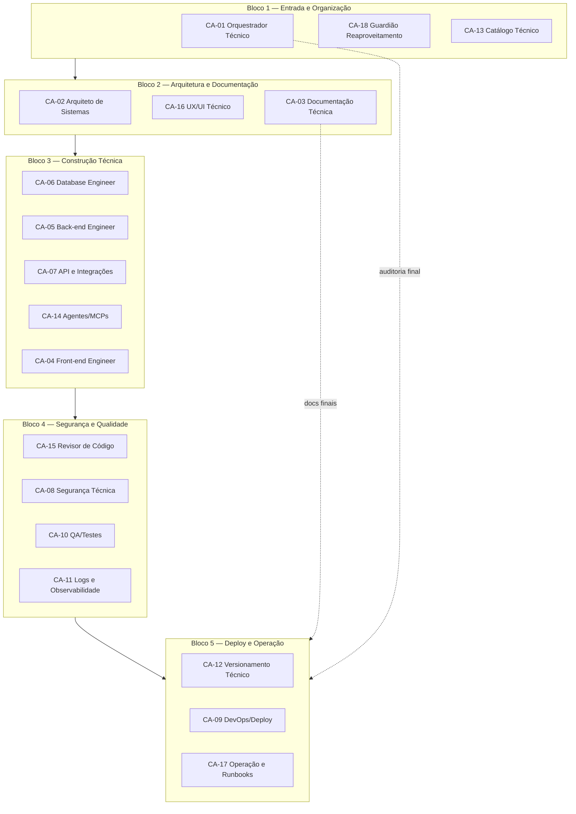

# Plano Profundo de Evolução: 11 → 18 Agentes na Sala Dev

> **Data:** 31 de maio de 2026
> **Baseado em:** Análise completa do módulo Sala Dev + execução da Central de Padrões com 18 agentes (comprovou o modelo)
> **Estado atual:** Sala Dev v2.5.0 — 11 agentes documentados, 14 agentes mockados, 18 agentes desenhados
> **Estado alvo:** Sala Dev v3.0.0 — 18 agentes operacionais integrados ao código, documentos e motor de execução

---

## 0. Diagnóstico Profundo — Estado Atual por Camada

### 0.1 Documentação da Metodologia

| Arquivo | Conteúdo atual | Problema | Impacto |
|---|---|---|---|
| [`AGENTS.md`](../governance/metodologia_multiagentes/AGENTS.md) | 11 agentes: Orquestrador, Product Strategist, System Architect, UX Designer, Project Planner, Frontend/Backend/DB/Integrations Engineers, QA Reviewer, Technical Writer | Não reflete os 18 agentes CA-01 a CA-18 | Nova execução vai usar nomenclatura errada |
| [`PROJECT_BOOTSTRAP.md`](../governance/metodologia_multiagentes/PROJECT_BOOTSTRAP.md) | Instruções para 11 agentes | Desatualizado | Agentes novos não sabem como atuar |
| [`CONTEXT.md`](../governance/metodologia_multiagentes/CONTEXT.md) | Contexto do projeto | Desatualizado | Perde rastreabilidade |
| [`docs/Sala Dev — Estrutura Visual dos 18 Agentes por Etapa da Esteira`](../docs/Sala%20Dev%20%E2%80%94%20Estrutura%20Visual%20dos%2018%20Agentes%20por%20Etapa%20da%20Esteira) | 18 agentes DESENHADOS (1121 linhas) | ✅ Já existe mas precisa de ajustes | Documento de referência visual |
| [`plano_modulo.md`](../plano_modulo.md) | Histórico da Sala Dev v2.5.0 | Desatualizado | Versão não reflete 18 agentes |
| [`agent/persona.md`](../agent/persona.md) | Persona da Sala Dev como agente | ✅ Válido | Template para as 7 novas personas |
| [`agent/falas_user.md`](../agent/falas_user.md) | Frases de ativação | ✅ Válido | Pode ser expandido |
| [`agent/session_log.md`](../agent/session_log.md) | Log de sessão | ✅ Válido | Template |

### 0.2 Código da Sala Dev (Frontend)

| Camada | Arquivo | Agentes atuais | Problema |
|---|---|---|---|
| **Mock Service** | [`salaDevMockService.ts`](../services/salaDevMockService.ts) | 14 agentes mockados (dev-1 a dev-14) — Orquestrador, Product Strat, Sys Architect, Planner, Frontend/Backend/DB/Integrations/Mobile/AI/QA/DevOps/Security/Tech Writer | **14 ≠ 11 ≠ 18**. Nomes e códigos não alinhados com CA-01 a CA-18 |
| **Agent Catalog Adapter** | [`salaDevAgentCatalogAdapter.ts`](../services/salaDevAgentCatalogAdapter.ts) | Adapta do catálogo oficial do SagB (App.tsx) | Precisa mapear CA-01 a CA-18 |
| **Domain Types** | [`salaDev.domain.ts`](../types/salaDev.domain.ts) | `RunAgentEntity`, `AgentCatalogEntity`, `RecommendedAgentEntity` | Tipos genéricos OK, mas sem constantes dos 18 agentes |
| **Status Types** | [`salaDev.status.ts`](../types/salaDev.status.ts) | `RunAgentStatus`, `MacroLayerStatus` (6 camadas) | 6 macrocamadas OK, mas precisam ser mapeadas para 5 blocos |
| **Hook Central** | [`useSalaDevRun.ts`](../hooks/useSalaDevRun.ts) | 289 linhas com lógica de run, agentes, handoffs, gates | Precisa suportar 18 agentes e 5 blocos |
| **Componentes** | `CommandCenterPanel`, `AgentsFlowPanel`, `WorkspacePanel` | Exibem agentes mockados | Precisam ser atualizados para exibir CA-01 a CA-18 |
| **UX Core** | `NewProjectEntryPanel` | Formulário de briefing | OK - genérico |
| **Layout** | `DevRoomView.tsx` | Header simples sem sidebar própria | Precisa de `SalaDevLayout.tsx` com sidebar plugável |

### 0.3 Persistência (Supabase)

| Camada | Arquivo | Status |
|---|---|---|
| Mock Repository | [`salaDevRepository.ts`](../services/salaDevRepository.ts) | ✅ Ativo como provider PADRÃO |
| Supabase Repository | [`salaDevSupabaseRepository.ts`](../services/salaDevSupabaseRepository.ts) | ✅ Implementado (326 linhas) mas DESLIGADO |
| Mapper | [`salaDevSupabaseMapper.ts`](../services/salaDevSupabaseMapper.ts) | ✅ Pronto |
| Persistence Types | [`salaDev.persistence.ts`](../types/salaDev.persistence.ts) | ✅ Modelado |
| Migration | `supabase/migrations/` | ❌ Não existe migration para Sala Dev |

### 0.4 Motor de Execução

| Componente | Status |
|---|---|
| Orquestrador de agentes | ❌ Não existe |
| Pipeline de transformação briefing → artefatos | ❌ Não existe |
| Geração de documentos/planos reais | ❌ Não existe |
| Integração com VS Code/Roo | ⚠️ Deny-by-default (ponte existe mas desabilitada) |
| Exportação técnica | ⚠️ `salaDevTechnicalExportService.ts` existe mas sem pipeline real |

### 0.5 Matriz de Inconsistências (CRÍTICO)

```
Documentação (AGENTS.md): 11 agentes
         ↓
Documento Visual (18 Agentes): 18 agentes
         ↓
Mock Service (código): 14 agentes
         ↓
Catálogo Oficial SagB: N agentes (variável)
         ↓
Frontend (exibição): 14 agentes mockados
```

**NENHUMA camada está alinhada com a outra.** Isso é o gap #1 a resolver.

---

## 1. Mapeamento Detalhado: Estado Atual → Estado Alvo

### 1.1 Tabela de Correspondência Completa

| Código | Nome Novo (18) | Nome Antigo (11) | Mock Atual (14) | Ação |
|---|---|---|---|---|
| CA-01 | Orquestrador Técnico | Orquestrador | dev-1 Orquestrador | Renomear + expandir escopo |
| CA-02 | Arquiteto de Sistemas | System Architect | dev-3 Sys Architect | Renomear |
| CA-03 | Documentação Técnica | Technical Writer | dev-14 Tech Writer | Renomear |
| CA-04 | Front-end Engineer | Frontend Engineer | dev-5 Frontend Eng. | Renomear |
| CA-05 | Back-end Engineer | Backend Engineer | dev-6 Backend Eng. | Renomear |
| CA-06 | Database Engineer | Database Engineer | dev-7 DB Engineer | Renomear |
| CA-07 | API & Integrations Engineer | Integrations Engineer | dev-8 Integrations | Renomear |
| **CA-08** | **Segurança Técnica** | — | dev-13 Security Eng. | **Criar (mock existe)** |
| **CA-09** | **DevOps/Deploy Engineer** | — | dev-12 DevOps Eng. | **Criar (mock existe)** |
| CA-10 | QA/Testes e Validação | QA Reviewer | dev-11 QA Reviewer | Renomear |
| **CA-11** | **Logs e Observabilidade** | — | — | **Criar DO ZERO** |
| **CA-12** | **Versionamento Técnico** | — | — | **Criar DO ZERO** |
| **CA-13** | **Catálogo Técnico** | — | — | **Criar DO ZERO** |
| **CA-14** | **Agentes/MCPs/Automações** | — | dev-10 AI Engineer | **Criar (mock existe, renomear)** |
| **CA-15** | **Revisor de Código** | — | — | **Criar DO ZERO** |
| CA-16 | UX/UI Técnico | UX and Flow Designer | — | Renomear |
| **CA-17** | **Operação e Runbooks** | — | — | **Criar DO ZERO** |
| CA-18 | Guardião de Reaproveitamento | Product Strategist | dev-2 Product Strat. | Renomear + mudar escopo |

### 1.2 Agentes Removidos

| Agente Antigo | Destino |
|---|---|
| **Product Strategist** (ET-02) | → CA-18 Guardião de Reaproveitamento (escopo diferente: não cria visão de produto, verifica duplicidade) |
| **Project Planner** (ET-05) | → Distribuído entre CA-01 Orquestrador + CA-12 Versionamento + CA-17 Operação |
| **Mobile Engineer** (dev-9) | → Não faz parte dos 18 agentes essenciais. Pode ser adicionado na expansão para 30. |

### 1.3 Macrocamadas (6) → Blocos (5)

| Macrocamada Atual | Bloco Novo (18 agentes) | Agentes |
|---|---|---|
| 1. Descoberta e Definição | **Bloco 1** — Entrada e Organização | CA-01, CA-18, CA-13 |
| 2. Arquitetura e Planejamento | **Bloco 2** — Arquitetura e Documentação | CA-02, CA-16, CA-03 |
| 3. Implementação Técnica | **Bloco 3** — Construção Técnica | CA-04, CA-05, CA-06, CA-07, CA-14 |
| 4. Revisão e Qualidade | **Bloco 4** — Segurança e Qualidade | CA-08, CA-15, CA-10, CA-11 |
| 5. Deploy e Entrega | **Bloco 5** — Deploy e Operação | CA-12, CA-09, CA-17 |
| 6. Documentação Final | (incorporado no Bloco 5 + Auditoria Final) | CA-03 revisita |

---

## 2. Gaps por Camada — O que PRECISA ser criado/modificado

### 2.1 Documentação (7 arquivos)

| # | Arquivo | Ação | Complexidade |
|---|---|---|---|
| D01 | [`AGENTS.md`](../governance/metodologia_multiagentes/AGENTS.md) | Reescrever: 11 → 18 agentes, CA-01 a CA-18, 5 blocos, entregáveis por agente | 🟡 Médio |
| D02 | [`PROJECT_BOOTSTRAP.md`](../governance/metodologia_multiagentes/PROJECT_BOOTSTRAP.md) | Atualizar com 18 agentes, nova ordem, regras de handoff | 🟡 Médio |
| D03 | [`CONTEXT.md`](../governance/metodologia_multiagentes/CONTEXT.md) | Atualizar status, foco, próximos passos | 🟢 Fácil |
| D04 | Personas em [`agent/`](../agent/) | Criar 7 novas personas (CA-08, CA-09, CA-11, CA-12, CA-13, CA-15, CA-17). Atualizar 7 existentes | 🔴 Alto |
| D05 | Prompts em [`agent/prompts/`](../agent/prompts/) | Criar prompts de ativação para os 7 novos. Atualizar 7 existentes | 🟡 Médio |
| D06 | [`plano_modulo.md`](../plano_modulo.md) | Adicionar entrada v3.0.0 com evolução para 18 agentes | 🟢 Fácil |
| D07 | [`docs/Sala Dev — Estrutura Visual dos 18 Agentes por Etapa da Esteira`](../docs/Sala%20Dev%20%E2%80%94%20Estrutura%20Visual%20dos%2018%20Agentes%20por%20Etapa%20da%20Esteira) | Ajustar (blocos, nomes CA, detalhar cada agente) | 🟡 Médio |

### 2.2 Código — Mock Service (1 arquivo)

| # | Arquivo | Ação | Complexidade |
|---|---|---|---|
| M01 | [`salaDevMockService.ts`](../services/salaDevMockService.ts) | Reescrever `MOCK_DEV_AGENTS` de 14 para 18 agentes CA-01 a CA-18 | 🟡 Médio |

**O que muda no mock:**
```typescript
// ANTES: 14 agentes com IDs dev-1 a dev-14
const MOCK_DEV_AGENTS: DevAgent[] = [
  { id: 'dev-1', name: 'Orquestrador', ... },
  { id: 'dev-2', name: 'Product Strat.', ... },
  // ... 12 mais
];

// DEPOIS: 18 agentes com IDs CA-01 a CA-18
const MOCK_DEV_AGENTS: DevAgent[] = [
  { id: 'CA-01', name: 'Orquestrador Técnico', code: 'CA-01', block: 'Entrada e Organização', ... },
  { id: 'CA-02', name: 'Arquiteto de Sistemas', code: 'CA-02', block: 'Arquitetura e Documentação', ... },
  // ... 16 mais
];
```

**Impacto downstream:**
- `MOCK_FLOW_EVENTS` — precisa ter eventos simulados para 18 agentes
- `MOCK_RUN` — precisa refletir 5 blocos em vez de 6 macrocamadas
- `MOCK_FILE_TREE` — precisa gerar artefatos para cada bloco

### 2.3 Código — Tipos (2 arquivos)

| # | Arquivo | Ação | Complexidade |
|---|---|---|---|
| T01 | [`salaDev.domain.ts`](../types/salaDev.domain.ts) | Adicionar constantes `AGENT_CA01` a `AGENT_CA18`, tipo `AgentBlock` (5 blocos), expandir `MacroLayerEntity` | 🟡 Médio |
| T02 | [`salaDev.status.ts`](../types/salaDev.status.ts) | Adicionar `AgentBlockStatus`, `BlockName` type | 🟢 Fácil |

**Novos tipos:**
```typescript
export type AgentCode = 'CA-01' | 'CA-02' | 'CA-03' | 'CA-04' | 'CA-05' | 'CA-06' 
  | 'CA-07' | 'CA-08' | 'CA-09' | 'CA-10' | 'CA-11' | 'CA-12' 
  | 'CA-13' | 'CA-14' | 'CA-15' | 'CA-16' | 'CA-17' | 'CA-18';

export type BlockName = 
  | 'Entrada e Organização'
  | 'Arquitetura e Documentação'
  | 'Construção Técnica'
  | 'Segurança e Qualidade'
  | 'Deploy e Operação';

export const BLOCK_AGENTS: Record<BlockName, AgentCode[]> = {
  'Entrada e Organização': ['CA-01', 'CA-18', 'CA-13'],
  'Arquitetura e Documentação': ['CA-02', 'CA-16', 'CA-03'],
  'Construção Técnica': ['CA-04', 'CA-05', 'CA-06', 'CA-07', 'CA-14'],
  'Segurança e Qualidade': ['CA-08', 'CA-15', 'CA-10', 'CA-11'],
  'Deploy e Operação': ['CA-12', 'CA-09', 'CA-17'],
};
```

### 2.4 Código — Hook Central (1 arquivo)

| # | Arquivo | Ação | Complexidade |
|---|---|---|---|
| H01 | [`useSalaDevRun.ts`](../hooks/useSalaDevRun.ts) | Atualizar lógica de 6 macrocamadas para 5 blocos, adicionar seleção de agente por bloco | 🔴 Alto |

**O que muda:**
- `macroLayers` (6) → `blocks` (5) com a nova nomenclatura
- `getAgentsByMacroLayer()` → `getAgentsByBlock()`
- Handoffs entre blocos em vez de entre macrocamadas
- Gates por bloco em vez de por macrocamada

### 2.5 Código — Componentes (3 arquivos)

| # | Arquivo | Ação | Complexidade |
|---|---|---|---|
| C01 | [`CommandCenterPanel.tsx`](../components/CommandCenterPanel.tsx) | Exibir bloco atual em vez de macrocamada, agente CA-XX em execução | 🟡 Médio |
| C02 | [`AgentsFlowPanel.tsx`](../components/AgentsFlowPanel.tsx) | Renderizar 5 blocos com 18 agentes em vez de 6 macrocamadas com 14 agentes | 🔴 Alto |
| C03 | [`WorkspacePanel.tsx`](../components/WorkspacePanel.tsx) | Exibir artefatos por bloco/agente CA-XX | 🟡 Médio |

### 2.6 Código — Layout (1 arquivo)

| # | Arquivo | Ação | Complexidade |
|---|---|---|---|
| L01 | Criar [`layout/SalaDevLayout.tsx`](../layout/SalaDevLayout.tsx) | Sidebar plugável própria com navegação interna | 🔴 Alto |
| L02 | [`DevRoomView.tsx`](../components/DevRoomView.tsx) | Adaptar para usar SalaDevLayout | 🟡 Médio |

### 2.7 Persistência — Supabase (2 arquivos)

| # | Arquivo | Ação | Complexidade |
|---|---|---|---|
| S01 | Criar migration `saladev_v3_18_agentes.sql` | Tabelas para persistir runs com 18 agentes, 5 blocos | 🟡 Médio |
| S02 | [`salaDevSupabaseRepository.ts`](../services/salaDevSupabaseRepository.ts) | Atualizar queries para suportar 18 agentes e 5 blocos | 🟡 Médio |

### 2.8 Motor de Orquestração (NOVO)

| # | Arquivo | Ação | Complexidade |
|---|---|---|---|
| E01 | Criar [`services/salaDevOrchestratorEngine.ts`](../services/salaDevOrchestratorEngine.ts) | Motor que executa os 18 agentes em sequência por bloco | 🔴🔴 Muito Alto |
| E02 | Criar [`services/salaDevPipelineService.ts`](../services/salaDevPipelineService.ts) | Pipeline briefing → artefatos → documentação | 🔴 Alto |
| E03 | Criar [`services/salaDevExecutionPlanner.ts`](../services/salaDevExecutionPlanner.ts) | Planejador que quebra briefing em tarefas por agente | 🔴 Alto |

---

## 3. Plano de Execução — 3 Fases, 11 Etapas



### 3.1 Fase 1 — Alinhamento Documental (5 arquivos)

#### E01: Atualizar Documentos da Metodologia Multiagentes

**Arquivos:** [`AGENTS.md`](../governance/metodologia_multiagentes/AGENTS.md), [`PROJECT_BOOTSTRAP.md`](../governance/metodologia_multiagentes/PROJECT_BOOTSTRAP.md), [`CONTEXT.md`](../governance/metodologia_multiagentes/CONTEXT.md)

**O que fazer em AGENTS.md:**
```markdown
# AGENTS.md — Sistema Multiagentes do Projeto (v3.0.0)

## Visão Geral
18 agentes oficiais organizados em 5 blocos sequenciais: Entrada → Arquitetura → Construção → Qualidade → Deploy.

## Lista de Agentes

### CA-01 — Orquestrador Técnico
**Bloco:** 1 — Entrada e Organização
**Missão:** Receber a ideia, organizar o fluxo, decidir a ordem das etapas...
**Ordem de Atuação:** Bloco 1, passo 1
**Entregáveis:** `.plans/00-fluxo-geral.md`, `.logs/00-orquestracao.md`

### CA-02 — Arquiteto de Sistemas
**Bloco:** 2 — Arquitetura e Documentação
...

...até CA-18
```

**Checklist:**
- [ ] AGENTS.md reescrito com 18 agentes CA-01 a CA-18
- [ ] Cada agente tem: bloco, missão, input, output, entregáveis, "não faz"
- [ ] Ordem de atuação por bloco documentada
- [ ] PROJECT_BOOTSTRAP.md atualizado com 18 agentes
- [ ] CONTEXT.md atualizado

#### E02: Criar 7 Novas Personas + 7 Prompts de Ativação

**Personas a criar em [`agent/`](../agent/):**

| Arquivo | Conteúdo |
|---|---|
| [`ca-08-seguranca-tecnica.md`](../agent/ca-08-seguranca-tecnica.md) | Persona do CA-08: missão, skills, tom de voz, regras |
| [`ca-09-devops-deploy.md`](../agent/ca-09-devops-deploy.md) | Persona do CA-09 |
| [`ca-11-logs-observabilidade.md`](../agent/ca-11-logs-observabilidade.md) | Persona do CA-11 |
| [`ca-12-versionamento.md`](../agent/ca-12-versionamento.md) | Persona do CA-12 |
| [`ca-13-catalogo-tecnico.md`](../agent/ca-13-catalogo-tecnico.md) | Persona do CA-13 |
| [`ca-15-revisor-codigo.md`](../agent/ca-15-revisor-codigo.md) | Persona do CA-15 |
| [`ca-17-operacao-runbooks.md`](../agent/ca-17-operacao-runbooks.md) | Persona do CA-17 |

**Personas a atualizar (7):** CA-01, CA-02, CA-03, CA-04, CA-05, CA-06, CA-07 — adicionar código CA, bloco, escopo refinado.

**Prompts a criar em [`agent/prompts/`](../agent/prompts/):**
Mesmo esquema — 7 novos prompts de ativação, 7 prompts atualizados.

**Template de persona:**
```markdown
# CA-XX — Nome do Agente

## Identidade
- **Código:** CA-XX
- **Bloco:** Nome do Bloco
- **Depende de:** CA-YY
- **Entrega para:** CA-ZZ

## Missão
[descrição]

## Responsabilidades
1. ...
2. ...

## Input
- O que recebe

## Output
- O que produz

## Entregável principal
- `caminho/do/arquivo`

## Não faz
- [ ] Não implementa [coisa]
```

#### E03: Atualizar plano_modulo.md + changelog

**Arquivo:** [`plano_modulo.md`](../plano_modulo.md)

**Entrada a adicionar:**
```markdown
## v3.0.0 — Evolução para 18 Agentes

**Data:** 31/05/2026

### O que mudou
- Metodologia multiagentes evoluiu de 11 para 18 agentes
- 6 macrocamadas → 5 blocos
- 7 novos agentes criados (CA-08, CA-09, CA-11, CA-12, CA-13, CA-14, CA-15, CA-17)
- AGENTS.md, PROJECT_BOOTSTRAP.md, CONTEXT.md reescritos
- Mock service atualizado para 18 agentes
- Tipos e constantes de agente expandidos
- Componentes de UI atualizados para 5 blocos

### Arquivos modificados
- AGENTS.md, PROJECT_BOOTSTRAP.md, CONTEXT.md
- salaDevMockService.ts, salaDev.domain.ts, salaDev.status.ts
- useSalaDevRun.ts, CommandCenterPanel, AgentsFlowPanel, WorkspacePanel

### Arquivos criados
- 7 novas personas, 7 novos prompts
- layout/SalaDevLayout.tsx
```

---

### 3.2 Fase 2 — Código (Tipos, Mock, Hooks, Componentes, Layout)

#### E04: Atualizar Tipos e Constantes

**Arquivos:** [`salaDev.domain.ts`](../types/salaDev.domain.ts), [`salaDev.status.ts`](../types/salaDev.status.ts)

**O que adicionar em salaDev.domain.ts:**
```typescript
// ===== CONSTANTES DOS 18 AGENTES =====

export type AgentCode = 'CA-01' | 'CA-02' | 'CA-03' | 'CA-04' | 'CA-05' | 'CA-06' 
  | 'CA-07' | 'CA-08' | 'CA-09' | 'CA-10' | 'CA-11' | 'CA-12' 
  | 'CA-13' | 'CA-14' | 'CA-15' | 'CA-16' | 'CA-17' | 'CA-18';

export type BlockName = 
  | 'Entrada e Organização'
  | 'Arquitetura e Documentação'
  | 'Construção Técnica'
  | 'Segurança e Qualidade'
  | 'Deploy e Operação';

export interface AgentBlockEntity {
  name: BlockName;
  order: 1 | 2 | 3 | 4 | 5;
  agents: AgentCode[];
  status: 'pending' | 'running' | 'completed' | 'blocked';
  currentAgentIndex: number;
  progress: number;
}

export const BLOCK_AGENTS: Record<BlockName, AgentCode[]> = { ... };
export const AGENT_INFO: Record<AgentCode, { name: string; block: BlockName; role: string }> = { ... };
```

**O que adicionar em salaDev.status.ts:**
```typescript
export type AgentBlockStatus = 'pending' | 'running' | 'completed' | 'blocked';
```

#### E05: Atualizar Mock Service (14 → 18 agentes)

**Arquivo:** [`salaDevMockService.ts`](../services/salaDevMockService.ts)

**O que mudar:**
```typescript
// ANTIGO: 14 agentes mockados com IDs dev-1 a dev-14
const MOCK_DEV_AGENTS: DevAgent[] = [ ... 14 itens ... ];

// NOVO: 18 agentes mockados com IDs CA-01 a CA-18
const MOCK_DEV_AGENTS: DevAgent[] = [
  { id: 'CA-01', code: 'CA-01', name: 'Orquestrador Técnico', block: 'Entrada e Organização', role: 'Orquestrador de Desenvolvimento', ... },
  { id: 'CA-02', code: 'CA-02', name: 'Arquiteto de Sistemas', block: 'Arquitetura e Documentação', role: 'System Architect', ... },
  { id: 'CA-03', code: 'CA-03', name: 'Documentação Técnica', block: 'Arquitetura e Documentação', role: 'Technical Writer', ... },
  { id: 'CA-04', code: 'CA-04', name: 'Front-end Engineer', block: 'Construção Técnica', role: 'Frontend Engineer', ... },
  { id: 'CA-05', code: 'CA-05', name: 'Back-end Engineer', block: 'Construção Técnica', role: 'Backend Engineer', ... },
  { id: 'CA-06', code: 'CA-06', name: 'Database Engineer', block: 'Construção Técnica', role: 'Database Engineer', ... },
  { id: 'CA-07', code: 'CA-07', name: 'API & Integrations', block: 'Construção Técnica', role: 'Integrations Engineer', ... },
  { id: 'CA-08', code: 'CA-08', name: 'Segurança Técnica', block: 'Segurança e Qualidade', role: 'Security Engineer', ... },
  { id: 'CA-09', code: 'CA-09', name: 'DevOps/Deploy', block: 'Deploy e Operação', role: 'DevOps Engineer', ... },
  { id: 'CA-10', code: 'CA-10', name: 'QA/Testes', block: 'Segurança e Qualidade', role: 'QA Reviewer', ... },
  { id: 'CA-11', code: 'CA-11', name: 'Logs e Observabilidade', block: 'Segurança e Qualidade', role: 'Observability Engineer', ... },
  { id: 'CA-12', code: 'CA-12', name: 'Versionamento Técnico', block: 'Deploy e Operação', role: 'Versioning Engineer', ... },
  { id: 'CA-13', code: 'CA-13', name: 'Catálogo Técnico', block: 'Entrada e Organização', role: 'Technical Cataloger', ... },
  { id: 'CA-14', code: 'CA-14', name: 'Agentes/MCPs', block: 'Construção Técnica', role: 'Automation Engineer', ... },
  { id: 'CA-15', code: 'CA-15', name: 'Revisor de Código', block: 'Segurança e Qualidade', role: 'Code Reviewer', ... },
  { id: 'CA-16', code: 'CA-16', name: 'UX/UI Técnico', block: 'Arquitetura e Documentação', role: 'UX Designer', ... },
  { id: 'CA-17', code: 'CA-17', name: 'Operação/Runbooks', block: 'Deploy e Operação', role: 'Operations Engineer', ... },
  { id: 'CA-18', code: 'CA-18', name: 'Guardião Reaproveitamento', block: 'Entrada e Organização', role: 'Reuse Guardian', ... },
];
```

**Impacto nos eventos mockados:**
- `MOCK_FLOW_EVENTS` precisa refletir a nova ordem: Bloco 1 → Bloco 2 → Bloco 3 → Bloco 4 → Bloco 5
- Handoffs entre blocos em vez de entre macrocamadas
- Gates por bloco

#### E06: Atualizar Hook Central + Componentes

**Hook:** [`useSalaDevRun.ts`](../hooks/useSalaDevRun.ts)
- Renomear `macroLayers` para `blocks` (ou manter compatibilidade)
- Adicionar `getAgentsByBlock(blockName): AgentCatalogEntity[]`
- Adicionar `getCurrentBlock(): AgentBlockEntity`
- Adicionar `getNextBlock(): AgentBlockEntity | null`
- Manter `getAgentsByMacroLayer()` como deprecated wrapper

**Componentes:**

| Componente | O que muda |
|---|---|
| [`CommandCenterPanel.tsx`](../components/CommandCenterPanel.tsx) | Mostrar "Bloco X — Nome do Bloco" em vez de macrocamada. Agente atual é "CA-XX — Nome". |
| [`AgentsFlowPanel.tsx`](../components/AgentsFlowPanel.tsx) | Renderizar 5 blocos como grupos. Cada bloco mostra seus agentes CA-01 a CA-XX. Handoff entre blocos. |
| [`WorkspacePanel.tsx`](../components/WorkspacePanel.tsx) | Artefatos agrupados por bloco. Filtro por CA-XX. |

#### E07: Sidebar Plugável da Sala Dev

**CRIAR:** [`layout/SalaDevLayout.tsx`](../layout/SalaDevLayout.tsx)

```tsx
// Estrutura da sidebar:
// [Ícone Sala Dev]
// ──────────────
// 🏠 Home
// 🚀 Runs Ativas
// 📋 Workflows
// 📚 Catálogo de Agentes
// ⚙️ Configurações
// ──────────────
// ← Voltar ao SagB
```

**MODIFICAR:** [`DevRoomView.tsx`](../components/DevRoomView.tsx)
- Envolver em `SalaDevLayout`
- Remover header simples
- Adicionar `tabId` na condição `hideSidebar` do `App.tsx`

---

### 3.3 Fase 3 — Motor de Orquestração + Persistência

#### E08: Motor de Orquestração (NOVO)

**Arquivo:** [`services/salaDevOrchestratorEngine.ts`](../services/salaDevOrchestratorEngine.ts)

```typescript
export class SalaDevOrchestratorEngine {
  // Estados da run
  private currentBlock: number = 0; // 0 a 4
  private currentAgentIndex: number = 0;
  private runStatus: 'idle' | 'running' | 'paused' | 'completed' | 'failed' = 'idle';
  
  // Iniciar execução de uma run
  async startRun(briefing: string): Promise<DevRunEntity>
  
  // Executar o agente atual do bloco atual
  async executeCurrentAgent(): Promise<ArtifactEntity>
  
  // Avançar para o próximo agente/bloco
  async next(): Promise<{ agent: AgentCode; block: BlockName } | null>
  
  // Validar gate do bloco atual
  async validateGate(): Promise<GateResult>
  
  // Gerar artefatos da execução do agente
  async generateArtifacts(agent: AgentCode, input: string): Promise<ArtifactEntity[]>
}
```

**Fluxo de execução:**
```
startRun(briefing)
  → Bloco 1: CA-01 (orquestra) → CA-18 (verifica reuso) → CA-13 (cataloga)
    → Gate 1: Briefing validado? Ativos catalogados?
  → Bloco 2: CA-02 (arquiteta) → CA-16 (desenha UX) → CA-03 (documenta)
    → Gate 2: Arquitetura aprovada? Documentação iniciada?
  → Bloco 3: CA-06 (DB) → CA-05 (backend) → CA-07 (APIs) → CA-14 (automações) → CA-04 (frontend)
    → Gate 3: Implementação completa? Build passa?
  → Bloco 4: CA-15 (revisa código) → CA-08 (segurança) → CA-10 (QA) → CA-11 (logs)
    → Gate 4: Revisão aprovada? QA passa? Segurança OK?
  → Bloco 5: CA-12 (versiona) → CA-09 (deploy) → CA-17 (runbook) → CA-03 (docs finais)
    → Gate 5: Deploy realizado? Runbook pronto?
  → Auditoria Final
```

#### E09: Pipeline + Serviço de Exportação

**Arquivo:** [`services/salaDevPipelineService.ts`](../services/salaDevPipelineService.ts)

```typescript
export class SalaDevPipelineService {
  // Transforma briefing em plano de execução detalhado
  async plan(briefing: string): Promise<ExecutionPlan>
  
  // Gera artefatos de documentação para um agente específico
  async generateArtifact(agent: AgentCode, input: any): Promise<ArtifactEntity>
  
  // Cria estrutura de pastas do projeto alvo
  async createProjectStructure(plan: ExecutionPlan): Promise<FileNode[]>
  
  // Gera pacote técnico exportável
  async exportTechnicalPackage(runId: string): Promise<TechnicalExecutionPackage>
}
```

#### E10: Migration Supabase para Sala Dev

**Arquivo:** [`supabase/migrations/20260531235000_saladev_v3_18_agentes.sql`](../../../../../supabase/migrations/20260531235000_saladev_v3_18_agentes.sql)

**Tabelas:**
| Tabela | Finalidade |
|---|---|
| `saladev_runs` | Runs de desenvolvimento |
| `saladev_run_agents` | Agentes CA-XX em cada run |
| `saladev_run_blocks` | Blocos 1-5 em cada run |
| `saladev_run_artifacts` | Artefatos gerados |
| `saladev_run_logs` | Logs de execução |
| `saladev_run_decisions` | Decisões durante a run |
| `saladev_run_gates` | Gates de validação |

#### E11: Ativar Provider Supabase como Padrão

**Arquivo:** [`salaDevRepository.ts`](../services/salaDevRepository.ts)

**O que mudar:**
```typescript
// ANTES: mock como padrão
const provider = 'mock';

// DEPOIS: supabase como padrão com fallback mock
const provider = import.meta.env.VITE_SALA_DEV_DATA_PROVIDER || 'supabase';
```

**E se Supabase falhar?** O repositório já tem fallback implementado. Só precisa testar.

---

## 4. Matriz de Esforço vs Impacto (Detalhada)

| Etapa | Esforço | Impacto | Prioridade | Depende de |
|---|---|---|---|---|
| E01: Documentos Metodologia | 🟢 Baixo | 🟢 Crítico | **1** | Nada |
| E02: 7 Personas + Prompts | 🟡 Médio | 🟢 Alto | **2** | E01 (referência) |
| E03: plano_modulo.md | 🟢 Baixo | 🟡 Médio | **3** | E01+E02 |
| E04: Tipos e Constantes | 🟢 Baixo | 🟢 Crítico | **4** | Nada (código) |
| E05: Mock 14→18 | 🟡 Médio | 🟢 Alto | **5** | E04 (tipos novos) |
| E06: Hook + Componentes | 🔴 Alto | 🟢 Alto | **6** | E04+E05 |
| E07: Sidebar Plugável | 🔴 Alto | 🟡 Médio | **7** | Nada (isolado) |
| E08: Motor Orquestração | 🔴🔴 Muito Alto | 🟢🚀 Transformador | **8** | E06 (componentes) |
| E09: Pipeline + Exportação | 🔴 Alto | 🟢 Alto | **9** | E08 |
| E10: Migration Supabase | 🟡 Médio | 🟢 Alto | **10** | E08 (schema) |
| E11: Ativar Provider | 🟢 Baixo | 🟢 Alto | **11** | E10 |

---

## 5. Riscos e Mitigações

| Risco | Probabilidade | Impacto | Mitigação |
|---|---|---|---|
| Quebrar mock existente ao mudar IDs de dev-X para CA-XX | Alta | Alto | Manter compatibilidade: adicionar campo `code: AgentCode` sem remover `id` |
| Componentes quebrados após renomear macrocamadas para blocos | Alta | Alto | Manter wrapper `macroLayers` como getter deprecated enquanto migra para `blocks` |
| Motor de orquestração complexo demais para uma única etapa | Alta | Médio | Implementar versão 0.1 simplificada (só sequência, sem execução real de código) |
| Sidebar plugável quebra navegação existente | Média | Alto | Testar em paralelo com header atual; fallback para DevRoomView original |
| AGENTS.md muito grande com 18 agentes | Média | Baixo | Manter descrições concisas; usar tabelas para visão geral |
| Usuário esperar execução real e receber só simulação | Alta | Alto | Comunicar claramente: Fase 3 = motor de orquestração com geração de artefatos, NÃO execução de código real |

---

## 6. Resumo dos Artefatos por Etapa

| Etapa | Arquivos | Total |
|---|---|---|
| E01 | AGENTS.md, PROJECT_BOOTSTRAP.md, CONTEXT.md | 3 modificados |
| E02 | ca-08 a ca-17 (7 personas) + 7 prompts | 14 criados |
| E03 | plano_modulo.md | 1 modificado |
| E04 | salaDev.domain.ts, salaDev.status.ts | 2 modificados |
| E05 | salaDevMockService.ts | 1 modificado |
| E06 | useSalaDevRun.ts, CommandCenterPanel, AgentsFlowPanel, WorkspacePanel | 4 modificados |
| E07 | SalaDevLayout.tsx (criar), DevRoomView.tsx (modificar) | 1 criado + 1 modificado |
| E08 | salaDevOrchestratorEngine.ts | 1 criado |
| E09 | salaDevPipelineService.ts | 1 criado |
| E10 | migration SQL | 1 criado |
| E11 | salaDevRepository.ts | 1 modificado |

**Total:** ~30 arquivos envolvidos (17 criados, 13 modificados)

---

## 7. Ordem de Execução Recomendada

### Sessão 1 (Fase 1 — Documentação)
1. E01: AGENTS.md, PROJECT_BOOTSTRAP.md, CONTEXT.md
2. E02: 7 personas + 7 prompts
3. E03: plano_modulo.md

### Sessão 2 (Fase 2 — Código Base)
4. E04: Tipos e constantes
5. E05: Mock service 14→18
6. E06: Hook central + componentes

### Sessão 3 (Fase 2 — Layout)
7. E07: Sidebar plugável

### Sessão 4 (Fase 3 — Motor)
8. E08: Motor de orquestração
9. E09: Pipeline + exportação

### Sessão 5 (Fase 3 — Persistência)
10. E10: Migration Supabase
11. E11: Ativar provider Supabase

### Validação Final
- npm run build
- Testar navegação com sidebar
- Testar com 18 agentes mockados
- Testar fluxo de orquestração
- Verificar documentos atualizados

---

## 8. Diagrama de Estado Final



**Legenda por cor:**
- 🔵 Azul = Existente (já tinha equivalente nos 11 agentes)
- 🟢 Verde = Renomeado/Adaptado
- 🔴 Vermelho = **NOVO** (7 agentes criados do zero)
- 🟡 Amarelo = Mesclado de agentes antigos

---

## 9. Convenções e Padrões

### Nomenclatura no Código
- IDs de agente no mock: `CA-01`, `CA-02`, ..., `CA-18`
- Tipo `AgentCode`: `'CA-01' | 'CA-02' | ... | 'CA-18'`
- Constantes: `AGENT_CA01`, `AGENT_CA02`, etc.
- Blocos: `BlockName` com 5 valores literais

### Commits
- `docs(sala-dev): atualiza AGENTS.md para 18 agentes`
- `feat(sala-dev): adiciona tipos e constantes dos 18 agentes`
- `refactor(sala-dev): atualiza mock service para 18 agentes`
- `feat(sala-dev): implementa sidebar plugável`
- `feat(sala-dev): cria motor de orquestração v0.1`

### Compatibilidade
- Manter `macroLayers` como getter deprecated (não remover subitamente)
- Manter `id` antigo nos mocks junto com `code` novo
- AGENTS.md antigo NÃO é apagado — é substituído mas conteúdo preservado

---

*Plano gerado em 31 de maio de 2026.*
*Escopo: Evolução completa da Sala Dev de 11 para 18 agentes.*
*3 Fases, 11 Etapas, ~30 arquivos, 1 motor de orquestração.*
