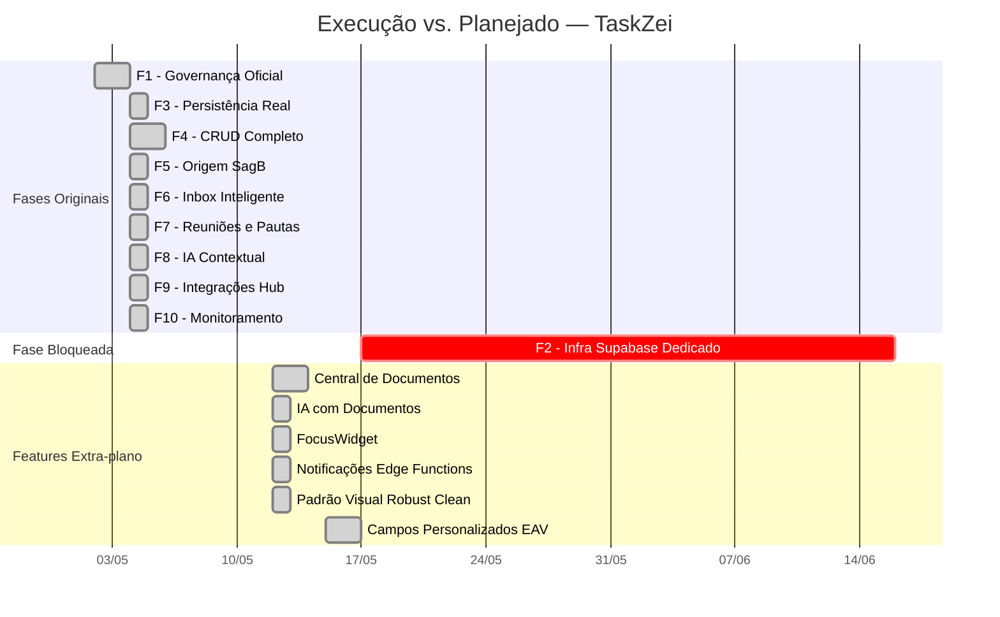
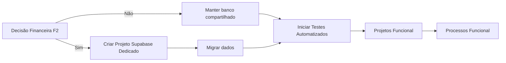
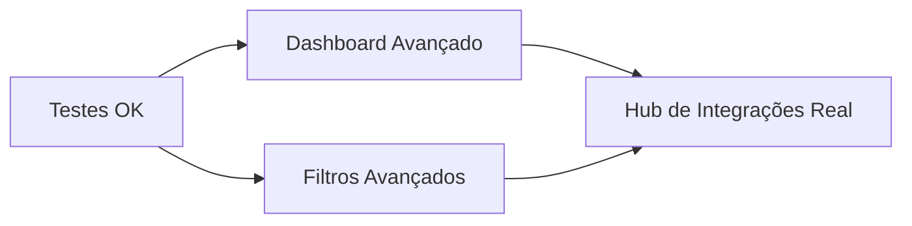

# Plano de Continuidade — Módulo TaskZei (Agenda Inteligente)

> **Documento:** Plano executivo de continuidade do módulo
> **Data:** 2026-05-25
> **Contexto:** Planejamento baseado em auditoria completa do código, plano_modulo.md, changelog.md e decisions.md

---

## Sumário Executivo

O módulo **TaskZei (Agenda Inteligente)** encontra-se atualmente na **versão 1.17.0** e teve **todas as 10 fases do plano original implementadas**, exceto a **FASE 2** (Infraestrutura Própria Supabase), que permanece bloqueada por indefinição financeira.

Adicionalmente, foram implementadas diversas features além do plano original (Central de Documentos, IA Contextual, FocusWidget, Notificações, Campos Personalizados, Padrão Visual Robust Clean).

Este documento organiza as **pendências, oportunidades de melhoria e próximos passos** em ordens de prioridade.

---

## 1. Estado Atual vs. Plano Original

---

## 2. Pendências Atuais

### 2.1 Pendência Bloqueante: FASE 2 — Infraestrutura Própria Supabase

| ID | Item | Status | Depende de |
|---|---|---|---|
| ET-05 | Criar projeto Supabase TaskZei | ❌ Não iniciado | Definição financeira |
| ET-06 | Executar migration no novo projeto | ❌ Não iniciado | ET-05 |
| ET-07 | Configurar env vars e CI/CD | ❌ Não iniciado | ET-06 |

**Risco:** O módulo opera no banco compartilhado do SagB. Enquanto não houver **dono financeiro** definido, o TaskZei não terá infraestrutura própria, limitando sua destacabilidade e escalabilidade.

**Decisão necessária:** Definir:
- Quem paga o plano **Pro (US$25/mês)** do Supabase
- Quem gerencia o projeto (acesso ao dashboard)
- Cronograma para a migração

### 2.2 Pendências de Refinamento

| ID | Item | Prioridade | Esforço |
|---|---|---|---|
| P1 | Projetos — página ainda é placeholder (`AgendaInteligenteProjectsPage.tsx`) | Média | 3-5 dias |
| P2 | Processos — página ainda é placeholder (`AgendaInteligenteProcessesPage.tsx`) | Média | 3-5 dias |
| P3 | Conformidade visual canônica pendente (hex inline, tipografia `text-[11px]`) | Baixa | Documentado em ET-04 |
| P4 | Testes automatizados — inexistentes no módulo | Alta | 5-8 dias |
| P5 | Documentação de API para consumidores externos | Média | 2-3 dias |

---

## 3. Oportunidades de Evolução

### 3.1 Curto Prazo (Prioridade Alta)

#### ET-N1: Testes Automatizados (5-8 dias)
**Justificativa:** O módulo tem 0 testes automatizados. Risco alto de regressão a cada alteração.

**O que fazer:**
- Testes unitários para serviços: `nlParser`, `metricsService`, `monitorService`, `AuditService`
- Testes de integração para o facade: `TaskzeiFacade.createTask`, `updateTask`, etc.
- Testes de componente para os principais componentes: `task_drawer`, `task_list`, `TaskModal`
- Configurar Vitest no módulo

**Arquivos envolvidos:**
- `src/modules/taskzei/**/*.test.ts`
- `vitest.config.ts` (ou similar)

---

#### ET-N2: Projetos — Funcional (3-5 dias)
**Justificativa:** Página de Projetos é placeholder. Usuários não conseguem agrupar tarefas em projetos.

**O que fazer:**
- Migration: `taskzei_projects` (id, name, description, status, workspace_id, created_at, updated_at)
- Types: `project.types.ts`
- Store: `project.store.ts` (Zustand)
- Provider: métodos CRUD de projetos
- UI: `AgendaInteligenteProjectsPage.tsx` com listagem + criação inline + cards de projeto
- Relacionamento: tarefa pode pertencer a um projeto (FK opcional em `taskzei_tasks`)

**Dependência:** Provider existente (mock + supabase)

---

#### ET-N3: Processos — Funcional (3-5 dias)
**Justificativa:** Página de Processos é placeholder. Workflows não são representáveis.

**O que fazer:**
- Migration: `taskzei_processes` (id, name, description, stages JSONB, workspace_id)
- Types: `process.types.ts`
- UI: `AgendaInteligenteProcessesPage.tsx` com visualização de estágios

**Nota:** Pode ser simplificado — começar com lista de processos + estágios textuais, sem automação de transição.

---

### 3.2 Médio Prazo (Prioridade Média)

#### ET-N4: Dashboard Avançado com Gráficos (5-8 dias)
**Justificativa:** HomePage atual tem KPIs básicos. Falta visualização de tendências.

**O que fazer:**
- Implementar gráficos de conclusão ao longo do tempo (usando dados reais de `completedAt`)
- Pipeline de tarefas (funil: inbox → task → concluída)
- Produtividade por membro (tarefas concluídas por assignee)
- Biblioteca de gráficos: Recharts ou Chart.js (leve)

---

#### ET-N5: Filtros Avançados e Salvos (3-5 dias)
**Justificativa:** Filtros atuais são apenas status + busca textual.

**O que fazer:**
- Filtros por: assignee, prioridade, data de vencimento (range), tags, origem
- Filtros salvos (persistir configuração de filtro como "view" favorita)
- Compartilhamento de filtros entre usuários do mesmo workspace

---

#### ET-N6: Integração com Hub de Integrações (promover de placeholder para real)
**Justificativa:** `taskzei.hub.ts` atualmente faz apenas `console.log`.

**O que fazer:**
- Conectar ao `hub-integracao` real (quando disponível)
- Implementar publish real de eventos (task_created, task_completed, meeting_created, inbox_converted)
- Implementar `syncState` real

---

### 3.3 Longo Prazo (Prioridade Baixa)

| ID | Item | Observação |
|---|---|---|
| ET-N7 | Modo Offline com Sync | Service Worker + IndexedDB para cache local |
| ET-N8 | Kanban Avançado com Colunas Customizáveis | Colunas definidas por usuário, drag entre colunas |
| ET-N9 | Integração Calendário (Google Calendar / Outlook) | Via Hub de Integrações |
| ET-N10 | Notificações Push via OneSignal | Schema `taskzei_push_devices` já criado (v1.15.0) |
| ET-N11 | CI/CD independente | Fora do escopo atual (critério 6 de módulo destacável) |
| ET-N12 | Build standalone | Fora do escopo atual (critério 7 de módulo destacável) |

---

## 4. Dívidas Técnicas Conhecidas

### 4.1 Conformidade Visual Canônica (Documentada desde ET-04)
- Uso de cores hex inline em componentes pré-1.16.0 (parcialmente corrigido no Robust Clean)
- Tipografia `text-[11px]` fora da tabela canônica
- Header canônico do módulo não implementado

### 4.2 Provider Mock Desatualizado
- Mock provider pode estar dessincronizado com o schema real
- Necessário revisão periódica conforme decidido na decisao_011

### 4.3 TypeScript Errors Pre-existentes
- Documentados no changelog v1.16.0: `Promise type mismatch` em `useAutoSave`
- Não corrigidos por não serem causados pela refatoração

---

## 5. Próximos Passos Recomendados

### Prioridade 1 (Imediato)

### Prioridade 2 (Após P1)

### Prioridade 3 (Longo Prazo)
- Kanban Avançado
- Integração Calendário
- Modo Offline
- Notificações Push

---

## 6. Riscos Atualizados

| ID | Risco | Probabilidade | Impacto | Mitigação |
|---|---|---|---|---|
| R1 | F2 sem dono financeiro indefinidamente | Alta | Crítico | Documentar impacto. Se não resolver em 30 dias, considerar banco compartilhado como permanente |
| R2 | Regressão por falta de testes | Alta | Alto | ET-N1 como prioridade máxima pós-definição financeira |
| R3 | Mock removido acidentalmente | Média | Alto | Manter decisao_011: mock é fallback permanente |
| R4 | Conflito com outros módulos no banco compartilhado | Média | Médio | Prefixo `taskzei_` já implementado |
| R5 | Perda de dados na migração futura | Baixa | Crítico | Plano de migração já documentado em `docs/MIGRACAO_FUTURA_SUPABASE_TASKZEI.md` |

---

## 7. Glossário de Referências

| Referência | Localização |
|---|---|
| Plano original | [`plano_modulo.md`](../plano_modulo.md) |
| Decisões de arquitetura | [`decisions.md`](../decisions.md) |
| Histórico de versões | [`changelog.md`](../changelog.md) |
| Documentação técnica | [`module-doc.ts`](../module-doc.ts) |
| Persona do agente | [`agent/persona.md`](../agent/persona.md) |
| Prompt de ativação | [`agent/prompt_ativacao_cline.md`](../agent/prompt_ativacao_cline.md) |
| Plano de migração Supabase | [`docs/MIGRACAO_FUTURA_SUPABASE_TASKZEI.md`](MIGRACAO_FUTURA_SUPABASE_TASKZEI.md) |
| Plano de execução unificada | [`plano_execucao_unificada.md`](../plano_execucao_unificada.md) |

---

## 8. Checklist de Ações Imediatas

- [ ] **Definir dono financeiro** para o Supabase dedicado (FASE 2)
- [ ] Iniciar **ET-N1: Testes Automatizados** (5-8 dias)
- [ ] Iniciar **ET-N2: Projetos Funcional** (3-5 dias)
- [ ] Iniciar **ET-N3: Processos Funcional** (3-5 dias)
- [ ] Revisar **Mock Provider** contra schema atual
- [ ] Corrigir **TypeScript errors** pre-existentes no `useAutoSave`
- [ ] Agendar revisão quinzenal do plano (próxima: já vencida — última prevista 2026-05-17)

---

*Documento mantido em [`src/modules/taskzei/docs/PLANO_CONTINUIDADE_TASKZEI.md`](PLANO_CONTINUIDADE_TASKZEI.md)*
